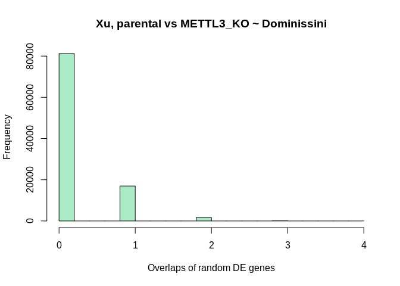

## m6a reanalysis - Xu METTL3 dataset

The following analysis is the summary of the differential expression
analysis performed for the [Xu et
al.](https://doi.org/10.1038/s41586-021-03210-1) dataset. In the first
instance, the transcriptomic dataset, which formed a subset of the many
datasets in this publication, was downloaded from NCBI SRA with project
ID [PRJNA521368](https://www.ncbi.nlm.nih.gov/bioproject/PRJNA521368).
Total QC, preprocessing and quantification was done using the
[NF-core](http://nf-co.re) RNAseq pipeline. Salmon counts obtained from
the pipeline were used for subsequent differential expression (DE)
analysis using DESeq2 using custom R script.

### Preprocess prior to DE analysis

We first list the files quantified by salmon and using the `tximport`
package, import in the workspace. Meanwhile, to determine gene-level
counts, we also generate a transcript <–> gene map from the
Ensembl mouse annotation package.

``` r
library(tximport)
library(DESeq2)
library(data.table)
library(dplyr)
library(tibble)
library(EnsDb.Mmusculus.v79)
library(GEOquery)
library(DT)
library(ggpubr)
library(ggplot2)
library(EnsDb.Hsapiens.v86)
library(GEOquery)
library(DT)
library(ggplot2)
library(kableExtra)
library(ggvenn)

# List count files
xu_cnt_files = list.files('/home/ssamberkar/work/projects/results/salmon', pattern = 'quant.sf', full.names = T, recursive = T)

# Generate tx-gene map for mouse from Ensembl Bioconductor

edb = EnsDb.Mmusculus.v79
mm_tx2gene = transcriptsBy(edb, by = "gene", filter = SeqNameFilter(c("X", "Y"))) %>%  
  data.frame() %>% 
  dplyr::select('tx_name','gene_id')
colnames(mm_tx2gene) = c('TXNAME', 'GENEID')
xu_txi = tximport(xu_cnt_files, type = 'salmon',tx2gene = mm_tx2gene, ignoreTxVersion = T)
```

## DE analysis

To obtain the experimental design, we fetch the experiment `phenoData`
originally submitted to GEO and subset it to generate our design matrix.
Once generated, we then use the `genotype` variable to run DE analysis.

    ## Warning in DESeqDataSet(se, design = design, ignoreRank): some variables in
    ## design formula are characters, converting to factors

### DE results

Since there are more than 1 `genotype` tested in this dataset, we
generate separate DE tables for each pairwise contrast:

``` r
# Generate all pairwise contrasts from exp. design matrix
xu_contrasts_pairs = t(combn(unique(xu_coldata$genotype),2))
xu_DE_results.list = xu_DE_results_df.list = vector(mode = 'list', length = dim(xu_contrasts_pairs)[1])
names(xu_DE_results.list) = names(xu_DE_results_df.list) = paste(xu_contrasts_pairs[,1], xu_contrasts_pairs[,2], sep = ' ~ ')

for(i in 1:dim(xu_contrasts_pairs)[1]){
  
  xu_DE_results.list[[i]] = results(xu_dds, contrast = c('genotype', xu_contrasts_pairs[i,1], xu_contrasts_pairs[i,2])) 
  xu_DE_results_df.list[[i]] = xu_DE_results.list[[i]] %>% 
    data.frame() %>% 
    rownames_to_column('GeneID') %>%
    dplyr::filter(padj <= 0.05 & abs(log2FoldChange) >= 1) %>%
    mutate(`-log10_pval` = round(-log10(pvalue),digits = 3),
           `-log10_adj_pval` = round(-log10(padj),digits = 3),
           `log2FC` = round(log2FoldChange,digits = 3),
           `stat` = round(stat, digits = 3),
           `lfcSE` = round(lfcSE, digits = 3),
           `BaseMean` = round(baseMean, digits = 3)) %>%
    dplyr::select(c('GeneID', 'BaseMean', 'log2FC', 'lfcSE', 'stat', '-log10_pval', '-log10_adj_pval'))
    
  datatable(data.frame(number_of_DEGs = unlist(lapply(xu_DE_results_df.list, function(x)dim(x)[1]))) %>% rownames_to_column('Contrasts'), caption = 'Summary of DEGs for all pairwise contrasts')
    
  
}
```

#### DE genes

The individual DE genes table are as follows:

``` r
knitr::kable(xu_DE_results_df.list[[1]])
```

<table>
<thead>
<tr>
<th style="text-align:left;">
GeneID
</th>
<th style="text-align:right;">
BaseMean
</th>
<th style="text-align:right;">
log2FC
</th>
<th style="text-align:right;">
lfcSE
</th>
<th style="text-align:right;">
stat
</th>
<th style="text-align:right;">
-log10\_pval
</th>
<th style="text-align:right;">
-log10\_adj\_pval
</th>
</tr>
</thead>
<tbody>
<tr>
<td style="text-align:left;">
ENSMUSG00000002014
</td>
<td style="text-align:right;">
179.801
</td>
<td style="text-align:right;">
-1.249
</td>
<td style="text-align:right;">
0.260
</td>
<td style="text-align:right;">
-4.810
</td>
<td style="text-align:right;">
5.821
</td>
<td style="text-align:right;">
4.410
</td>
</tr>
<tr>
<td style="text-align:left;">
ENSMUSG00000008035
</td>
<td style="text-align:right;">
92.732
</td>
<td style="text-align:right;">
-2.531
</td>
<td style="text-align:right;">
0.446
</td>
<td style="text-align:right;">
-5.681
</td>
<td style="text-align:right;">
7.874
</td>
<td style="text-align:right;">
6.162
</td>
</tr>
<tr>
<td style="text-align:left;">
ENSMUSG00000015289
</td>
<td style="text-align:right;">
116.778
</td>
<td style="text-align:right;">
1.079
</td>
<td style="text-align:right;">
0.333
</td>
<td style="text-align:right;">
3.240
</td>
<td style="text-align:right;">
2.922
</td>
<td style="text-align:right;">
1.864
</td>
</tr>
<tr>
<td style="text-align:left;">
ENSMUSG00000025529
</td>
<td style="text-align:right;">
26.758
</td>
<td style="text-align:right;">
3.162
</td>
<td style="text-align:right;">
0.690
</td>
<td style="text-align:right;">
4.583
</td>
<td style="text-align:right;">
5.340
</td>
<td style="text-align:right;">
3.970
</td>
</tr>
<tr>
<td style="text-align:left;">
ENSMUSG00000031012
</td>
<td style="text-align:right;">
135.971
</td>
<td style="text-align:right;">
1.119
</td>
<td style="text-align:right;">
0.348
</td>
<td style="text-align:right;">
3.213
</td>
<td style="text-align:right;">
2.882
</td>
<td style="text-align:right;">
1.842
</td>
</tr>
<tr>
<td style="text-align:left;">
ENSMUSG00000031153
</td>
<td style="text-align:right;">
114.155
</td>
<td style="text-align:right;">
-1.352
</td>
<td style="text-align:right;">
0.372
</td>
<td style="text-align:right;">
-3.636
</td>
<td style="text-align:right;">
3.558
</td>
<td style="text-align:right;">
2.338
</td>
</tr>
<tr>
<td style="text-align:left;">
ENSMUSG00000031216
</td>
<td style="text-align:right;">
119.667
</td>
<td style="text-align:right;">
1.742
</td>
<td style="text-align:right;">
0.326
</td>
<td style="text-align:right;">
5.342
</td>
<td style="text-align:right;">
7.036
</td>
<td style="text-align:right;">
5.500
</td>
</tr>
<tr>
<td style="text-align:left;">
ENSMUSG00000031371
</td>
<td style="text-align:right;">
116.042
</td>
<td style="text-align:right;">
-1.025
</td>
<td style="text-align:right;">
0.320
</td>
<td style="text-align:right;">
-3.201
</td>
<td style="text-align:right;">
2.863
</td>
<td style="text-align:right;">
1.833
</td>
</tr>
<tr>
<td style="text-align:left;">
ENSMUSG00000033436
</td>
<td style="text-align:right;">
171.310
</td>
<td style="text-align:right;">
-1.147
</td>
<td style="text-align:right;">
0.268
</td>
<td style="text-align:right;">
-4.283
</td>
<td style="text-align:right;">
4.735
</td>
<td style="text-align:right;">
3.438
</td>
</tr>
<tr>
<td style="text-align:left;">
ENSMUSG00000034607
</td>
<td style="text-align:right;">
37.246
</td>
<td style="text-align:right;">
4.412
</td>
<td style="text-align:right;">
0.775
</td>
<td style="text-align:right;">
5.693
</td>
<td style="text-align:right;">
7.903
</td>
<td style="text-align:right;">
6.162
</td>
</tr>
<tr>
<td style="text-align:left;">
ENSMUSG00000036782
</td>
<td style="text-align:right;">
1491.332
</td>
<td style="text-align:right;">
1.130
</td>
<td style="text-align:right;">
0.116
</td>
<td style="text-align:right;">
9.773
</td>
<td style="text-align:right;">
21.834
</td>
<td style="text-align:right;">
19.123
</td>
</tr>
<tr>
<td style="text-align:left;">
ENSMUSG00000040363
</td>
<td style="text-align:right;">
258.293
</td>
<td style="text-align:right;">
1.454
</td>
<td style="text-align:right;">
0.244
</td>
<td style="text-align:right;">
5.957
</td>
<td style="text-align:right;">
8.591
</td>
<td style="text-align:right;">
6.782
</td>
</tr>
<tr>
<td style="text-align:left;">
ENSMUSG00000041115
</td>
<td style="text-align:right;">
24.296
</td>
<td style="text-align:right;">
2.223
</td>
<td style="text-align:right;">
0.716
</td>
<td style="text-align:right;">
3.104
</td>
<td style="text-align:right;">
2.719
</td>
<td style="text-align:right;">
1.740
</td>
</tr>
<tr>
<td style="text-align:left;">
ENSMUSG00000041688
</td>
<td style="text-align:right;">
94.846
</td>
<td style="text-align:right;">
1.272
</td>
<td style="text-align:right;">
0.387
</td>
<td style="text-align:right;">
3.285
</td>
<td style="text-align:right;">
2.991
</td>
<td style="text-align:right;">
1.892
</td>
</tr>
<tr>
<td style="text-align:left;">
ENSMUSG00000041710
</td>
<td style="text-align:right;">
32.243
</td>
<td style="text-align:right;">
-1.987
</td>
<td style="text-align:right;">
0.641
</td>
<td style="text-align:right;">
-3.098
</td>
<td style="text-align:right;">
2.711
</td>
<td style="text-align:right;">
1.739
</td>
</tr>
<tr>
<td style="text-align:left;">
ENSMUSG00000042271
</td>
<td style="text-align:right;">
101.404
</td>
<td style="text-align:right;">
1.234
</td>
<td style="text-align:right;">
0.342
</td>
<td style="text-align:right;">
3.604
</td>
<td style="text-align:right;">
3.505
</td>
<td style="text-align:right;">
2.324
</td>
</tr>
<tr>
<td style="text-align:left;">
ENSMUSG00000043929
</td>
<td style="text-align:right;">
56.525
</td>
<td style="text-align:right;">
1.762
</td>
<td style="text-align:right;">
0.543
</td>
<td style="text-align:right;">
3.244
</td>
<td style="text-align:right;">
2.928
</td>
<td style="text-align:right;">
1.864
</td>
</tr>
<tr>
<td style="text-align:left;">
ENSMUSG00000045180
</td>
<td style="text-align:right;">
196.504
</td>
<td style="text-align:right;">
1.245
</td>
<td style="text-align:right;">
0.273
</td>
<td style="text-align:right;">
4.560
</td>
<td style="text-align:right;">
5.292
</td>
<td style="text-align:right;">
3.942
</td>
</tr>
<tr>
<td style="text-align:left;">
ENSMUSG00000046550
</td>
<td style="text-align:right;">
33.277
</td>
<td style="text-align:right;">
2.020
</td>
<td style="text-align:right;">
0.640
</td>
<td style="text-align:right;">
3.157
</td>
<td style="text-align:right;">
2.797
</td>
<td style="text-align:right;">
1.784
</td>
</tr>
<tr>
<td style="text-align:left;">
ENSMUSG00000050332
</td>
<td style="text-align:right;">
124.735
</td>
<td style="text-align:right;">
-1.195
</td>
<td style="text-align:right;">
0.314
</td>
<td style="text-align:right;">
-3.806
</td>
<td style="text-align:right;">
3.850
</td>
<td style="text-align:right;">
2.601
</td>
</tr>
<tr>
<td style="text-align:left;">
ENSMUSG00000050424
</td>
<td style="text-align:right;">
124.637
</td>
<td style="text-align:right;">
-2.229
</td>
<td style="text-align:right;">
0.323
</td>
<td style="text-align:right;">
-6.897
</td>
<td style="text-align:right;">
11.275
</td>
<td style="text-align:right;">
9.040
</td>
</tr>
<tr>
<td style="text-align:left;">
ENSMUSG00000055780
</td>
<td style="text-align:right;">
30.766
</td>
<td style="text-align:right;">
-3.811
</td>
<td style="text-align:right;">
0.774
</td>
<td style="text-align:right;">
-4.921
</td>
<td style="text-align:right;">
6.064
</td>
<td style="text-align:right;">
4.608
</td>
</tr>
<tr>
<td style="text-align:left;">
ENSMUSG00000060685
</td>
<td style="text-align:right;">
12.695
</td>
<td style="text-align:right;">
5.586
</td>
<td style="text-align:right;">
1.735
</td>
<td style="text-align:right;">
3.220
</td>
<td style="text-align:right;">
2.893
</td>
<td style="text-align:right;">
1.844
</td>
</tr>
<tr>
<td style="text-align:left;">
ENSMUSG00000062184
</td>
<td style="text-align:right;">
15.372
</td>
<td style="text-align:right;">
5.524
</td>
<td style="text-align:right;">
1.641
</td>
<td style="text-align:right;">
3.367
</td>
<td style="text-align:right;">
3.119
</td>
<td style="text-align:right;">
2.009
</td>
</tr>
<tr>
<td style="text-align:left;">
ENSMUSG00000064137
</td>
<td style="text-align:right;">
326.891
</td>
<td style="text-align:right;">
-1.712
</td>
<td style="text-align:right;">
0.218
</td>
<td style="text-align:right;">
-7.854
</td>
<td style="text-align:right;">
14.394
</td>
<td style="text-align:right;">
11.983
</td>
</tr>
<tr>
<td style="text-align:left;">
ENSMUSG00000068270
</td>
<td style="text-align:right;">
113.428
</td>
<td style="text-align:right;">
2.121
</td>
<td style="text-align:right;">
0.355
</td>
<td style="text-align:right;">
5.974
</td>
<td style="text-align:right;">
8.636
</td>
<td style="text-align:right;">
6.782
</td>
</tr>
<tr>
<td style="text-align:left;">
ENSMUSG00000073295
</td>
<td style="text-align:right;">
40.258
</td>
<td style="text-align:right;">
1.869
</td>
<td style="text-align:right;">
0.588
</td>
<td style="text-align:right;">
3.177
</td>
<td style="text-align:right;">
2.828
</td>
<td style="text-align:right;">
1.806
</td>
</tr>
<tr>
<td style="text-align:left;">
ENSMUSG00000081221
</td>
<td style="text-align:right;">
9.898
</td>
<td style="text-align:right;">
5.900
</td>
<td style="text-align:right;">
1.997
</td>
<td style="text-align:right;">
2.955
</td>
<td style="text-align:right;">
2.505
</td>
<td style="text-align:right;">
1.571
</td>
</tr>
</tbody>
</table>

``` r
knitr::kable(xu_DE_results_df.list[[2]])
```

<table>
<thead>
<tr>
<th style="text-align:left;">
GeneID
</th>
<th style="text-align:right;">
BaseMean
</th>
<th style="text-align:right;">
log2FC
</th>
<th style="text-align:right;">
lfcSE
</th>
<th style="text-align:right;">
stat
</th>
<th style="text-align:right;">
-log10\_pval
</th>
<th style="text-align:right;">
-log10\_adj\_pval
</th>
</tr>
</thead>
<tbody>
<tr>
<td style="text-align:left;">
ENSMUSG00000000266
</td>
<td style="text-align:right;">
4.907
</td>
<td style="text-align:right;">
-5.077
</td>
<td style="text-align:right;">
2.100
</td>
<td style="text-align:right;">
-2.418
</td>
<td style="text-align:right;">
1.806
</td>
<td style="text-align:right;">
1.316
</td>
</tr>
<tr>
<td style="text-align:left;">
ENSMUSG00000001131
</td>
<td style="text-align:right;">
73.689
</td>
<td style="text-align:right;">
-1.100
</td>
<td style="text-align:right;">
0.375
</td>
<td style="text-align:right;">
-2.935
</td>
<td style="text-align:right;">
2.477
</td>
<td style="text-align:right;">
1.886
</td>
</tr>
<tr>
<td style="text-align:left;">
ENSMUSG00000001134
</td>
<td style="text-align:right;">
67.807
</td>
<td style="text-align:right;">
-1.970
</td>
<td style="text-align:right;">
0.407
</td>
<td style="text-align:right;">
-4.845
</td>
<td style="text-align:right;">
5.897
</td>
<td style="text-align:right;">
4.963
</td>
</tr>
<tr>
<td style="text-align:left;">
ENSMUSG00000002006
</td>
<td style="text-align:right;">
497.297
</td>
<td style="text-align:right;">
-1.174
</td>
<td style="text-align:right;">
0.169
</td>
<td style="text-align:right;">
-6.938
</td>
<td style="text-align:right;">
11.401
</td>
<td style="text-align:right;">
10.173
</td>
</tr>
<tr>
<td style="text-align:left;">
ENSMUSG00000006200
</td>
<td style="text-align:right;">
38.942
</td>
<td style="text-align:right;">
-3.030
</td>
<td style="text-align:right;">
0.600
</td>
<td style="text-align:right;">
-5.050
</td>
<td style="text-align:right;">
6.355
</td>
<td style="text-align:right;">
5.370
</td>
</tr>
<tr>
<td style="text-align:left;">
ENSMUSG00000008035
</td>
<td style="text-align:right;">
92.732
</td>
<td style="text-align:right;">
-3.439
</td>
<td style="text-align:right;">
0.432
</td>
<td style="text-align:right;">
-7.968
</td>
<td style="text-align:right;">
14.792
</td>
<td style="text-align:right;">
13.406
</td>
</tr>
<tr>
<td style="text-align:left;">
ENSMUSG00000008682
</td>
<td style="text-align:right;">
1731.974
</td>
<td style="text-align:right;">
-1.566
</td>
<td style="text-align:right;">
0.324
</td>
<td style="text-align:right;">
-4.838
</td>
<td style="text-align:right;">
5.882
</td>
<td style="text-align:right;">
4.961
</td>
</tr>
<tr>
<td style="text-align:left;">
ENSMUSG00000009406
</td>
<td style="text-align:right;">
162.169
</td>
<td style="text-align:right;">
-1.039
</td>
<td style="text-align:right;">
0.260
</td>
<td style="text-align:right;">
-4.000
</td>
<td style="text-align:right;">
4.198
</td>
<td style="text-align:right;">
3.400
</td>
</tr>
<tr>
<td style="text-align:left;">
ENSMUSG00000015291
</td>
<td style="text-align:right;">
415.562
</td>
<td style="text-align:right;">
-1.336
</td>
<td style="text-align:right;">
0.203
</td>
<td style="text-align:right;">
-6.574
</td>
<td style="text-align:right;">
10.311
</td>
<td style="text-align:right;">
9.106
</td>
</tr>
<tr>
<td style="text-align:left;">
ENSMUSG00000016150
</td>
<td style="text-align:right;">
9.700
</td>
<td style="text-align:right;">
4.978
</td>
<td style="text-align:right;">
1.424
</td>
<td style="text-align:right;">
3.497
</td>
<td style="text-align:right;">
3.327
</td>
<td style="text-align:right;">
2.625
</td>
</tr>
<tr>
<td style="text-align:left;">
ENSMUSG00000016409
</td>
<td style="text-align:right;">
124.498
</td>
<td style="text-align:right;">
-1.461
</td>
<td style="text-align:right;">
0.362
</td>
<td style="text-align:right;">
-4.038
</td>
<td style="text-align:right;">
4.269
</td>
<td style="text-align:right;">
3.464
</td>
</tr>
<tr>
<td style="text-align:left;">
ENSMUSG00000023443
</td>
<td style="text-align:right;">
29.036
</td>
<td style="text-align:right;">
-2.626
</td>
<td style="text-align:right;">
0.664
</td>
<td style="text-align:right;">
-3.954
</td>
<td style="text-align:right;">
4.114
</td>
<td style="text-align:right;">
3.329
</td>
</tr>
<tr>
<td style="text-align:left;">
ENSMUSG00000025040
</td>
<td style="text-align:right;">
52.722
</td>
<td style="text-align:right;">
-1.640
</td>
<td style="text-align:right;">
0.491
</td>
<td style="text-align:right;">
-3.342
</td>
<td style="text-align:right;">
3.080
</td>
<td style="text-align:right;">
2.411
</td>
</tr>
<tr>
<td style="text-align:left;">
ENSMUSG00000025056
</td>
<td style="text-align:right;">
151.086
</td>
<td style="text-align:right;">
-1.482
</td>
<td style="text-align:right;">
0.306
</td>
<td style="text-align:right;">
-4.840
</td>
<td style="text-align:right;">
5.886
</td>
<td style="text-align:right;">
4.961
</td>
</tr>
<tr>
<td style="text-align:left;">
ENSMUSG00000025265
</td>
<td style="text-align:right;">
481.179
</td>
<td style="text-align:right;">
-1.417
</td>
<td style="text-align:right;">
0.164
</td>
<td style="text-align:right;">
-8.657
</td>
<td style="text-align:right;">
17.314
</td>
<td style="text-align:right;">
15.785
</td>
</tr>
<tr>
<td style="text-align:left;">
ENSMUSG00000025268
</td>
<td style="text-align:right;">
99.300
</td>
<td style="text-align:right;">
-1.042
</td>
<td style="text-align:right;">
0.358
</td>
<td style="text-align:right;">
-2.913
</td>
<td style="text-align:right;">
2.447
</td>
<td style="text-align:right;">
1.861
</td>
</tr>
<tr>
<td style="text-align:left;">
ENSMUSG00000025529
</td>
<td style="text-align:right;">
26.758
</td>
<td style="text-align:right;">
1.677
</td>
<td style="text-align:right;">
0.631
</td>
<td style="text-align:right;">
2.659
</td>
<td style="text-align:right;">
2.106
</td>
<td style="text-align:right;">
1.562
</td>
</tr>
<tr>
<td style="text-align:left;">
ENSMUSG00000025666
</td>
<td style="text-align:right;">
69.502
</td>
<td style="text-align:right;">
-1.183
</td>
<td style="text-align:right;">
0.402
</td>
<td style="text-align:right;">
-2.945
</td>
<td style="text-align:right;">
2.491
</td>
<td style="text-align:right;">
1.896
</td>
</tr>
<tr>
<td style="text-align:left;">
ENSMUSG00000031066
</td>
<td style="text-align:right;">
231.600
</td>
<td style="text-align:right;">
-1.062
</td>
<td style="text-align:right;">
0.228
</td>
<td style="text-align:right;">
-4.654
</td>
<td style="text-align:right;">
5.487
</td>
<td style="text-align:right;">
4.606
</td>
</tr>
<tr>
<td style="text-align:left;">
ENSMUSG00000031111
</td>
<td style="text-align:right;">
12.455
</td>
<td style="text-align:right;">
-3.299
</td>
<td style="text-align:right;">
0.972
</td>
<td style="text-align:right;">
-3.393
</td>
<td style="text-align:right;">
3.161
</td>
<td style="text-align:right;">
2.480
</td>
</tr>
<tr>
<td style="text-align:left;">
ENSMUSG00000031146
</td>
<td style="text-align:right;">
181.621
</td>
<td style="text-align:right;">
-1.501
</td>
<td style="text-align:right;">
0.258
</td>
<td style="text-align:right;">
-5.827
</td>
<td style="text-align:right;">
8.248
</td>
<td style="text-align:right;">
7.144
</td>
</tr>
<tr>
<td style="text-align:left;">
ENSMUSG00000031149
</td>
<td style="text-align:right;">
60.522
</td>
<td style="text-align:right;">
-1.539
</td>
<td style="text-align:right;">
0.428
</td>
<td style="text-align:right;">
-3.600
</td>
<td style="text-align:right;">
3.497
</td>
<td style="text-align:right;">
2.777
</td>
</tr>
<tr>
<td style="text-align:left;">
ENSMUSG00000031150
</td>
<td style="text-align:right;">
103.707
</td>
<td style="text-align:right;">
-2.367
</td>
<td style="text-align:right;">
0.376
</td>
<td style="text-align:right;">
-6.299
</td>
<td style="text-align:right;">
9.523
</td>
<td style="text-align:right;">
8.372
</td>
</tr>
<tr>
<td style="text-align:left;">
ENSMUSG00000031158
</td>
<td style="text-align:right;">
273.868
</td>
<td style="text-align:right;">
-1.768
</td>
<td style="text-align:right;">
0.225
</td>
<td style="text-align:right;">
-7.869
</td>
<td style="text-align:right;">
14.448
</td>
<td style="text-align:right;">
13.110
</td>
</tr>
<tr>
<td style="text-align:left;">
ENSMUSG00000031162
</td>
<td style="text-align:right;">
44.745
</td>
<td style="text-align:right;">
2.809
</td>
<td style="text-align:right;">
0.565
</td>
<td style="text-align:right;">
4.974
</td>
<td style="text-align:right;">
6.183
</td>
<td style="text-align:right;">
5.205
</td>
</tr>
<tr>
<td style="text-align:left;">
ENSMUSG00000031167
</td>
<td style="text-align:right;">
2037.577
</td>
<td style="text-align:right;">
1.571
</td>
<td style="text-align:right;">
0.102
</td>
<td style="text-align:right;">
15.384
</td>
<td style="text-align:right;">
52.681
</td>
<td style="text-align:right;">
49.896
</td>
</tr>
<tr>
<td style="text-align:left;">
ENSMUSG00000031169
</td>
<td style="text-align:right;">
44.349
</td>
<td style="text-align:right;">
1.893
</td>
<td style="text-align:right;">
0.509
</td>
<td style="text-align:right;">
3.719
</td>
<td style="text-align:right;">
3.699
</td>
<td style="text-align:right;">
2.960
</td>
</tr>
<tr>
<td style="text-align:left;">
ENSMUSG00000031201
</td>
<td style="text-align:right;">
150.694
</td>
<td style="text-align:right;">
1.593
</td>
<td style="text-align:right;">
0.281
</td>
<td style="text-align:right;">
5.676
</td>
<td style="text-align:right;">
7.861
</td>
<td style="text-align:right;">
6.801
</td>
</tr>
<tr>
<td style="text-align:left;">
ENSMUSG00000031221
</td>
<td style="text-align:right;">
245.265
</td>
<td style="text-align:right;">
-1.482
</td>
<td style="text-align:right;">
0.230
</td>
<td style="text-align:right;">
-6.449
</td>
<td style="text-align:right;">
9.949
</td>
<td style="text-align:right;">
8.788
</td>
</tr>
<tr>
<td style="text-align:left;">
ENSMUSG00000031239
</td>
<td style="text-align:right;">
80.470
</td>
<td style="text-align:right;">
-2.004
</td>
<td style="text-align:right;">
0.373
</td>
<td style="text-align:right;">
-5.377
</td>
<td style="text-align:right;">
7.120
</td>
<td style="text-align:right;">
6.091
</td>
</tr>
<tr>
<td style="text-align:left;">
ENSMUSG00000031257
</td>
<td style="text-align:right;">
252.529
</td>
<td style="text-align:right;">
1.611
</td>
<td style="text-align:right;">
0.225
</td>
<td style="text-align:right;">
7.148
</td>
<td style="text-align:right;">
12.055
</td>
<td style="text-align:right;">
10.802
</td>
</tr>
<tr>
<td style="text-align:left;">
ENSMUSG00000031258
</td>
<td style="text-align:right;">
11.865
</td>
<td style="text-align:right;">
-2.887
</td>
<td style="text-align:right;">
1.161
</td>
<td style="text-align:right;">
-2.487
</td>
<td style="text-align:right;">
1.890
</td>
<td style="text-align:right;">
1.380
</td>
</tr>
<tr>
<td style="text-align:left;">
ENSMUSG00000031262
</td>
<td style="text-align:right;">
186.485
</td>
<td style="text-align:right;">
1.189
</td>
<td style="text-align:right;">
0.280
</td>
<td style="text-align:right;">
4.249
</td>
<td style="text-align:right;">
4.669
</td>
<td style="text-align:right;">
3.828
</td>
</tr>
<tr>
<td style="text-align:left;">
ENSMUSG00000031266
</td>
<td style="text-align:right;">
43.909
</td>
<td style="text-align:right;">
8.139
</td>
<td style="text-align:right;">
1.568
</td>
<td style="text-align:right;">
5.190
</td>
<td style="text-align:right;">
6.676
</td>
<td style="text-align:right;">
5.662
</td>
</tr>
<tr>
<td style="text-align:left;">
ENSMUSG00000031274
</td>
<td style="text-align:right;">
8.725
</td>
<td style="text-align:right;">
-3.548
</td>
<td style="text-align:right;">
1.238
</td>
<td style="text-align:right;">
-2.866
</td>
<td style="text-align:right;">
2.382
</td>
<td style="text-align:right;">
1.804
</td>
</tr>
<tr>
<td style="text-align:left;">
ENSMUSG00000031293
</td>
<td style="text-align:right;">
7.782
</td>
<td style="text-align:right;">
4.941
</td>
<td style="text-align:right;">
1.906
</td>
<td style="text-align:right;">
2.592
</td>
<td style="text-align:right;">
2.020
</td>
<td style="text-align:right;">
1.495
</td>
</tr>
<tr>
<td style="text-align:left;">
ENSMUSG00000031303
</td>
<td style="text-align:right;">
881.602
</td>
<td style="text-align:right;">
1.305
</td>
<td style="text-align:right;">
0.145
</td>
<td style="text-align:right;">
9.028
</td>
<td style="text-align:right;">
18.756
</td>
<td style="text-align:right;">
17.117
</td>
</tr>
<tr>
<td style="text-align:left;">
ENSMUSG00000031373
</td>
<td style="text-align:right;">
22.712
</td>
<td style="text-align:right;">
2.460
</td>
<td style="text-align:right;">
0.750
</td>
<td style="text-align:right;">
3.282
</td>
<td style="text-align:right;">
2.986
</td>
<td style="text-align:right;">
2.332
</td>
</tr>
<tr>
<td style="text-align:left;">
ENSMUSG00000031387
</td>
<td style="text-align:right;">
324.894
</td>
<td style="text-align:right;">
-1.120
</td>
<td style="text-align:right;">
0.198
</td>
<td style="text-align:right;">
-5.662
</td>
<td style="text-align:right;">
7.824
</td>
<td style="text-align:right;">
6.772
</td>
</tr>
<tr>
<td style="text-align:left;">
ENSMUSG00000031390
</td>
<td style="text-align:right;">
51.561
</td>
<td style="text-align:right;">
1.687
</td>
<td style="text-align:right;">
0.464
</td>
<td style="text-align:right;">
3.636
</td>
<td style="text-align:right;">
3.558
</td>
<td style="text-align:right;">
2.830
</td>
</tr>
<tr>
<td style="text-align:left;">
ENSMUSG00000031393
</td>
<td style="text-align:right;">
175.463
</td>
<td style="text-align:right;">
-2.168
</td>
<td style="text-align:right;">
0.301
</td>
<td style="text-align:right;">
-7.211
</td>
<td style="text-align:right;">
12.256
</td>
<td style="text-align:right;">
10.963
</td>
</tr>
<tr>
<td style="text-align:left;">
ENSMUSG00000031399
</td>
<td style="text-align:right;">
21.351
</td>
<td style="text-align:right;">
-2.272
</td>
<td style="text-align:right;">
0.710
</td>
<td style="text-align:right;">
-3.199
</td>
<td style="text-align:right;">
2.861
</td>
<td style="text-align:right;">
2.222
</td>
</tr>
<tr>
<td style="text-align:left;">
ENSMUSG00000031431
</td>
<td style="text-align:right;">
14.974
</td>
<td style="text-align:right;">
-2.130
</td>
<td style="text-align:right;">
0.861
</td>
<td style="text-align:right;">
-2.472
</td>
<td style="text-align:right;">
1.872
</td>
<td style="text-align:right;">
1.364
</td>
</tr>
<tr>
<td style="text-align:left;">
ENSMUSG00000031432
</td>
<td style="text-align:right;">
1473.930
</td>
<td style="text-align:right;">
-1.073
</td>
<td style="text-align:right;">
0.109
</td>
<td style="text-align:right;">
-9.867
</td>
<td style="text-align:right;">
22.238
</td>
<td style="text-align:right;">
20.453
</td>
</tr>
<tr>
<td style="text-align:left;">
ENSMUSG00000033906
</td>
<td style="text-align:right;">
60.138
</td>
<td style="text-align:right;">
1.366
</td>
<td style="text-align:right;">
0.425
</td>
<td style="text-align:right;">
3.212
</td>
<td style="text-align:right;">
2.880
</td>
<td style="text-align:right;">
2.239
</td>
</tr>
<tr>
<td style="text-align:left;">
ENSMUSG00000034055
</td>
<td style="text-align:right;">
115.064
</td>
<td style="text-align:right;">
-1.231
</td>
<td style="text-align:right;">
0.315
</td>
<td style="text-align:right;">
-3.910
</td>
<td style="text-align:right;">
4.035
</td>
<td style="text-align:right;">
3.263
</td>
</tr>
<tr>
<td style="text-align:left;">
ENSMUSG00000034480
</td>
<td style="text-align:right;">
150.167
</td>
<td style="text-align:right;">
-1.320
</td>
<td style="text-align:right;">
0.345
</td>
<td style="text-align:right;">
-3.827
</td>
<td style="text-align:right;">
3.888
</td>
<td style="text-align:right;">
3.120
</td>
</tr>
<tr>
<td style="text-align:left;">
ENSMUSG00000035045
</td>
<td style="text-align:right;">
227.253
</td>
<td style="text-align:right;">
2.324
</td>
<td style="text-align:right;">
0.262
</td>
<td style="text-align:right;">
8.856
</td>
<td style="text-align:right;">
18.082
</td>
<td style="text-align:right;">
16.502
</td>
</tr>
<tr>
<td style="text-align:left;">
ENSMUSG00000035150
</td>
<td style="text-align:right;">
4159.788
</td>
<td style="text-align:right;">
1.107
</td>
<td style="text-align:right;">
0.094
</td>
<td style="text-align:right;">
11.760
</td>
<td style="text-align:right;">
31.202
</td>
<td style="text-align:right;">
29.117
</td>
</tr>
<tr>
<td style="text-align:left;">
ENSMUSG00000035246
</td>
<td style="text-align:right;">
246.124
</td>
<td style="text-align:right;">
1.050
</td>
<td style="text-align:right;">
0.226
</td>
<td style="text-align:right;">
4.637
</td>
<td style="text-align:right;">
5.451
</td>
<td style="text-align:right;">
4.575
</td>
</tr>
<tr>
<td style="text-align:left;">
ENSMUSG00000036502
</td>
<td style="text-align:right;">
75.692
</td>
<td style="text-align:right;">
1.360
</td>
<td style="text-align:right;">
0.405
</td>
<td style="text-align:right;">
3.358
</td>
<td style="text-align:right;">
3.105
</td>
<td style="text-align:right;">
2.431
</td>
</tr>
<tr>
<td style="text-align:left;">
ENSMUSG00000036959
</td>
<td style="text-align:right;">
211.710
</td>
<td style="text-align:right;">
-1.570
</td>
<td style="text-align:right;">
0.253
</td>
<td style="text-align:right;">
-6.197
</td>
<td style="text-align:right;">
9.241
</td>
<td style="text-align:right;">
8.099
</td>
</tr>
<tr>
<td style="text-align:left;">
ENSMUSG00000037005
</td>
<td style="text-align:right;">
35.695
</td>
<td style="text-align:right;">
1.619
</td>
<td style="text-align:right;">
0.577
</td>
<td style="text-align:right;">
2.804
</td>
<td style="text-align:right;">
2.296
</td>
<td style="text-align:right;">
1.729
</td>
</tr>
<tr>
<td style="text-align:left;">
ENSMUSG00000037341
</td>
<td style="text-align:right;">
112.956
</td>
<td style="text-align:right;">
1.630
</td>
<td style="text-align:right;">
0.347
</td>
<td style="text-align:right;">
4.695
</td>
<td style="text-align:right;">
5.573
</td>
<td style="text-align:right;">
4.686
</td>
</tr>
<tr>
<td style="text-align:left;">
ENSMUSG00000037475
</td>
<td style="text-align:right;">
667.430
</td>
<td style="text-align:right;">
1.283
</td>
<td style="text-align:right;">
0.165
</td>
<td style="text-align:right;">
7.798
</td>
<td style="text-align:right;">
14.202
</td>
<td style="text-align:right;">
12.894
</td>
</tr>
<tr>
<td style="text-align:left;">
ENSMUSG00000037636
</td>
<td style="text-align:right;">
34.059
</td>
<td style="text-align:right;">
1.929
</td>
<td style="text-align:right;">
0.620
</td>
<td style="text-align:right;">
3.110
</td>
<td style="text-align:right;">
2.727
</td>
<td style="text-align:right;">
2.104
</td>
</tr>
<tr>
<td style="text-align:left;">
ENSMUSG00000039231
</td>
<td style="text-align:right;">
767.389
</td>
<td style="text-align:right;">
1.787
</td>
<td style="text-align:right;">
0.167
</td>
<td style="text-align:right;">
10.720
</td>
<td style="text-align:right;">
26.084
</td>
<td style="text-align:right;">
24.144
</td>
</tr>
<tr>
<td style="text-align:left;">
ENSMUSG00000039278
</td>
<td style="text-align:right;">
34.539
</td>
<td style="text-align:right;">
-2.270
</td>
<td style="text-align:right;">
0.580
</td>
<td style="text-align:right;">
-3.915
</td>
<td style="text-align:right;">
4.043
</td>
<td style="text-align:right;">
3.267
</td>
</tr>
<tr>
<td style="text-align:left;">
ENSMUSG00000039521
</td>
<td style="text-align:right;">
188.378
</td>
<td style="text-align:right;">
2.255
</td>
<td style="text-align:right;">
0.287
</td>
<td style="text-align:right;">
7.860
</td>
<td style="text-align:right;">
14.414
</td>
<td style="text-align:right;">
13.092
</td>
</tr>
<tr>
<td style="text-align:left;">
ENSMUSG00000039556
</td>
<td style="text-align:right;">
42.818
</td>
<td style="text-align:right;">
-2.038
</td>
<td style="text-align:right;">
0.584
</td>
<td style="text-align:right;">
-3.488
</td>
<td style="text-align:right;">
3.314
</td>
<td style="text-align:right;">
2.615
</td>
</tr>
<tr>
<td style="text-align:left;">
ENSMUSG00000040363
</td>
<td style="text-align:right;">
258.293
</td>
<td style="text-align:right;">
-1.140
</td>
<td style="text-align:right;">
0.224
</td>
<td style="text-align:right;">
-5.082
</td>
<td style="text-align:right;">
6.428
</td>
<td style="text-align:right;">
5.429
</td>
</tr>
<tr>
<td style="text-align:left;">
ENSMUSG00000041649
</td>
<td style="text-align:right;">
266.540
</td>
<td style="text-align:right;">
1.369
</td>
<td style="text-align:right;">
0.250
</td>
<td style="text-align:right;">
5.477
</td>
<td style="text-align:right;">
7.365
</td>
<td style="text-align:right;">
6.328
</td>
</tr>
<tr>
<td style="text-align:left;">
ENSMUSG00000041688
</td>
<td style="text-align:right;">
94.846
</td>
<td style="text-align:right;">
-1.072
</td>
<td style="text-align:right;">
0.357
</td>
<td style="text-align:right;">
-3.002
</td>
<td style="text-align:right;">
2.571
</td>
<td style="text-align:right;">
1.966
</td>
</tr>
<tr>
<td style="text-align:left;">
ENSMUSG00000041710
</td>
<td style="text-align:right;">
32.243
</td>
<td style="text-align:right;">
2.339
</td>
<td style="text-align:right;">
0.786
</td>
<td style="text-align:right;">
2.976
</td>
<td style="text-align:right;">
2.535
</td>
<td style="text-align:right;">
1.935
</td>
</tr>
<tr>
<td style="text-align:left;">
ENSMUSG00000043929
</td>
<td style="text-align:right;">
56.525
</td>
<td style="text-align:right;">
-1.641
</td>
<td style="text-align:right;">
0.499
</td>
<td style="text-align:right;">
-3.289
</td>
<td style="text-align:right;">
2.998
</td>
<td style="text-align:right;">
2.340
</td>
</tr>
<tr>
<td style="text-align:left;">
ENSMUSG00000045010
</td>
<td style="text-align:right;">
50.632
</td>
<td style="text-align:right;">
-1.625
</td>
<td style="text-align:right;">
0.477
</td>
<td style="text-align:right;">
-3.404
</td>
<td style="text-align:right;">
3.177
</td>
<td style="text-align:right;">
2.493
</td>
</tr>
<tr>
<td style="text-align:left;">
ENSMUSG00000045179
</td>
<td style="text-align:right;">
24.150
</td>
<td style="text-align:right;">
-2.684
</td>
<td style="text-align:right;">
0.707
</td>
<td style="text-align:right;">
-3.799
</td>
<td style="text-align:right;">
3.837
</td>
<td style="text-align:right;">
3.078
</td>
</tr>
<tr>
<td style="text-align:left;">
ENSMUSG00000045237
</td>
<td style="text-align:right;">
127.309
</td>
<td style="text-align:right;">
-1.102
</td>
<td style="text-align:right;">
0.296
</td>
<td style="text-align:right;">
-3.721
</td>
<td style="text-align:right;">
3.702
</td>
<td style="text-align:right;">
2.960
</td>
</tr>
<tr>
<td style="text-align:left;">
ENSMUSG00000048949
</td>
<td style="text-align:right;">
68.316
</td>
<td style="text-align:right;">
1.262
</td>
<td style="text-align:right;">
0.462
</td>
<td style="text-align:right;">
2.729
</td>
<td style="text-align:right;">
2.198
</td>
<td style="text-align:right;">
1.641
</td>
</tr>
<tr>
<td style="text-align:left;">
ENSMUSG00000049775
</td>
<td style="text-align:right;">
182.333
</td>
<td style="text-align:right;">
-2.314
</td>
<td style="text-align:right;">
0.322
</td>
<td style="text-align:right;">
-7.189
</td>
<td style="text-align:right;">
12.184
</td>
<td style="text-align:right;">
10.905
</td>
</tr>
<tr>
<td style="text-align:left;">
ENSMUSG00000050148
</td>
<td style="text-align:right;">
111.455
</td>
<td style="text-align:right;">
-1.352
</td>
<td style="text-align:right;">
0.340
</td>
<td style="text-align:right;">
-3.979
</td>
<td style="text-align:right;">
4.159
</td>
<td style="text-align:right;">
3.366
</td>
</tr>
<tr>
<td style="text-align:left;">
ENSMUSG00000050197
</td>
<td style="text-align:right;">
7.463
</td>
<td style="text-align:right;">
-3.752
</td>
<td style="text-align:right;">
1.387
</td>
<td style="text-align:right;">
-2.705
</td>
<td style="text-align:right;">
2.166
</td>
<td style="text-align:right;">
1.614
</td>
</tr>
<tr>
<td style="text-align:left;">
ENSMUSG00000050424
</td>
<td style="text-align:right;">
124.637
</td>
<td style="text-align:right;">
1.359
</td>
<td style="text-align:right;">
0.361
</td>
<td style="text-align:right;">
3.763
</td>
<td style="text-align:right;">
3.776
</td>
<td style="text-align:right;">
3.024
</td>
</tr>
<tr>
<td style="text-align:left;">
ENSMUSG00000051159
</td>
<td style="text-align:right;">
6.027
</td>
<td style="text-align:right;">
-4.160
</td>
<td style="text-align:right;">
1.707
</td>
<td style="text-align:right;">
-2.437
</td>
<td style="text-align:right;">
1.830
</td>
<td style="text-align:right;">
1.333
</td>
</tr>
<tr>
<td style="text-align:left;">
ENSMUSG00000054667
</td>
<td style="text-align:right;">
4.295
</td>
<td style="text-align:right;">
-6.206
</td>
<td style="text-align:right;">
2.175
</td>
<td style="text-align:right;">
-2.853
</td>
<td style="text-align:right;">
2.364
</td>
<td style="text-align:right;">
1.789
</td>
</tr>
<tr>
<td style="text-align:left;">
ENSMUSG00000055653
</td>
<td style="text-align:right;">
450.609
</td>
<td style="text-align:right;">
-1.072
</td>
<td style="text-align:right;">
0.165
</td>
<td style="text-align:right;">
-6.488
</td>
<td style="text-align:right;">
10.060
</td>
<td style="text-align:right;">
8.878
</td>
</tr>
<tr>
<td style="text-align:left;">
ENSMUSG00000057836
</td>
<td style="text-align:right;">
42.009
</td>
<td style="text-align:right;">
1.515
</td>
<td style="text-align:right;">
0.586
</td>
<td style="text-align:right;">
2.585
</td>
<td style="text-align:right;">
2.012
</td>
<td style="text-align:right;">
1.490
</td>
</tr>
<tr>
<td style="text-align:left;">
ENSMUSG00000058252
</td>
<td style="text-align:right;">
8.565
</td>
<td style="text-align:right;">
4.114
</td>
<td style="text-align:right;">
1.367
</td>
<td style="text-align:right;">
3.010
</td>
<td style="text-align:right;">
2.583
</td>
<td style="text-align:right;">
1.975
</td>
</tr>
<tr>
<td style="text-align:left;">
ENSMUSG00000058254
</td>
<td style="text-align:right;">
67.470
</td>
<td style="text-align:right;">
-1.673
</td>
<td style="text-align:right;">
0.426
</td>
<td style="text-align:right;">
-3.923
</td>
<td style="text-align:right;">
4.059
</td>
<td style="text-align:right;">
3.278
</td>
</tr>
<tr>
<td style="text-align:left;">
ENSMUSG00000060681
</td>
<td style="text-align:right;">
43.089
</td>
<td style="text-align:right;">
-1.281
</td>
<td style="text-align:right;">
0.492
</td>
<td style="text-align:right;">
-2.604
</td>
<td style="text-align:right;">
2.036
</td>
<td style="text-align:right;">
1.506
</td>
</tr>
<tr>
<td style="text-align:left;">
ENSMUSG00000062949
</td>
<td style="text-align:right;">
166.548
</td>
<td style="text-align:right;">
1.629
</td>
<td style="text-align:right;">
0.277
</td>
<td style="text-align:right;">
5.881
</td>
<td style="text-align:right;">
8.390
</td>
<td style="text-align:right;">
7.278
</td>
</tr>
<tr>
<td style="text-align:left;">
ENSMUSG00000064137
</td>
<td style="text-align:right;">
326.891
</td>
<td style="text-align:right;">
3.235
</td>
<td style="text-align:right;">
0.301
</td>
<td style="text-align:right;">
10.759
</td>
<td style="text-align:right;">
26.270
</td>
<td style="text-align:right;">
24.263
</td>
</tr>
<tr>
<td style="text-align:left;">
ENSMUSG00000067194
</td>
<td style="text-align:right;">
1842.489
</td>
<td style="text-align:right;">
-1.052
</td>
<td style="text-align:right;">
0.126
</td>
<td style="text-align:right;">
-8.321
</td>
<td style="text-align:right;">
16.060
</td>
<td style="text-align:right;">
14.577
</td>
</tr>
<tr>
<td style="text-align:left;">
ENSMUSG00000067276
</td>
<td style="text-align:right;">
13.349
</td>
<td style="text-align:right;">
-2.917
</td>
<td style="text-align:right;">
0.967
</td>
<td style="text-align:right;">
-3.017
</td>
<td style="text-align:right;">
2.592
</td>
<td style="text-align:right;">
1.981
</td>
</tr>
<tr>
<td style="text-align:left;">
ENSMUSG00000067924
</td>
<td style="text-align:right;">
19.641
</td>
<td style="text-align:right;">
-2.969
</td>
<td style="text-align:right;">
0.867
</td>
<td style="text-align:right;">
-3.423
</td>
<td style="text-align:right;">
3.208
</td>
<td style="text-align:right;">
2.520
</td>
</tr>
<tr>
<td style="text-align:left;">
ENSMUSG00000067925
</td>
<td style="text-align:right;">
10.135
</td>
<td style="text-align:right;">
-3.102
</td>
<td style="text-align:right;">
1.204
</td>
<td style="text-align:right;">
-2.576
</td>
<td style="text-align:right;">
2.000
</td>
<td style="text-align:right;">
1.481
</td>
</tr>
<tr>
<td style="text-align:left;">
ENSMUSG00000068048
</td>
<td style="text-align:right;">
21.586
</td>
<td style="text-align:right;">
-2.660
</td>
<td style="text-align:right;">
0.756
</td>
<td style="text-align:right;">
-3.520
</td>
<td style="text-align:right;">
3.365
</td>
<td style="text-align:right;">
2.660
</td>
</tr>
<tr>
<td style="text-align:left;">
ENSMUSG00000068457
</td>
<td style="text-align:right;">
160.038
</td>
<td style="text-align:right;">
1.340
</td>
<td style="text-align:right;">
0.279
</td>
<td style="text-align:right;">
4.806
</td>
<td style="text-align:right;">
5.813
</td>
<td style="text-align:right;">
4.903
</td>
</tr>
<tr>
<td style="text-align:left;">
ENSMUSG00000069045
</td>
<td style="text-align:right;">
455.465
</td>
<td style="text-align:right;">
1.658
</td>
<td style="text-align:right;">
0.174
</td>
<td style="text-align:right;">
9.504
</td>
<td style="text-align:right;">
20.695
</td>
<td style="text-align:right;">
18.952
</td>
</tr>
<tr>
<td style="text-align:left;">
ENSMUSG00000072249
</td>
<td style="text-align:right;">
3.299
</td>
<td style="text-align:right;">
-5.834
</td>
<td style="text-align:right;">
2.316
</td>
<td style="text-align:right;">
-2.520
</td>
<td style="text-align:right;">
1.930
</td>
<td style="text-align:right;">
1.417
</td>
</tr>
<tr>
<td style="text-align:left;">
ENSMUSG00000072929
</td>
<td style="text-align:right;">
4.073
</td>
<td style="text-align:right;">
-6.266
</td>
<td style="text-align:right;">
2.322
</td>
<td style="text-align:right;">
-2.698
</td>
<td style="text-align:right;">
2.157
</td>
<td style="text-align:right;">
1.610
</td>
</tr>
<tr>
<td style="text-align:left;">
ENSMUSG00000078317
</td>
<td style="text-align:right;">
13.716
</td>
<td style="text-align:right;">
-2.396
</td>
<td style="text-align:right;">
0.931
</td>
<td style="text-align:right;">
-2.575
</td>
<td style="text-align:right;">
1.999
</td>
<td style="text-align:right;">
1.481
</td>
</tr>
<tr>
<td style="text-align:left;">
ENSMUSG00000079297
</td>
<td style="text-align:right;">
72.312
</td>
<td style="text-align:right;">
-10.416
</td>
<td style="text-align:right;">
1.501
</td>
<td style="text-align:right;">
-6.939
</td>
<td style="text-align:right;">
11.404
</td>
<td style="text-align:right;">
10.173
</td>
</tr>
<tr>
<td style="text-align:left;">
ENSMUSG00000079317
</td>
<td style="text-align:right;">
64.177
</td>
<td style="text-align:right;">
1.190
</td>
<td style="text-align:right;">
0.440
</td>
<td style="text-align:right;">
2.703
</td>
<td style="text-align:right;">
2.164
</td>
<td style="text-align:right;">
1.614
</td>
</tr>
<tr>
<td style="text-align:left;">
ENSMUSG00000079428
</td>
<td style="text-align:right;">
11.400
</td>
<td style="text-align:right;">
2.999
</td>
<td style="text-align:right;">
1.155
</td>
<td style="text-align:right;">
2.597
</td>
<td style="text-align:right;">
2.027
</td>
<td style="text-align:right;">
1.500
</td>
</tr>
<tr>
<td style="text-align:left;">
ENSMUSG00000079435
</td>
<td style="text-align:right;">
772.071
</td>
<td style="text-align:right;">
-1.792
</td>
<td style="text-align:right;">
0.152
</td>
<td style="text-align:right;">
-11.785
</td>
<td style="text-align:right;">
31.330
</td>
<td style="text-align:right;">
29.148
</td>
</tr>
<tr>
<td style="text-align:left;">
ENSMUSG00000079641
</td>
<td style="text-align:right;">
910.851
</td>
<td style="text-align:right;">
-2.681
</td>
<td style="text-align:right;">
0.411
</td>
<td style="text-align:right;">
-6.530
</td>
<td style="text-align:right;">
10.182
</td>
<td style="text-align:right;">
8.988
</td>
</tr>
<tr>
<td style="text-align:left;">
ENSMUSG00000081044
</td>
<td style="text-align:right;">
122.926
</td>
<td style="text-align:right;">
-3.235
</td>
<td style="text-align:right;">
0.352
</td>
<td style="text-align:right;">
-9.181
</td>
<td style="text-align:right;">
19.368
</td>
<td style="text-align:right;">
17.663
</td>
</tr>
<tr>
<td style="text-align:left;">
ENSMUSG00000081255
</td>
<td style="text-align:right;">
36.668
</td>
<td style="text-align:right;">
1.712
</td>
<td style="text-align:right;">
0.567
</td>
<td style="text-align:right;">
3.018
</td>
<td style="text-align:right;">
2.594
</td>
<td style="text-align:right;">
1.981
</td>
</tr>
<tr>
<td style="text-align:left;">
ENSMUSG00000081471
</td>
<td style="text-align:right;">
192.221
</td>
<td style="text-align:right;">
1.823
</td>
<td style="text-align:right;">
0.275
</td>
<td style="text-align:right;">
6.637
</td>
<td style="text-align:right;">
10.496
</td>
<td style="text-align:right;">
9.279
</td>
</tr>
<tr>
<td style="text-align:left;">
ENSMUSG00000081551
</td>
<td style="text-align:right;">
71.669
</td>
<td style="text-align:right;">
1.943
</td>
<td style="text-align:right;">
0.432
</td>
<td style="text-align:right;">
4.497
</td>
<td style="text-align:right;">
5.162
</td>
<td style="text-align:right;">
4.297
</td>
</tr>
<tr>
<td style="text-align:left;">
ENSMUSG00000081739
</td>
<td style="text-align:right;">
539.270
</td>
<td style="text-align:right;">
1.543
</td>
<td style="text-align:right;">
0.181
</td>
<td style="text-align:right;">
8.544
</td>
<td style="text-align:right;">
16.887
</td>
<td style="text-align:right;">
15.381
</td>
</tr>
<tr>
<td style="text-align:left;">
ENSMUSG00000081752
</td>
<td style="text-align:right;">
734.879
</td>
<td style="text-align:right;">
1.474
</td>
<td style="text-align:right;">
0.143
</td>
<td style="text-align:right;">
10.278
</td>
<td style="text-align:right;">
24.051
</td>
<td style="text-align:right;">
22.221
</td>
</tr>
<tr>
<td style="text-align:left;">
ENSMUSG00000081807
</td>
<td style="text-align:right;">
49.887
</td>
<td style="text-align:right;">
2.627
</td>
<td style="text-align:right;">
0.540
</td>
<td style="text-align:right;">
4.864
</td>
<td style="text-align:right;">
5.938
</td>
<td style="text-align:right;">
4.993
</td>
</tr>
<tr>
<td style="text-align:left;">
ENSMUSG00000082693
</td>
<td style="text-align:right;">
20.044
</td>
<td style="text-align:right;">
2.131
</td>
<td style="text-align:right;">
0.804
</td>
<td style="text-align:right;">
2.651
</td>
<td style="text-align:right;">
2.096
</td>
<td style="text-align:right;">
1.554
</td>
</tr>
<tr>
<td style="text-align:left;">
ENSMUSG00000082894
</td>
<td style="text-align:right;">
189.579
</td>
<td style="text-align:right;">
1.888
</td>
<td style="text-align:right;">
0.264
</td>
<td style="text-align:right;">
7.155
</td>
<td style="text-align:right;">
12.078
</td>
<td style="text-align:right;">
10.812
</td>
</tr>
<tr>
<td style="text-align:left;">
ENSMUSG00000083200
</td>
<td style="text-align:right;">
38.865
</td>
<td style="text-align:right;">
2.875
</td>
<td style="text-align:right;">
0.663
</td>
<td style="text-align:right;">
4.337
</td>
<td style="text-align:right;">
4.841
</td>
<td style="text-align:right;">
3.996
</td>
</tr>
<tr>
<td style="text-align:left;">
ENSMUSG00000083763
</td>
<td style="text-align:right;">
17.498
</td>
<td style="text-align:right;">
2.015
</td>
<td style="text-align:right;">
0.798
</td>
<td style="text-align:right;">
2.525
</td>
<td style="text-align:right;">
1.936
</td>
<td style="text-align:right;">
1.421
</td>
</tr>
<tr>
<td style="text-align:left;">
ENSMUSG00000083898
</td>
<td style="text-align:right;">
153.733
</td>
<td style="text-align:right;">
1.957
</td>
<td style="text-align:right;">
0.303
</td>
<td style="text-align:right;">
6.469
</td>
<td style="text-align:right;">
10.005
</td>
<td style="text-align:right;">
8.833
</td>
</tr>
<tr>
<td style="text-align:left;">
ENSMUSG00000084007
</td>
<td style="text-align:right;">
5.876
</td>
<td style="text-align:right;">
3.783
</td>
<td style="text-align:right;">
1.533
</td>
<td style="text-align:right;">
2.467
</td>
<td style="text-align:right;">
1.866
</td>
<td style="text-align:right;">
1.360
</td>
</tr>
<tr>
<td style="text-align:left;">
ENSMUSG00000094081
</td>
<td style="text-align:right;">
398.984
</td>
<td style="text-align:right;">
1.962
</td>
<td style="text-align:right;">
0.248
</td>
<td style="text-align:right;">
7.913
</td>
<td style="text-align:right;">
14.599
</td>
<td style="text-align:right;">
13.246
</td>
</tr>
<tr>
<td style="text-align:left;">
ENSMUSG00000094484
</td>
<td style="text-align:right;">
1252.167
</td>
<td style="text-align:right;">
1.856
</td>
<td style="text-align:right;">
0.133
</td>
<td style="text-align:right;">
13.943
</td>
<td style="text-align:right;">
43.462
</td>
<td style="text-align:right;">
40.978
</td>
</tr>
<tr>
<td style="text-align:left;">
ENSMUSG00000094941
</td>
<td style="text-align:right;">
5.114
</td>
<td style="text-align:right;">
6.047
</td>
<td style="text-align:right;">
2.212
</td>
<td style="text-align:right;">
2.734
</td>
<td style="text-align:right;">
2.203
</td>
<td style="text-align:right;">
1.641
</td>
</tr>
<tr>
<td style="text-align:left;">
ENSMUSG00000095597
</td>
<td style="text-align:right;">
2102.925
</td>
<td style="text-align:right;">
-1.333
</td>
<td style="text-align:right;">
0.125
</td>
<td style="text-align:right;">
-10.622
</td>
<td style="text-align:right;">
25.626
</td>
<td style="text-align:right;">
23.744
</td>
</tr>
<tr>
<td style="text-align:left;">
ENSMUSG00000096850
</td>
<td style="text-align:right;">
398.626
</td>
<td style="text-align:right;">
2.969
</td>
<td style="text-align:right;">
0.232
</td>
<td style="text-align:right;">
12.808
</td>
<td style="text-align:right;">
36.828
</td>
<td style="text-align:right;">
34.520
</td>
</tr>
</tbody>
</table>

``` r
knitr::kable(xu_DE_results_df.list[[3]])
```

<table>
<thead>
<tr>
<th style="text-align:left;">
GeneID
</th>
<th style="text-align:right;">
BaseMean
</th>
<th style="text-align:right;">
log2FC
</th>
<th style="text-align:right;">
lfcSE
</th>
<th style="text-align:right;">
stat
</th>
<th style="text-align:right;">
-log10\_pval
</th>
<th style="text-align:right;">
-log10\_adj\_pval
</th>
</tr>
</thead>
<tbody>
<tr>
<td style="text-align:left;">
ENSMUSG00000008035
</td>
<td style="text-align:right;">
92.732
</td>
<td style="text-align:right;">
-1.549
</td>
<td style="text-align:right;">
0.452
</td>
<td style="text-align:right;">
-3.429
</td>
<td style="text-align:right;">
3.217
</td>
<td style="text-align:right;">
2.027
</td>
</tr>
<tr>
<td style="text-align:left;">
ENSMUSG00000025529
</td>
<td style="text-align:right;">
26.758
</td>
<td style="text-align:right;">
2.395
</td>
<td style="text-align:right;">
0.659
</td>
<td style="text-align:right;">
3.636
</td>
<td style="text-align:right;">
3.558
</td>
<td style="text-align:right;">
2.294
</td>
</tr>
<tr>
<td style="text-align:left;">
ENSMUSG00000031012
</td>
<td style="text-align:right;">
135.971
</td>
<td style="text-align:right;">
1.095
</td>
<td style="text-align:right;">
0.345
</td>
<td style="text-align:right;">
3.176
</td>
<td style="text-align:right;">
2.826
</td>
<td style="text-align:right;">
1.744
</td>
</tr>
<tr>
<td style="text-align:left;">
ENSMUSG00000031103
</td>
<td style="text-align:right;">
144.846
</td>
<td style="text-align:right;">
1.153
</td>
<td style="text-align:right;">
0.292
</td>
<td style="text-align:right;">
3.945
</td>
<td style="text-align:right;">
4.098
</td>
<td style="text-align:right;">
2.681
</td>
</tr>
<tr>
<td style="text-align:left;">
ENSMUSG00000031209
</td>
<td style="text-align:right;">
9.174
</td>
<td style="text-align:right;">
5.421
</td>
<td style="text-align:right;">
1.821
</td>
<td style="text-align:right;">
2.977
</td>
<td style="text-align:right;">
2.536
</td>
<td style="text-align:right;">
1.512
</td>
</tr>
<tr>
<td style="text-align:left;">
ENSMUSG00000031216
</td>
<td style="text-align:right;">
119.667
</td>
<td style="text-align:right;">
2.075
</td>
<td style="text-align:right;">
0.337
</td>
<td style="text-align:right;">
6.154
</td>
<td style="text-align:right;">
9.123
</td>
<td style="text-align:right;">
7.126
</td>
</tr>
<tr>
<td style="text-align:left;">
ENSMUSG00000031371
</td>
<td style="text-align:right;">
116.042
</td>
<td style="text-align:right;">
-1.087
</td>
<td style="text-align:right;">
0.320
</td>
<td style="text-align:right;">
-3.398
</td>
<td style="text-align:right;">
3.168
</td>
<td style="text-align:right;">
2.016
</td>
</tr>
<tr>
<td style="text-align:left;">
ENSMUSG00000031438
</td>
<td style="text-align:right;">
49.935
</td>
<td style="text-align:right;">
1.723
</td>
<td style="text-align:right;">
0.509
</td>
<td style="text-align:right;">
3.388
</td>
<td style="text-align:right;">
3.152
</td>
<td style="text-align:right;">
2.013
</td>
</tr>
<tr>
<td style="text-align:left;">
ENSMUSG00000034607
</td>
<td style="text-align:right;">
37.246
</td>
<td style="text-align:right;">
2.684
</td>
<td style="text-align:right;">
0.601
</td>
<td style="text-align:right;">
4.464
</td>
<td style="text-align:right;">
5.094
</td>
<td style="text-align:right;">
3.575
</td>
</tr>
<tr>
<td style="text-align:left;">
ENSMUSG00000036782
</td>
<td style="text-align:right;">
1491.332
</td>
<td style="text-align:right;">
1.922
</td>
<td style="text-align:right;">
0.120
</td>
<td style="text-align:right;">
16.070
</td>
<td style="text-align:right;">
57.379
</td>
<td style="text-align:right;">
54.684
</td>
</tr>
<tr>
<td style="text-align:left;">
ENSMUSG00000036959
</td>
<td style="text-align:right;">
211.710
</td>
<td style="text-align:right;">
1.505
</td>
<td style="text-align:right;">
0.275
</td>
<td style="text-align:right;">
5.462
</td>
<td style="text-align:right;">
7.326
</td>
<td style="text-align:right;">
5.599
</td>
</tr>
<tr>
<td style="text-align:left;">
ENSMUSG00000039231
</td>
<td style="text-align:right;">
767.389
</td>
<td style="text-align:right;">
-1.283
</td>
<td style="text-align:right;">
0.159
</td>
<td style="text-align:right;">
-8.045
</td>
<td style="text-align:right;">
15.064
</td>
<td style="text-align:right;">
12.845
</td>
</tr>
<tr>
<td style="text-align:left;">
ENSMUSG00000040363
</td>
<td style="text-align:right;">
258.293
</td>
<td style="text-align:right;">
1.010
</td>
<td style="text-align:right;">
0.239
</td>
<td style="text-align:right;">
4.226
</td>
<td style="text-align:right;">
4.624
</td>
<td style="text-align:right;">
3.159
</td>
</tr>
<tr>
<td style="text-align:left;">
ENSMUSG00000041688
</td>
<td style="text-align:right;">
94.846
</td>
<td style="text-align:right;">
1.261
</td>
<td style="text-align:right;">
0.389
</td>
<td style="text-align:right;">
3.238
</td>
<td style="text-align:right;">
2.920
</td>
<td style="text-align:right;">
1.817
</td>
</tr>
<tr>
<td style="text-align:left;">
ENSMUSG00000042271
</td>
<td style="text-align:right;">
101.404
</td>
<td style="text-align:right;">
1.163
</td>
<td style="text-align:right;">
0.342
</td>
<td style="text-align:right;">
3.400
</td>
<td style="text-align:right;">
3.171
</td>
<td style="text-align:right;">
2.016
</td>
</tr>
<tr>
<td style="text-align:left;">
ENSMUSG00000045180
</td>
<td style="text-align:right;">
196.504
</td>
<td style="text-align:right;">
1.073
</td>
<td style="text-align:right;">
0.271
</td>
<td style="text-align:right;">
3.958
</td>
<td style="text-align:right;">
4.121
</td>
<td style="text-align:right;">
2.681
</td>
</tr>
<tr>
<td style="text-align:left;">
ENSMUSG00000049775
</td>
<td style="text-align:right;">
182.333
</td>
<td style="text-align:right;">
-1.256
</td>
<td style="text-align:right;">
0.330
</td>
<td style="text-align:right;">
-3.809
</td>
<td style="text-align:right;">
3.855
</td>
<td style="text-align:right;">
2.481
</td>
</tr>
<tr>
<td style="text-align:left;">
ENSMUSG00000050424
</td>
<td style="text-align:right;">
124.637
</td>
<td style="text-align:right;">
-1.212
</td>
<td style="text-align:right;">
0.329
</td>
<td style="text-align:right;">
-3.679
</td>
<td style="text-align:right;">
3.630
</td>
<td style="text-align:right;">
2.332
</td>
</tr>
<tr>
<td style="text-align:left;">
ENSMUSG00000052854
</td>
<td style="text-align:right;">
47.664
</td>
<td style="text-align:right;">
2.353
</td>
<td style="text-align:right;">
0.624
</td>
<td style="text-align:right;">
3.771
</td>
<td style="text-align:right;">
3.790
</td>
<td style="text-align:right;">
2.437
</td>
</tr>
<tr>
<td style="text-align:left;">
ENSMUSG00000055780
</td>
<td style="text-align:right;">
30.766
</td>
<td style="text-align:right;">
-3.707
</td>
<td style="text-align:right;">
0.776
</td>
<td style="text-align:right;">
-4.777
</td>
<td style="text-align:right;">
5.750
</td>
<td style="text-align:right;">
4.134
</td>
</tr>
<tr>
<td style="text-align:left;">
ENSMUSG00000062184
</td>
<td style="text-align:right;">
15.372
</td>
<td style="text-align:right;">
3.056
</td>
<td style="text-align:right;">
1.078
</td>
<td style="text-align:right;">
2.836
</td>
<td style="text-align:right;">
2.340
</td>
<td style="text-align:right;">
1.360
</td>
</tr>
<tr>
<td style="text-align:left;">
ENSMUSG00000064137
</td>
<td style="text-align:right;">
326.891
</td>
<td style="text-align:right;">
-2.223
</td>
<td style="text-align:right;">
0.216
</td>
<td style="text-align:right;">
-10.270
</td>
<td style="text-align:right;">
24.015
</td>
<td style="text-align:right;">
21.621
</td>
</tr>
<tr>
<td style="text-align:left;">
ENSMUSG00000068270
</td>
<td style="text-align:right;">
113.428
</td>
<td style="text-align:right;">
1.823
</td>
<td style="text-align:right;">
0.350
</td>
<td style="text-align:right;">
5.206
</td>
<td style="text-align:right;">
6.715
</td>
<td style="text-align:right;">
5.061
</td>
</tr>
</tbody>
</table>

``` r
knitr::kable(xu_DE_results_df.list[[4]])
```

<table>
<thead>
<tr>
<th style="text-align:left;">
GeneID
</th>
<th style="text-align:right;">
BaseMean
</th>
<th style="text-align:right;">
log2FC
</th>
<th style="text-align:right;">
lfcSE
</th>
<th style="text-align:right;">
stat
</th>
<th style="text-align:right;">
-log10\_pval
</th>
<th style="text-align:right;">
-log10\_adj\_pval
</th>
</tr>
</thead>
<tbody>
<tr>
<td style="text-align:left;">
ENSMUSG00000000134
</td>
<td style="text-align:right;">
303.779
</td>
<td style="text-align:right;">
-1.377
</td>
<td style="text-align:right;">
0.234
</td>
<td style="text-align:right;">
-5.894
</td>
<td style="text-align:right;">
8.423
</td>
<td style="text-align:right;">
7.403
</td>
</tr>
<tr>
<td style="text-align:left;">
ENSMUSG00000001131
</td>
<td style="text-align:right;">
73.689
</td>
<td style="text-align:right;">
-1.408
</td>
<td style="text-align:right;">
0.379
</td>
<td style="text-align:right;">
-3.711
</td>
<td style="text-align:right;">
3.686
</td>
<td style="text-align:right;">
2.998
</td>
</tr>
<tr>
<td style="text-align:left;">
ENSMUSG00000001134
</td>
<td style="text-align:right;">
67.807
</td>
<td style="text-align:right;">
-1.525
</td>
<td style="text-align:right;">
0.399
</td>
<td style="text-align:right;">
-3.826
</td>
<td style="text-align:right;">
3.885
</td>
<td style="text-align:right;">
3.187
</td>
</tr>
<tr>
<td style="text-align:left;">
ENSMUSG00000001986
</td>
<td style="text-align:right;">
10.452
</td>
<td style="text-align:right;">
-3.362
</td>
<td style="text-align:right;">
1.116
</td>
<td style="text-align:right;">
-3.012
</td>
<td style="text-align:right;">
2.586
</td>
<td style="text-align:right;">
2.036
</td>
</tr>
<tr>
<td style="text-align:left;">
ENSMUSG00000002006
</td>
<td style="text-align:right;">
497.297
</td>
<td style="text-align:right;">
-2.014
</td>
<td style="text-align:right;">
0.174
</td>
<td style="text-align:right;">
-11.548
</td>
<td style="text-align:right;">
30.122
</td>
<td style="text-align:right;">
28.227
</td>
</tr>
<tr>
<td style="text-align:left;">
ENSMUSG00000006200
</td>
<td style="text-align:right;">
38.942
</td>
<td style="text-align:right;">
-2.186
</td>
<td style="text-align:right;">
0.560
</td>
<td style="text-align:right;">
-3.905
</td>
<td style="text-align:right;">
4.025
</td>
<td style="text-align:right;">
3.317
</td>
</tr>
<tr>
<td style="text-align:left;">
ENSMUSG00000006423
</td>
<td style="text-align:right;">
161.917
</td>
<td style="text-align:right;">
1.041
</td>
<td style="text-align:right;">
0.297
</td>
<td style="text-align:right;">
3.507
</td>
<td style="text-align:right;">
3.343
</td>
<td style="text-align:right;">
2.682
</td>
</tr>
<tr>
<td style="text-align:left;">
ENSMUSG00000006678
</td>
<td style="text-align:right;">
733.587
</td>
<td style="text-align:right;">
1.445
</td>
<td style="text-align:right;">
0.153
</td>
<td style="text-align:right;">
9.435
</td>
<td style="text-align:right;">
20.406
</td>
<td style="text-align:right;">
18.863
</td>
</tr>
<tr>
<td style="text-align:left;">
ENSMUSG00000009731
</td>
<td style="text-align:right;">
26.736
</td>
<td style="text-align:right;">
-2.933
</td>
<td style="text-align:right;">
0.713
</td>
<td style="text-align:right;">
-4.116
</td>
<td style="text-align:right;">
4.414
</td>
<td style="text-align:right;">
3.688
</td>
</tr>
<tr>
<td style="text-align:left;">
ENSMUSG00000015289
</td>
<td style="text-align:right;">
116.778
</td>
<td style="text-align:right;">
-2.066
</td>
<td style="text-align:right;">
0.321
</td>
<td style="text-align:right;">
-6.431
</td>
<td style="text-align:right;">
9.897
</td>
<td style="text-align:right;">
8.771
</td>
</tr>
<tr>
<td style="text-align:left;">
ENSMUSG00000015342
</td>
<td style="text-align:right;">
33.044
</td>
<td style="text-align:right;">
-1.575
</td>
<td style="text-align:right;">
0.592
</td>
<td style="text-align:right;">
-2.662
</td>
<td style="text-align:right;">
2.109
</td>
<td style="text-align:right;">
1.621
</td>
</tr>
<tr>
<td style="text-align:left;">
ENSMUSG00000016409
</td>
<td style="text-align:right;">
124.498
</td>
<td style="text-align:right;">
-1.242
</td>
<td style="text-align:right;">
0.360
</td>
<td style="text-align:right;">
-3.452
</td>
<td style="text-align:right;">
3.255
</td>
<td style="text-align:right;">
2.606
</td>
</tr>
<tr>
<td style="text-align:left;">
ENSMUSG00000018595
</td>
<td style="text-align:right;">
6.642
</td>
<td style="text-align:right;">
3.871
</td>
<td style="text-align:right;">
1.558
</td>
<td style="text-align:right;">
2.484
</td>
<td style="text-align:right;">
1.887
</td>
<td style="text-align:right;">
1.441
</td>
</tr>
<tr>
<td style="text-align:left;">
ENSMUSG00000023443
</td>
<td style="text-align:right;">
29.036
</td>
<td style="text-align:right;">
-3.415
</td>
<td style="text-align:right;">
0.705
</td>
<td style="text-align:right;">
-4.844
</td>
<td style="text-align:right;">
5.896
</td>
<td style="text-align:right;">
5.052
</td>
</tr>
<tr>
<td style="text-align:left;">
ENSMUSG00000025038
</td>
<td style="text-align:right;">
27.258
</td>
<td style="text-align:right;">
1.575
</td>
<td style="text-align:right;">
0.621
</td>
<td style="text-align:right;">
2.536
</td>
<td style="text-align:right;">
1.951
</td>
<td style="text-align:right;">
1.489
</td>
</tr>
<tr>
<td style="text-align:left;">
ENSMUSG00000025040
</td>
<td style="text-align:right;">
52.722
</td>
<td style="text-align:right;">
-1.385
</td>
<td style="text-align:right;">
0.494
</td>
<td style="text-align:right;">
-2.802
</td>
<td style="text-align:right;">
2.295
</td>
<td style="text-align:right;">
1.774
</td>
</tr>
<tr>
<td style="text-align:left;">
ENSMUSG00000025056
</td>
<td style="text-align:right;">
151.086
</td>
<td style="text-align:right;">
-1.041
</td>
<td style="text-align:right;">
0.300
</td>
<td style="text-align:right;">
-3.475
</td>
<td style="text-align:right;">
3.291
</td>
<td style="text-align:right;">
2.640
</td>
</tr>
<tr>
<td style="text-align:left;">
ENSMUSG00000025151
</td>
<td style="text-align:right;">
508.373
</td>
<td style="text-align:right;">
-1.216
</td>
<td style="text-align:right;">
0.163
</td>
<td style="text-align:right;">
-7.480
</td>
<td style="text-align:right;">
13.129
</td>
<td style="text-align:right;">
11.849
</td>
</tr>
<tr>
<td style="text-align:left;">
ENSMUSG00000025265
</td>
<td style="text-align:right;">
481.179
</td>
<td style="text-align:right;">
-1.344
</td>
<td style="text-align:right;">
0.163
</td>
<td style="text-align:right;">
-8.241
</td>
<td style="text-align:right;">
15.769
</td>
<td style="text-align:right;">
14.386
</td>
</tr>
<tr>
<td style="text-align:left;">
ENSMUSG00000025270
</td>
<td style="text-align:right;">
15.966
</td>
<td style="text-align:right;">
3.006
</td>
<td style="text-align:right;">
0.974
</td>
<td style="text-align:right;">
3.087
</td>
<td style="text-align:right;">
2.695
</td>
<td style="text-align:right;">
2.127
</td>
</tr>
<tr>
<td style="text-align:left;">
ENSMUSG00000025666
</td>
<td style="text-align:right;">
69.502
</td>
<td style="text-align:right;">
-1.587
</td>
<td style="text-align:right;">
0.408
</td>
<td style="text-align:right;">
-3.885
</td>
<td style="text-align:right;">
3.991
</td>
<td style="text-align:right;">
3.290
</td>
</tr>
<tr>
<td style="text-align:left;">
ENSMUSG00000031010
</td>
<td style="text-align:right;">
3853.108
</td>
<td style="text-align:right;">
1.075
</td>
<td style="text-align:right;">
0.116
</td>
<td style="text-align:right;">
9.225
</td>
<td style="text-align:right;">
19.546
</td>
<td style="text-align:right;">
18.027
</td>
</tr>
<tr>
<td style="text-align:left;">
ENSMUSG00000031012
</td>
<td style="text-align:right;">
135.971
</td>
<td style="text-align:right;">
-1.671
</td>
<td style="text-align:right;">
0.339
</td>
<td style="text-align:right;">
-4.922
</td>
<td style="text-align:right;">
6.068
</td>
<td style="text-align:right;">
5.209
</td>
</tr>
<tr>
<td style="text-align:left;">
ENSMUSG00000031066
</td>
<td style="text-align:right;">
231.600
</td>
<td style="text-align:right;">
-1.051
</td>
<td style="text-align:right;">
0.227
</td>
<td style="text-align:right;">
-4.623
</td>
<td style="text-align:right;">
5.422
</td>
<td style="text-align:right;">
4.615
</td>
</tr>
<tr>
<td style="text-align:left;">
ENSMUSG00000031079
</td>
<td style="text-align:right;">
16.627
</td>
<td style="text-align:right;">
2.480
</td>
<td style="text-align:right;">
0.871
</td>
<td style="text-align:right;">
2.845
</td>
<td style="text-align:right;">
2.353
</td>
<td style="text-align:right;">
1.825
</td>
</tr>
<tr>
<td style="text-align:left;">
ENSMUSG00000031099
</td>
<td style="text-align:right;">
81.280
</td>
<td style="text-align:right;">
1.858
</td>
<td style="text-align:right;">
0.383
</td>
<td style="text-align:right;">
4.852
</td>
<td style="text-align:right;">
5.912
</td>
<td style="text-align:right;">
5.059
</td>
</tr>
<tr>
<td style="text-align:left;">
ENSMUSG00000031119
</td>
<td style="text-align:right;">
165.669
</td>
<td style="text-align:right;">
-1.421
</td>
<td style="text-align:right;">
0.272
</td>
<td style="text-align:right;">
-5.219
</td>
<td style="text-align:right;">
6.744
</td>
<td style="text-align:right;">
5.827
</td>
</tr>
<tr>
<td style="text-align:left;">
ENSMUSG00000031134
</td>
<td style="text-align:right;">
96.647
</td>
<td style="text-align:right;">
1.249
</td>
<td style="text-align:right;">
0.353
</td>
<td style="text-align:right;">
3.536
</td>
<td style="text-align:right;">
3.391
</td>
<td style="text-align:right;">
2.726
</td>
</tr>
<tr>
<td style="text-align:left;">
ENSMUSG00000031139
</td>
<td style="text-align:right;">
325.152
</td>
<td style="text-align:right;">
1.661
</td>
<td style="text-align:right;">
0.192
</td>
<td style="text-align:right;">
8.649
</td>
<td style="text-align:right;">
17.285
</td>
<td style="text-align:right;">
15.867
</td>
</tr>
<tr>
<td style="text-align:left;">
ENSMUSG00000031146
</td>
<td style="text-align:right;">
181.621
</td>
<td style="text-align:right;">
-1.393
</td>
<td style="text-align:right;">
0.255
</td>
<td style="text-align:right;">
-5.456
</td>
<td style="text-align:right;">
7.313
</td>
<td style="text-align:right;">
6.360
</td>
</tr>
<tr>
<td style="text-align:left;">
ENSMUSG00000031149
</td>
<td style="text-align:right;">
60.522
</td>
<td style="text-align:right;">
-1.903
</td>
<td style="text-align:right;">
0.434
</td>
<td style="text-align:right;">
-4.381
</td>
<td style="text-align:right;">
4.927
</td>
<td style="text-align:right;">
4.154
</td>
</tr>
<tr>
<td style="text-align:left;">
ENSMUSG00000031150
</td>
<td style="text-align:right;">
103.707
</td>
<td style="text-align:right;">
-2.082
</td>
<td style="text-align:right;">
0.373
</td>
<td style="text-align:right;">
-5.580
</td>
<td style="text-align:right;">
7.618
</td>
<td style="text-align:right;">
6.659
</td>
</tr>
<tr>
<td style="text-align:left;">
ENSMUSG00000031153
</td>
<td style="text-align:right;">
114.155
</td>
<td style="text-align:right;">
1.536
</td>
<td style="text-align:right;">
0.362
</td>
<td style="text-align:right;">
4.243
</td>
<td style="text-align:right;">
4.656
</td>
<td style="text-align:right;">
3.904
</td>
</tr>
<tr>
<td style="text-align:left;">
ENSMUSG00000031158
</td>
<td style="text-align:right;">
273.868
</td>
<td style="text-align:right;">
-1.329
</td>
<td style="text-align:right;">
0.220
</td>
<td style="text-align:right;">
-6.048
</td>
<td style="text-align:right;">
8.834
</td>
<td style="text-align:right;">
7.784
</td>
</tr>
<tr>
<td style="text-align:left;">
ENSMUSG00000031162
</td>
<td style="text-align:right;">
44.745
</td>
<td style="text-align:right;">
1.988
</td>
<td style="text-align:right;">
0.571
</td>
<td style="text-align:right;">
3.480
</td>
<td style="text-align:right;">
3.300
</td>
<td style="text-align:right;">
2.645
</td>
</tr>
<tr>
<td style="text-align:left;">
ENSMUSG00000031167
</td>
<td style="text-align:right;">
2037.577
</td>
<td style="text-align:right;">
1.625
</td>
<td style="text-align:right;">
0.102
</td>
<td style="text-align:right;">
15.942
</td>
<td style="text-align:right;">
56.487
</td>
<td style="text-align:right;">
54.166
</td>
</tr>
<tr>
<td style="text-align:left;">
ENSMUSG00000031169
</td>
<td style="text-align:right;">
44.349
</td>
<td style="text-align:right;">
1.241
</td>
<td style="text-align:right;">
0.518
</td>
<td style="text-align:right;">
2.396
</td>
<td style="text-align:right;">
1.780
</td>
<td style="text-align:right;">
1.353
</td>
</tr>
<tr>
<td style="text-align:left;">
ENSMUSG00000031179
</td>
<td style="text-align:right;">
13.337
</td>
<td style="text-align:right;">
-3.171
</td>
<td style="text-align:right;">
1.034
</td>
<td style="text-align:right;">
-3.066
</td>
<td style="text-align:right;">
2.664
</td>
<td style="text-align:right;">
2.104
</td>
</tr>
<tr>
<td style="text-align:left;">
ENSMUSG00000031201
</td>
<td style="text-align:right;">
150.694
</td>
<td style="text-align:right;">
1.741
</td>
<td style="text-align:right;">
0.280
</td>
<td style="text-align:right;">
6.224
</td>
<td style="text-align:right;">
9.314
</td>
<td style="text-align:right;">
8.232
</td>
</tr>
<tr>
<td style="text-align:left;">
ENSMUSG00000031202
</td>
<td style="text-align:right;">
22.781
</td>
<td style="text-align:right;">
2.469
</td>
<td style="text-align:right;">
0.739
</td>
<td style="text-align:right;">
3.341
</td>
<td style="text-align:right;">
3.079
</td>
<td style="text-align:right;">
2.454
</td>
</tr>
<tr>
<td style="text-align:left;">
ENSMUSG00000031209
</td>
<td style="text-align:right;">
9.174
</td>
<td style="text-align:right;">
-4.439
</td>
<td style="text-align:right;">
1.459
</td>
<td style="text-align:right;">
-3.043
</td>
<td style="text-align:right;">
2.630
</td>
<td style="text-align:right;">
2.073
</td>
</tr>
<tr>
<td style="text-align:left;">
ENSMUSG00000031216
</td>
<td style="text-align:right;">
119.667
</td>
<td style="text-align:right;">
-2.335
</td>
<td style="text-align:right;">
0.319
</td>
<td style="text-align:right;">
-7.321
</td>
<td style="text-align:right;">
12.609
</td>
<td style="text-align:right;">
11.356
</td>
</tr>
<tr>
<td style="text-align:left;">
ENSMUSG00000031221
</td>
<td style="text-align:right;">
245.265
</td>
<td style="text-align:right;">
-1.597
</td>
<td style="text-align:right;">
0.230
</td>
<td style="text-align:right;">
-6.951
</td>
<td style="text-align:right;">
11.442
</td>
<td style="text-align:right;">
10.277
</td>
</tr>
<tr>
<td style="text-align:left;">
ENSMUSG00000031229
</td>
<td style="text-align:right;">
2018.912
</td>
<td style="text-align:right;">
1.188
</td>
<td style="text-align:right;">
0.110
</td>
<td style="text-align:right;">
10.842
</td>
<td style="text-align:right;">
26.663
</td>
<td style="text-align:right;">
24.945
</td>
</tr>
<tr>
<td style="text-align:left;">
ENSMUSG00000031239
</td>
<td style="text-align:right;">
80.470
</td>
<td style="text-align:right;">
-2.148
</td>
<td style="text-align:right;">
0.374
</td>
<td style="text-align:right;">
-5.741
</td>
<td style="text-align:right;">
8.026
</td>
<td style="text-align:right;">
7.020
</td>
</tr>
<tr>
<td style="text-align:left;">
ENSMUSG00000031257
</td>
<td style="text-align:right;">
252.529
</td>
<td style="text-align:right;">
1.727
</td>
<td style="text-align:right;">
0.224
</td>
<td style="text-align:right;">
7.706
</td>
<td style="text-align:right;">
13.887
</td>
<td style="text-align:right;">
12.552
</td>
</tr>
<tr>
<td style="text-align:left;">
ENSMUSG00000031258
</td>
<td style="text-align:right;">
11.865
</td>
<td style="text-align:right;">
-3.235
</td>
<td style="text-align:right;">
1.186
</td>
<td style="text-align:right;">
-2.727
</td>
<td style="text-align:right;">
2.195
</td>
<td style="text-align:right;">
1.687
</td>
</tr>
<tr>
<td style="text-align:left;">
ENSMUSG00000031262
</td>
<td style="text-align:right;">
186.485
</td>
<td style="text-align:right;">
1.388
</td>
<td style="text-align:right;">
0.277
</td>
<td style="text-align:right;">
5.017
</td>
<td style="text-align:right;">
6.281
</td>
<td style="text-align:right;">
5.397
</td>
</tr>
<tr>
<td style="text-align:left;">
ENSMUSG00000031266
</td>
<td style="text-align:right;">
43.909
</td>
<td style="text-align:right;">
8.961
</td>
<td style="text-align:right;">
1.563
</td>
<td style="text-align:right;">
5.731
</td>
<td style="text-align:right;">
8.002
</td>
<td style="text-align:right;">
7.010
</td>
</tr>
<tr>
<td style="text-align:left;">
ENSMUSG00000031274
</td>
<td style="text-align:right;">
8.725
</td>
<td style="text-align:right;">
-5.869
</td>
<td style="text-align:right;">
1.760
</td>
<td style="text-align:right;">
-3.334
</td>
<td style="text-align:right;">
3.068
</td>
<td style="text-align:right;">
2.446
</td>
</tr>
<tr>
<td style="text-align:left;">
ENSMUSG00000031293
</td>
<td style="text-align:right;">
7.782
</td>
<td style="text-align:right;">
4.895
</td>
<td style="text-align:right;">
1.845
</td>
<td style="text-align:right;">
2.654
</td>
<td style="text-align:right;">
2.099
</td>
<td style="text-align:right;">
1.615
</td>
</tr>
<tr>
<td style="text-align:left;">
ENSMUSG00000031302
</td>
<td style="text-align:right;">
12.163
</td>
<td style="text-align:right;">
-2.593
</td>
<td style="text-align:right;">
1.074
</td>
<td style="text-align:right;">
-2.415
</td>
<td style="text-align:right;">
1.803
</td>
<td style="text-align:right;">
1.373
</td>
</tr>
<tr>
<td style="text-align:left;">
ENSMUSG00000031303
</td>
<td style="text-align:right;">
881.602
</td>
<td style="text-align:right;">
1.384
</td>
<td style="text-align:right;">
0.144
</td>
<td style="text-align:right;">
9.602
</td>
<td style="text-align:right;">
21.104
</td>
<td style="text-align:right;">
19.510
</td>
</tr>
<tr>
<td style="text-align:left;">
ENSMUSG00000031373
</td>
<td style="text-align:right;">
22.712
</td>
<td style="text-align:right;">
2.034
</td>
<td style="text-align:right;">
0.757
</td>
<td style="text-align:right;">
2.688
</td>
<td style="text-align:right;">
2.143
</td>
<td style="text-align:right;">
1.649
</td>
</tr>
<tr>
<td style="text-align:left;">
ENSMUSG00000031378
</td>
<td style="text-align:right;">
52.895
</td>
<td style="text-align:right;">
-1.343
</td>
<td style="text-align:right;">
0.442
</td>
<td style="text-align:right;">
-3.035
</td>
<td style="text-align:right;">
2.619
</td>
<td style="text-align:right;">
2.064
</td>
</tr>
<tr>
<td style="text-align:left;">
ENSMUSG00000031381
</td>
<td style="text-align:right;">
247.818
</td>
<td style="text-align:right;">
1.179
</td>
<td style="text-align:right;">
0.228
</td>
<td style="text-align:right;">
5.165
</td>
<td style="text-align:right;">
6.619
</td>
<td style="text-align:right;">
5.714
</td>
</tr>
<tr>
<td style="text-align:left;">
ENSMUSG00000031390
</td>
<td style="text-align:right;">
51.561
</td>
<td style="text-align:right;">
1.538
</td>
<td style="text-align:right;">
0.465
</td>
<td style="text-align:right;">
3.309
</td>
<td style="text-align:right;">
3.029
</td>
<td style="text-align:right;">
2.415
</td>
</tr>
<tr>
<td style="text-align:left;">
ENSMUSG00000031393
</td>
<td style="text-align:right;">
175.463
</td>
<td style="text-align:right;">
-2.196
</td>
<td style="text-align:right;">
0.302
</td>
<td style="text-align:right;">
-7.278
</td>
<td style="text-align:right;">
12.469
</td>
<td style="text-align:right;">
11.228
</td>
</tr>
<tr>
<td style="text-align:left;">
ENSMUSG00000031410
</td>
<td style="text-align:right;">
10.181
</td>
<td style="text-align:right;">
-5.800
</td>
<td style="text-align:right;">
1.745
</td>
<td style="text-align:right;">
-3.323
</td>
<td style="text-align:right;">
3.051
</td>
<td style="text-align:right;">
2.435
</td>
</tr>
<tr>
<td style="text-align:left;">
ENSMUSG00000031438
</td>
<td style="text-align:right;">
49.935
</td>
<td style="text-align:right;">
-1.421
</td>
<td style="text-align:right;">
0.470
</td>
<td style="text-align:right;">
-3.026
</td>
<td style="text-align:right;">
2.606
</td>
<td style="text-align:right;">
2.054
</td>
</tr>
<tr>
<td style="text-align:left;">
ENSMUSG00000034055
</td>
<td style="text-align:right;">
115.064
</td>
<td style="text-align:right;">
-1.509
</td>
<td style="text-align:right;">
0.317
</td>
<td style="text-align:right;">
-4.759
</td>
<td style="text-align:right;">
5.711
</td>
<td style="text-align:right;">
4.891
</td>
</tr>
<tr>
<td style="text-align:left;">
ENSMUSG00000034403
</td>
<td style="text-align:right;">
319.677
</td>
<td style="text-align:right;">
-1.692
</td>
<td style="text-align:right;">
0.193
</td>
<td style="text-align:right;">
-8.756
</td>
<td style="text-align:right;">
17.695
</td>
<td style="text-align:right;">
16.258
</td>
</tr>
<tr>
<td style="text-align:left;">
ENSMUSG00000034480
</td>
<td style="text-align:right;">
150.167
</td>
<td style="text-align:right;">
-1.043
</td>
<td style="text-align:right;">
0.339
</td>
<td style="text-align:right;">
-3.081
</td>
<td style="text-align:right;">
2.686
</td>
<td style="text-align:right;">
2.121
</td>
</tr>
<tr>
<td style="text-align:left;">
ENSMUSG00000034607
</td>
<td style="text-align:right;">
37.246
</td>
<td style="text-align:right;">
-4.330
</td>
<td style="text-align:right;">
0.771
</td>
<td style="text-align:right;">
-5.615
</td>
<td style="text-align:right;">
7.706
</td>
<td style="text-align:right;">
6.741
</td>
</tr>
<tr>
<td style="text-align:left;">
ENSMUSG00000035045
</td>
<td style="text-align:right;">
227.253
</td>
<td style="text-align:right;">
2.389
</td>
<td style="text-align:right;">
0.262
</td>
<td style="text-align:right;">
9.133
</td>
<td style="text-align:right;">
19.176
</td>
<td style="text-align:right;">
17.679
</td>
</tr>
<tr>
<td style="text-align:left;">
ENSMUSG00000035150
</td>
<td style="text-align:right;">
4159.788
</td>
<td style="text-align:right;">
1.230
</td>
<td style="text-align:right;">
0.094
</td>
<td style="text-align:right;">
13.097
</td>
<td style="text-align:right;">
38.463
</td>
<td style="text-align:right;">
36.443
</td>
</tr>
<tr>
<td style="text-align:left;">
ENSMUSG00000035246
</td>
<td style="text-align:right;">
246.124
</td>
<td style="text-align:right;">
1.759
</td>
<td style="text-align:right;">
0.221
</td>
<td style="text-align:right;">
7.958
</td>
<td style="text-align:right;">
14.756
</td>
<td style="text-align:right;">
13.405
</td>
</tr>
<tr>
<td style="text-align:left;">
ENSMUSG00000035776
</td>
<td style="text-align:right;">
62.499
</td>
<td style="text-align:right;">
-1.847
</td>
<td style="text-align:right;">
0.423
</td>
<td style="text-align:right;">
-4.362
</td>
<td style="text-align:right;">
4.889
</td>
<td style="text-align:right;">
4.121
</td>
</tr>
<tr>
<td style="text-align:left;">
ENSMUSG00000036959
</td>
<td style="text-align:right;">
211.710
</td>
<td style="text-align:right;">
-1.638
</td>
<td style="text-align:right;">
0.256
</td>
<td style="text-align:right;">
-6.399
</td>
<td style="text-align:right;">
9.805
</td>
<td style="text-align:right;">
8.692
</td>
</tr>
<tr>
<td style="text-align:left;">
ENSMUSG00000036985
</td>
<td style="text-align:right;">
65.640
</td>
<td style="text-align:right;">
-1.409
</td>
<td style="text-align:right;">
0.443
</td>
<td style="text-align:right;">
-3.180
</td>
<td style="text-align:right;">
2.832
</td>
<td style="text-align:right;">
2.246
</td>
</tr>
<tr>
<td style="text-align:left;">
ENSMUSG00000037005
</td>
<td style="text-align:right;">
35.695
</td>
<td style="text-align:right;">
1.873
</td>
<td style="text-align:right;">
0.572
</td>
<td style="text-align:right;">
3.276
</td>
<td style="text-align:right;">
2.978
</td>
<td style="text-align:right;">
2.370
</td>
</tr>
<tr>
<td style="text-align:left;">
ENSMUSG00000037341
</td>
<td style="text-align:right;">
112.956
</td>
<td style="text-align:right;">
2.048
</td>
<td style="text-align:right;">
0.343
</td>
<td style="text-align:right;">
5.973
</td>
<td style="text-align:right;">
8.633
</td>
<td style="text-align:right;">
7.599
</td>
</tr>
<tr>
<td style="text-align:left;">
ENSMUSG00000037347
</td>
<td style="text-align:right;">
11.224
</td>
<td style="text-align:right;">
-3.984
</td>
<td style="text-align:right;">
1.220
</td>
<td style="text-align:right;">
-3.265
</td>
<td style="text-align:right;">
2.961
</td>
<td style="text-align:right;">
2.356
</td>
</tr>
<tr>
<td style="text-align:left;">
ENSMUSG00000037475
</td>
<td style="text-align:right;">
667.430
</td>
<td style="text-align:right;">
1.780
</td>
<td style="text-align:right;">
0.164
</td>
<td style="text-align:right;">
10.876
</td>
<td style="text-align:right;">
26.826
</td>
<td style="text-align:right;">
25.069
</td>
</tr>
<tr>
<td style="text-align:left;">
ENSMUSG00000037636
</td>
<td style="text-align:right;">
34.059
</td>
<td style="text-align:right;">
2.210
</td>
<td style="text-align:right;">
0.615
</td>
<td style="text-align:right;">
3.593
</td>
<td style="text-align:right;">
3.486
</td>
<td style="text-align:right;">
2.812
</td>
</tr>
<tr>
<td style="text-align:left;">
ENSMUSG00000039231
</td>
<td style="text-align:right;">
767.389
</td>
<td style="text-align:right;">
2.776
</td>
<td style="text-align:right;">
0.163
</td>
<td style="text-align:right;">
16.985
</td>
<td style="text-align:right;">
63.975
</td>
<td style="text-align:right;">
61.478
</td>
</tr>
<tr>
<td style="text-align:left;">
ENSMUSG00000039278
</td>
<td style="text-align:right;">
34.539
</td>
<td style="text-align:right;">
-2.891
</td>
<td style="text-align:right;">
0.603
</td>
<td style="text-align:right;">
-4.794
</td>
<td style="text-align:right;">
5.787
</td>
<td style="text-align:right;">
4.958
</td>
</tr>
<tr>
<td style="text-align:left;">
ENSMUSG00000039521
</td>
<td style="text-align:right;">
188.378
</td>
<td style="text-align:right;">
2.282
</td>
<td style="text-align:right;">
0.286
</td>
<td style="text-align:right;">
7.974
</td>
<td style="text-align:right;">
14.812
</td>
<td style="text-align:right;">
13.446
</td>
</tr>
<tr>
<td style="text-align:left;">
ENSMUSG00000039556
</td>
<td style="text-align:right;">
42.818
</td>
<td style="text-align:right;">
-1.910
</td>
<td style="text-align:right;">
0.594
</td>
<td style="text-align:right;">
-3.216
</td>
<td style="text-align:right;">
2.885
</td>
<td style="text-align:right;">
2.292
</td>
</tr>
<tr>
<td style="text-align:left;">
ENSMUSG00000040363
</td>
<td style="text-align:right;">
258.293
</td>
<td style="text-align:right;">
-2.594
</td>
<td style="text-align:right;">
0.238
</td>
<td style="text-align:right;">
-10.877
</td>
<td style="text-align:right;">
26.830
</td>
<td style="text-align:right;">
25.069
</td>
</tr>
<tr>
<td style="text-align:left;">
ENSMUSG00000041096
</td>
<td style="text-align:right;">
260.560
</td>
<td style="text-align:right;">
1.351
</td>
<td style="text-align:right;">
0.260
</td>
<td style="text-align:right;">
5.190
</td>
<td style="text-align:right;">
6.678
</td>
<td style="text-align:right;">
5.766
</td>
</tr>
<tr>
<td style="text-align:left;">
ENSMUSG00000041115
</td>
<td style="text-align:right;">
24.296
</td>
<td style="text-align:right;">
-2.432
</td>
<td style="text-align:right;">
0.679
</td>
<td style="text-align:right;">
-3.581
</td>
<td style="text-align:right;">
3.466
</td>
<td style="text-align:right;">
2.798
</td>
</tr>
<tr>
<td style="text-align:left;">
ENSMUSG00000041688
</td>
<td style="text-align:right;">
94.846
</td>
<td style="text-align:right;">
-2.345
</td>
<td style="text-align:right;">
0.377
</td>
<td style="text-align:right;">
-6.219
</td>
<td style="text-align:right;">
9.301
</td>
<td style="text-align:right;">
8.227
</td>
</tr>
<tr>
<td style="text-align:left;">
ENSMUSG00000041710
</td>
<td style="text-align:right;">
32.243
</td>
<td style="text-align:right;">
4.326
</td>
<td style="text-align:right;">
0.748
</td>
<td style="text-align:right;">
5.786
</td>
<td style="text-align:right;">
8.143
</td>
<td style="text-align:right;">
7.130
</td>
</tr>
<tr>
<td style="text-align:left;">
ENSMUSG00000042271
</td>
<td style="text-align:right;">
101.404
</td>
<td style="text-align:right;">
-1.535
</td>
<td style="text-align:right;">
0.334
</td>
<td style="text-align:right;">
-4.599
</td>
<td style="text-align:right;">
5.373
</td>
<td style="text-align:right;">
4.575
</td>
</tr>
<tr>
<td style="text-align:left;">
ENSMUSG00000043929
</td>
<td style="text-align:right;">
56.525
</td>
<td style="text-align:right;">
-3.403
</td>
<td style="text-align:right;">
0.524
</td>
<td style="text-align:right;">
-6.495
</td>
<td style="text-align:right;">
10.081
</td>
<td style="text-align:right;">
8.946
</td>
</tr>
<tr>
<td style="text-align:left;">
ENSMUSG00000045010
</td>
<td style="text-align:right;">
50.632
</td>
<td style="text-align:right;">
-1.493
</td>
<td style="text-align:right;">
0.474
</td>
<td style="text-align:right;">
-3.150
</td>
<td style="text-align:right;">
2.787
</td>
<td style="text-align:right;">
2.209
</td>
</tr>
<tr>
<td style="text-align:left;">
ENSMUSG00000045179
</td>
<td style="text-align:right;">
24.150
</td>
<td style="text-align:right;">
-4.064
</td>
<td style="text-align:right;">
0.809
</td>
<td style="text-align:right;">
-5.027
</td>
<td style="text-align:right;">
6.302
</td>
<td style="text-align:right;">
5.412
</td>
</tr>
<tr>
<td style="text-align:left;">
ENSMUSG00000045180
</td>
<td style="text-align:right;">
196.504
</td>
<td style="text-align:right;">
-2.020
</td>
<td style="text-align:right;">
0.266
</td>
<td style="text-align:right;">
-7.590
</td>
<td style="text-align:right;">
13.494
</td>
<td style="text-align:right;">
12.190
</td>
</tr>
<tr>
<td style="text-align:left;">
ENSMUSG00000045237
</td>
<td style="text-align:right;">
127.309
</td>
<td style="text-align:right;">
-1.854
</td>
<td style="text-align:right;">
0.307
</td>
<td style="text-align:right;">
-6.048
</td>
<td style="text-align:right;">
8.834
</td>
<td style="text-align:right;">
7.784
</td>
</tr>
<tr>
<td style="text-align:left;">
ENSMUSG00000045330
</td>
<td style="text-align:right;">
27.083
</td>
<td style="text-align:right;">
-1.740
</td>
<td style="text-align:right;">
0.689
</td>
<td style="text-align:right;">
-2.524
</td>
<td style="text-align:right;">
1.936
</td>
<td style="text-align:right;">
1.479
</td>
</tr>
<tr>
<td style="text-align:left;">
ENSMUSG00000045427
</td>
<td style="text-align:right;">
568.234
</td>
<td style="text-align:right;">
1.347
</td>
<td style="text-align:right;">
0.151
</td>
<td style="text-align:right;">
8.931
</td>
<td style="text-align:right;">
18.376
</td>
<td style="text-align:right;">
16.900
</td>
</tr>
<tr>
<td style="text-align:left;">
ENSMUSG00000046550
</td>
<td style="text-align:right;">
33.277
</td>
<td style="text-align:right;">
-2.066
</td>
<td style="text-align:right;">
0.633
</td>
<td style="text-align:right;">
-3.262
</td>
<td style="text-align:right;">
2.957
</td>
<td style="text-align:right;">
2.354
</td>
</tr>
<tr>
<td style="text-align:left;">
ENSMUSG00000046774
</td>
<td style="text-align:right;">
24.186
</td>
<td style="text-align:right;">
-1.929
</td>
<td style="text-align:right;">
0.682
</td>
<td style="text-align:right;">
-2.829
</td>
<td style="text-align:right;">
2.331
</td>
<td style="text-align:right;">
1.805
</td>
</tr>
<tr>
<td style="text-align:left;">
ENSMUSG00000047045
</td>
<td style="text-align:right;">
234.728
</td>
<td style="text-align:right;">
-1.391
</td>
<td style="text-align:right;">
0.230
</td>
<td style="text-align:right;">
-6.037
</td>
<td style="text-align:right;">
8.805
</td>
<td style="text-align:right;">
7.763
</td>
</tr>
<tr>
<td style="text-align:left;">
ENSMUSG00000048949
</td>
<td style="text-align:right;">
68.316
</td>
<td style="text-align:right;">
1.140
</td>
<td style="text-align:right;">
0.463
</td>
<td style="text-align:right;">
2.464
</td>
<td style="text-align:right;">
1.862
</td>
<td style="text-align:right;">
1.420
</td>
</tr>
<tr>
<td style="text-align:left;">
ENSMUSG00000049775
</td>
<td style="text-align:right;">
182.333
</td>
<td style="text-align:right;">
-1.399
</td>
<td style="text-align:right;">
0.308
</td>
<td style="text-align:right;">
-4.536
</td>
<td style="text-align:right;">
5.242
</td>
<td style="text-align:right;">
4.449
</td>
</tr>
<tr>
<td style="text-align:left;">
ENSMUSG00000050148
</td>
<td style="text-align:right;">
111.455
</td>
<td style="text-align:right;">
-1.322
</td>
<td style="text-align:right;">
0.338
</td>
<td style="text-align:right;">
-3.910
</td>
<td style="text-align:right;">
4.035
</td>
<td style="text-align:right;">
3.323
</td>
</tr>
<tr>
<td style="text-align:left;">
ENSMUSG00000050197
</td>
<td style="text-align:right;">
7.463
</td>
<td style="text-align:right;">
-3.079
</td>
<td style="text-align:right;">
1.282
</td>
<td style="text-align:right;">
-2.402
</td>
<td style="text-align:right;">
1.787
</td>
<td style="text-align:right;">
1.358
</td>
</tr>
<tr>
<td style="text-align:left;">
ENSMUSG00000050424
</td>
<td style="text-align:right;">
124.637
</td>
<td style="text-align:right;">
3.587
</td>
<td style="text-align:right;">
0.338
</td>
<td style="text-align:right;">
10.597
</td>
<td style="text-align:right;">
25.513
</td>
<td style="text-align:right;">
23.829
</td>
</tr>
<tr>
<td style="text-align:left;">
ENSMUSG00000051323
</td>
<td style="text-align:right;">
29.287
</td>
<td style="text-align:right;">
-1.877
</td>
<td style="text-align:right;">
0.670
</td>
<td style="text-align:right;">
-2.801
</td>
<td style="text-align:right;">
2.293
</td>
<td style="text-align:right;">
1.774
</td>
</tr>
<tr>
<td style="text-align:left;">
ENSMUSG00000052854
</td>
<td style="text-align:right;">
47.664
</td>
<td style="text-align:right;">
-2.030
</td>
<td style="text-align:right;">
0.560
</td>
<td style="text-align:right;">
-3.628
</td>
<td style="text-align:right;">
3.544
</td>
<td style="text-align:right;">
2.866
</td>
</tr>
<tr>
<td style="text-align:left;">
ENSMUSG00000053211
</td>
<td style="text-align:right;">
18.443
</td>
<td style="text-align:right;">
1.813
</td>
<td style="text-align:right;">
0.767
</td>
<td style="text-align:right;">
2.365
</td>
<td style="text-align:right;">
1.744
</td>
<td style="text-align:right;">
1.321
</td>
</tr>
<tr>
<td style="text-align:left;">
ENSMUSG00000055653
</td>
<td style="text-align:right;">
450.609
</td>
<td style="text-align:right;">
-1.156
</td>
<td style="text-align:right;">
0.165
</td>
<td style="text-align:right;">
-6.993
</td>
<td style="text-align:right;">
11.569
</td>
<td style="text-align:right;">
10.386
</td>
</tr>
<tr>
<td style="text-align:left;">
ENSMUSG00000055780
</td>
<td style="text-align:right;">
30.766
</td>
<td style="text-align:right;">
2.639
</td>
<td style="text-align:right;">
0.619
</td>
<td style="text-align:right;">
4.261
</td>
<td style="text-align:right;">
4.691
</td>
<td style="text-align:right;">
3.934
</td>
</tr>
<tr>
<td style="text-align:left;">
ENSMUSG00000056537
</td>
<td style="text-align:right;">
767.705
</td>
<td style="text-align:right;">
-1.017
</td>
<td style="text-align:right;">
0.140
</td>
<td style="text-align:right;">
-7.267
</td>
<td style="text-align:right;">
12.434
</td>
<td style="text-align:right;">
11.204
</td>
</tr>
<tr>
<td style="text-align:left;">
ENSMUSG00000056679
</td>
<td style="text-align:right;">
11.523
</td>
<td style="text-align:right;">
-3.932
</td>
<td style="text-align:right;">
1.160
</td>
<td style="text-align:right;">
-3.389
</td>
<td style="text-align:right;">
3.154
</td>
<td style="text-align:right;">
2.523
</td>
</tr>
<tr>
<td style="text-align:left;">
ENSMUSG00000057836
</td>
<td style="text-align:right;">
42.009
</td>
<td style="text-align:right;">
2.797
</td>
<td style="text-align:right;">
0.565
</td>
<td style="text-align:right;">
4.951
</td>
<td style="text-align:right;">
6.132
</td>
<td style="text-align:right;">
5.258
</td>
</tr>
<tr>
<td style="text-align:left;">
ENSMUSG00000058252
</td>
<td style="text-align:right;">
8.565
</td>
<td style="text-align:right;">
3.673
</td>
<td style="text-align:right;">
1.374
</td>
<td style="text-align:right;">
2.672
</td>
<td style="text-align:right;">
2.123
</td>
<td style="text-align:right;">
1.630
</td>
</tr>
<tr>
<td style="text-align:left;">
ENSMUSG00000058254
</td>
<td style="text-align:right;">
67.470
</td>
<td style="text-align:right;">
-1.892
</td>
<td style="text-align:right;">
0.427
</td>
<td style="text-align:right;">
-4.436
</td>
<td style="text-align:right;">
5.037
</td>
<td style="text-align:right;">
4.260
</td>
</tr>
<tr>
<td style="text-align:left;">
ENSMUSG00000060681
</td>
<td style="text-align:right;">
43.089
</td>
<td style="text-align:right;">
-1.345
</td>
<td style="text-align:right;">
0.495
</td>
<td style="text-align:right;">
-2.714
</td>
<td style="text-align:right;">
2.178
</td>
<td style="text-align:right;">
1.674
</td>
</tr>
<tr>
<td style="text-align:left;">
ENSMUSG00000060685
</td>
<td style="text-align:right;">
12.695
</td>
<td style="text-align:right;">
-7.660
</td>
<td style="text-align:right;">
1.702
</td>
<td style="text-align:right;">
-4.500
</td>
<td style="text-align:right;">
5.167
</td>
<td style="text-align:right;">
4.382
</td>
</tr>
<tr>
<td style="text-align:left;">
ENSMUSG00000062184
</td>
<td style="text-align:right;">
15.372
</td>
<td style="text-align:right;">
-6.345
</td>
<td style="text-align:right;">
1.626
</td>
<td style="text-align:right;">
-3.903
</td>
<td style="text-align:right;">
4.022
</td>
<td style="text-align:right;">
3.317
</td>
</tr>
<tr>
<td style="text-align:left;">
ENSMUSG00000062949
</td>
<td style="text-align:right;">
166.548
</td>
<td style="text-align:right;">
1.494
</td>
<td style="text-align:right;">
0.277
</td>
<td style="text-align:right;">
5.389
</td>
<td style="text-align:right;">
7.151
</td>
<td style="text-align:right;">
6.216
</td>
</tr>
<tr>
<td style="text-align:left;">
ENSMUSG00000063785
</td>
<td style="text-align:right;">
886.107
</td>
<td style="text-align:right;">
-1.146
</td>
<td style="text-align:right;">
0.130
</td>
<td style="text-align:right;">
-8.842
</td>
<td style="text-align:right;">
18.027
</td>
<td style="text-align:right;">
16.572
</td>
</tr>
<tr>
<td style="text-align:left;">
ENSMUSG00000064137
</td>
<td style="text-align:right;">
326.891
</td>
<td style="text-align:right;">
4.947
</td>
<td style="text-align:right;">
0.291
</td>
<td style="text-align:right;">
17.023
</td>
<td style="text-align:right;">
64.257
</td>
<td style="text-align:right;">
61.478
</td>
</tr>
<tr>
<td style="text-align:left;">
ENSMUSG00000067561
</td>
<td style="text-align:right;">
24.327
</td>
<td style="text-align:right;">
-1.655
</td>
<td style="text-align:right;">
0.673
</td>
<td style="text-align:right;">
-2.459
</td>
<td style="text-align:right;">
1.856
</td>
<td style="text-align:right;">
1.416
</td>
</tr>
<tr>
<td style="text-align:left;">
ENSMUSG00000067567
</td>
<td style="text-align:right;">
38.157
</td>
<td style="text-align:right;">
1.419
</td>
<td style="text-align:right;">
0.533
</td>
<td style="text-align:right;">
2.663
</td>
<td style="text-align:right;">
2.111
</td>
<td style="text-align:right;">
1.621
</td>
</tr>
<tr>
<td style="text-align:left;">
ENSMUSG00000067924
</td>
<td style="text-align:right;">
19.641
</td>
<td style="text-align:right;">
-3.998
</td>
<td style="text-align:right;">
0.948
</td>
<td style="text-align:right;">
-4.219
</td>
<td style="text-align:right;">
4.611
</td>
<td style="text-align:right;">
3.866
</td>
</tr>
<tr>
<td style="text-align:left;">
ENSMUSG00000068270
</td>
<td style="text-align:right;">
113.428
</td>
<td style="text-align:right;">
-1.889
</td>
<td style="text-align:right;">
0.349
</td>
<td style="text-align:right;">
-5.409
</td>
<td style="text-align:right;">
7.198
</td>
<td style="text-align:right;">
6.257
</td>
</tr>
<tr>
<td style="text-align:left;">
ENSMUSG00000068457
</td>
<td style="text-align:right;">
160.038
</td>
<td style="text-align:right;">
1.374
</td>
<td style="text-align:right;">
0.278
</td>
<td style="text-align:right;">
4.937
</td>
<td style="text-align:right;">
6.100
</td>
<td style="text-align:right;">
5.231
</td>
</tr>
<tr>
<td style="text-align:left;">
ENSMUSG00000069045
</td>
<td style="text-align:right;">
455.465
</td>
<td style="text-align:right;">
1.248
</td>
<td style="text-align:right;">
0.176
</td>
<td style="text-align:right;">
7.086
</td>
<td style="text-align:right;">
11.861
</td>
<td style="text-align:right;">
10.665
</td>
</tr>
<tr>
<td style="text-align:left;">
ENSMUSG00000072929
</td>
<td style="text-align:right;">
4.073
</td>
<td style="text-align:right;">
-6.342
</td>
<td style="text-align:right;">
2.322
</td>
<td style="text-align:right;">
-2.731
</td>
<td style="text-align:right;">
2.200
</td>
<td style="text-align:right;">
1.690
</td>
</tr>
<tr>
<td style="text-align:left;">
ENSMUSG00000072934
</td>
<td style="text-align:right;">
6.171
</td>
<td style="text-align:right;">
5.352
</td>
<td style="text-align:right;">
1.848
</td>
<td style="text-align:right;">
2.897
</td>
<td style="text-align:right;">
2.424
</td>
<td style="text-align:right;">
1.888
</td>
</tr>
<tr>
<td style="text-align:left;">
ENSMUSG00000072969
</td>
<td style="text-align:right;">
61.944
</td>
<td style="text-align:right;">
1.040
</td>
<td style="text-align:right;">
0.423
</td>
<td style="text-align:right;">
2.456
</td>
<td style="text-align:right;">
1.852
</td>
<td style="text-align:right;">
1.414
</td>
</tr>
<tr>
<td style="text-align:left;">
ENSMUSG00000073062
</td>
<td style="text-align:right;">
19.201
</td>
<td style="text-align:right;">
-2.806
</td>
<td style="text-align:right;">
0.884
</td>
<td style="text-align:right;">
-3.172
</td>
<td style="text-align:right;">
2.821
</td>
<td style="text-align:right;">
2.240
</td>
</tr>
<tr>
<td style="text-align:left;">
ENSMUSG00000073139
</td>
<td style="text-align:right;">
81.894
</td>
<td style="text-align:right;">
-1.149
</td>
<td style="text-align:right;">
0.362
</td>
<td style="text-align:right;">
-3.174
</td>
<td style="text-align:right;">
2.822
</td>
<td style="text-align:right;">
2.240
</td>
</tr>
<tr>
<td style="text-align:left;">
ENSMUSG00000073293
</td>
<td style="text-align:right;">
15.813
</td>
<td style="text-align:right;">
-3.187
</td>
<td style="text-align:right;">
0.931
</td>
<td style="text-align:right;">
-3.425
</td>
<td style="text-align:right;">
3.211
</td>
<td style="text-align:right;">
2.575
</td>
</tr>
<tr>
<td style="text-align:left;">
ENSMUSG00000073295
</td>
<td style="text-align:right;">
40.258
</td>
<td style="text-align:right;">
-2.818
</td>
<td style="text-align:right;">
0.571
</td>
<td style="text-align:right;">
-4.934
</td>
<td style="text-align:right;">
6.093
</td>
<td style="text-align:right;">
5.229
</td>
</tr>
<tr>
<td style="text-align:left;">
ENSMUSG00000078317
</td>
<td style="text-align:right;">
13.716
</td>
<td style="text-align:right;">
-3.419
</td>
<td style="text-align:right;">
1.006
</td>
<td style="text-align:right;">
-3.399
</td>
<td style="text-align:right;">
3.169
</td>
<td style="text-align:right;">
2.535
</td>
</tr>
<tr>
<td style="text-align:left;">
ENSMUSG00000079297
</td>
<td style="text-align:right;">
72.312
</td>
<td style="text-align:right;">
-10.493
</td>
<td style="text-align:right;">
1.501
</td>
<td style="text-align:right;">
-6.990
</td>
<td style="text-align:right;">
11.561
</td>
<td style="text-align:right;">
10.386
</td>
</tr>
<tr>
<td style="text-align:left;">
ENSMUSG00000079316
</td>
<td style="text-align:right;">
353.774
</td>
<td style="text-align:right;">
-1.087
</td>
<td style="text-align:right;">
0.192
</td>
<td style="text-align:right;">
-5.650
</td>
<td style="text-align:right;">
7.794
</td>
<td style="text-align:right;">
6.823
</td>
</tr>
<tr>
<td style="text-align:left;">
ENSMUSG00000079317
</td>
<td style="text-align:right;">
64.177
</td>
<td style="text-align:right;">
1.448
</td>
<td style="text-align:right;">
0.435
</td>
<td style="text-align:right;">
3.331
</td>
<td style="text-align:right;">
3.063
</td>
<td style="text-align:right;">
2.444
</td>
</tr>
<tr>
<td style="text-align:left;">
ENSMUSG00000079387
</td>
<td style="text-align:right;">
9.207
</td>
<td style="text-align:right;">
-4.108
</td>
<td style="text-align:right;">
1.437
</td>
<td style="text-align:right;">
-2.859
</td>
<td style="text-align:right;">
2.372
</td>
<td style="text-align:right;">
1.841
</td>
</tr>
<tr>
<td style="text-align:left;">
ENSMUSG00000079435
</td>
<td style="text-align:right;">
772.071
</td>
<td style="text-align:right;">
-1.707
</td>
<td style="text-align:right;">
0.152
</td>
<td style="text-align:right;">
-11.254
</td>
<td style="text-align:right;">
28.655
</td>
<td style="text-align:right;">
26.811
</td>
</tr>
<tr>
<td style="text-align:left;">
ENSMUSG00000079641
</td>
<td style="text-align:right;">
910.851
</td>
<td style="text-align:right;">
-2.737
</td>
<td style="text-align:right;">
0.411
</td>
<td style="text-align:right;">
-6.667
</td>
<td style="text-align:right;">
10.583
</td>
<td style="text-align:right;">
9.438
</td>
</tr>
<tr>
<td style="text-align:left;">
ENSMUSG00000080254
</td>
<td style="text-align:right;">
40.067
</td>
<td style="text-align:right;">
1.762
</td>
<td style="text-align:right;">
0.525
</td>
<td style="text-align:right;">
3.355
</td>
<td style="text-align:right;">
3.101
</td>
<td style="text-align:right;">
2.473
</td>
</tr>
<tr>
<td style="text-align:left;">
ENSMUSG00000080922
</td>
<td style="text-align:right;">
4.643
</td>
<td style="text-align:right;">
4.554
</td>
<td style="text-align:right;">
1.829
</td>
<td style="text-align:right;">
2.489
</td>
<td style="text-align:right;">
1.893
</td>
<td style="text-align:right;">
1.445
</td>
</tr>
<tr>
<td style="text-align:left;">
ENSMUSG00000081044
</td>
<td style="text-align:right;">
122.926
</td>
<td style="text-align:right;">
-3.679
</td>
<td style="text-align:right;">
0.358
</td>
<td style="text-align:right;">
-10.273
</td>
<td style="text-align:right;">
24.029
</td>
<td style="text-align:right;">
22.377
</td>
</tr>
<tr>
<td style="text-align:left;">
ENSMUSG00000081221
</td>
<td style="text-align:right;">
9.898
</td>
<td style="text-align:right;">
-6.241
</td>
<td style="text-align:right;">
1.983
</td>
<td style="text-align:right;">
-3.147
</td>
<td style="text-align:right;">
2.782
</td>
<td style="text-align:right;">
2.207
</td>
</tr>
<tr>
<td style="text-align:left;">
ENSMUSG00000081255
</td>
<td style="text-align:right;">
36.668
</td>
<td style="text-align:right;">
1.653
</td>
<td style="text-align:right;">
0.567
</td>
<td style="text-align:right;">
2.917
</td>
<td style="text-align:right;">
2.451
</td>
<td style="text-align:right;">
1.911
</td>
</tr>
<tr>
<td style="text-align:left;">
ENSMUSG00000081471
</td>
<td style="text-align:right;">
192.221
</td>
<td style="text-align:right;">
1.735
</td>
<td style="text-align:right;">
0.275
</td>
<td style="text-align:right;">
6.316
</td>
<td style="text-align:right;">
9.572
</td>
<td style="text-align:right;">
8.473
</td>
</tr>
<tr>
<td style="text-align:left;">
ENSMUSG00000081551
</td>
<td style="text-align:right;">
71.669
</td>
<td style="text-align:right;">
2.323
</td>
<td style="text-align:right;">
0.427
</td>
<td style="text-align:right;">
5.443
</td>
<td style="text-align:right;">
7.280
</td>
<td style="text-align:right;">
6.333
</td>
</tr>
<tr>
<td style="text-align:left;">
ENSMUSG00000081739
</td>
<td style="text-align:right;">
539.270
</td>
<td style="text-align:right;">
1.725
</td>
<td style="text-align:right;">
0.180
</td>
<td style="text-align:right;">
9.602
</td>
<td style="text-align:right;">
21.104
</td>
<td style="text-align:right;">
19.510
</td>
</tr>
<tr>
<td style="text-align:left;">
ENSMUSG00000081752
</td>
<td style="text-align:right;">
734.879
</td>
<td style="text-align:right;">
1.788
</td>
<td style="text-align:right;">
0.142
</td>
<td style="text-align:right;">
12.588
</td>
<td style="text-align:right;">
35.608
</td>
<td style="text-align:right;">
33.655
</td>
</tr>
<tr>
<td style="text-align:left;">
ENSMUSG00000081807
</td>
<td style="text-align:right;">
49.887
</td>
<td style="text-align:right;">
3.214
</td>
<td style="text-align:right;">
0.531
</td>
<td style="text-align:right;">
6.050
</td>
<td style="text-align:right;">
8.840
</td>
<td style="text-align:right;">
7.784
</td>
</tr>
<tr>
<td style="text-align:left;">
ENSMUSG00000082270
</td>
<td style="text-align:right;">
7.433
</td>
<td style="text-align:right;">
3.462
</td>
<td style="text-align:right;">
1.345
</td>
<td style="text-align:right;">
2.574
</td>
<td style="text-align:right;">
1.998
</td>
<td style="text-align:right;">
1.531
</td>
</tr>
<tr>
<td style="text-align:left;">
ENSMUSG00000082693
</td>
<td style="text-align:right;">
20.044
</td>
<td style="text-align:right;">
2.853
</td>
<td style="text-align:right;">
0.783
</td>
<td style="text-align:right;">
3.646
</td>
<td style="text-align:right;">
3.574
</td>
<td style="text-align:right;">
2.894
</td>
</tr>
<tr>
<td style="text-align:left;">
ENSMUSG00000082894
</td>
<td style="text-align:right;">
189.579
</td>
<td style="text-align:right;">
1.878
</td>
<td style="text-align:right;">
0.263
</td>
<td style="text-align:right;">
7.132
</td>
<td style="text-align:right;">
12.004
</td>
<td style="text-align:right;">
10.797
</td>
</tr>
<tr>
<td style="text-align:left;">
ENSMUSG00000083200
</td>
<td style="text-align:right;">
38.865
</td>
<td style="text-align:right;">
3.410
</td>
<td style="text-align:right;">
0.652
</td>
<td style="text-align:right;">
5.229
</td>
<td style="text-align:right;">
6.769
</td>
<td style="text-align:right;">
5.846
</td>
</tr>
<tr>
<td style="text-align:left;">
ENSMUSG00000083763
</td>
<td style="text-align:right;">
17.498
</td>
<td style="text-align:right;">
2.063
</td>
<td style="text-align:right;">
0.795
</td>
<td style="text-align:right;">
2.596
</td>
<td style="text-align:right;">
2.026
</td>
<td style="text-align:right;">
1.548
</td>
</tr>
<tr>
<td style="text-align:left;">
ENSMUSG00000083805
</td>
<td style="text-align:right;">
13.227
</td>
<td style="text-align:right;">
3.856
</td>
<td style="text-align:right;">
1.075
</td>
<td style="text-align:right;">
3.586
</td>
<td style="text-align:right;">
3.475
</td>
<td style="text-align:right;">
2.804
</td>
</tr>
<tr>
<td style="text-align:left;">
ENSMUSG00000083898
</td>
<td style="text-align:right;">
153.733
</td>
<td style="text-align:right;">
1.474
</td>
<td style="text-align:right;">
0.306
</td>
<td style="text-align:right;">
4.825
</td>
<td style="text-align:right;">
5.853
</td>
<td style="text-align:right;">
5.014
</td>
</tr>
<tr>
<td style="text-align:left;">
ENSMUSG00000086316
</td>
<td style="text-align:right;">
29.351
</td>
<td style="text-align:right;">
-2.068
</td>
<td style="text-align:right;">
0.634
</td>
<td style="text-align:right;">
-3.259
</td>
<td style="text-align:right;">
2.951
</td>
<td style="text-align:right;">
2.352
</td>
</tr>
<tr>
<td style="text-align:left;">
ENSMUSG00000094081
</td>
<td style="text-align:right;">
398.984
</td>
<td style="text-align:right;">
1.675
</td>
<td style="text-align:right;">
0.249
</td>
<td style="text-align:right;">
6.736
</td>
<td style="text-align:right;">
10.790
</td>
<td style="text-align:right;">
9.635
</td>
</tr>
<tr>
<td style="text-align:left;">
ENSMUSG00000094378
</td>
<td style="text-align:right;">
11.184
</td>
<td style="text-align:right;">
-2.559
</td>
<td style="text-align:right;">
1.056
</td>
<td style="text-align:right;">
-2.425
</td>
<td style="text-align:right;">
1.815
</td>
<td style="text-align:right;">
1.382
</td>
</tr>
<tr>
<td style="text-align:left;">
ENSMUSG00000094484
</td>
<td style="text-align:right;">
1252.167
</td>
<td style="text-align:right;">
1.818
</td>
<td style="text-align:right;">
0.133
</td>
<td style="text-align:right;">
13.665
</td>
<td style="text-align:right;">
41.786
</td>
<td style="text-align:right;">
39.687
</td>
</tr>
<tr>
<td style="text-align:left;">
ENSMUSG00000094941
</td>
<td style="text-align:right;">
5.114
</td>
<td style="text-align:right;">
5.605
</td>
<td style="text-align:right;">
2.221
</td>
<td style="text-align:right;">
2.523
</td>
<td style="text-align:right;">
1.935
</td>
<td style="text-align:right;">
1.479
</td>
</tr>
<tr>
<td style="text-align:left;">
ENSMUSG00000096850
</td>
<td style="text-align:right;">
398.626
</td>
<td style="text-align:right;">
3.300
</td>
<td style="text-align:right;">
0.230
</td>
<td style="text-align:right;">
14.327
</td>
<td style="text-align:right;">
45.832
</td>
<td style="text-align:right;">
43.636
</td>
</tr>
</tbody>
</table>

``` r
knitr::kable(xu_DE_results_df.list[[5]])
```

<table>
<thead>
<tr>
<th style="text-align:left;">
GeneID
</th>
<th style="text-align:right;">
BaseMean
</th>
<th style="text-align:right;">
log2FC
</th>
<th style="text-align:right;">
lfcSE
</th>
<th style="text-align:right;">
stat
</th>
<th style="text-align:right;">
-log10\_pval
</th>
<th style="text-align:right;">
-log10\_adj\_pval
</th>
</tr>
</thead>
<tbody>
<tr>
<td style="text-align:left;">
ENSMUSG00000036959
</td>
<td style="text-align:right;">
211.71
</td>
<td style="text-align:right;">
1.436
</td>
<td style="text-align:right;">
0.278
</td>
<td style="text-align:right;">
5.165
</td>
<td style="text-align:right;">
6.618
</td>
<td style="text-align:right;">
4.521
</td>
</tr>
</tbody>
</table>

``` r
knitr::kable(xu_DE_results_df.list[[6]])
```

<table>
<thead>
<tr>
<th style="text-align:left;">
GeneID
</th>
<th style="text-align:right;">
BaseMean
</th>
<th style="text-align:right;">
log2FC
</th>
<th style="text-align:right;">
lfcSE
</th>
<th style="text-align:right;">
stat
</th>
<th style="text-align:right;">
-log10\_pval
</th>
<th style="text-align:right;">
-log10\_adj\_pval
</th>
</tr>
</thead>
<tbody>
<tr>
<td style="text-align:left;">
ENSMUSG00000000134
</td>
<td style="text-align:right;">
303.779
</td>
<td style="text-align:right;">
1.287
</td>
<td style="text-align:right;">
0.236
</td>
<td style="text-align:right;">
5.455
</td>
<td style="text-align:right;">
7.311
</td>
<td style="text-align:right;">
6.371
</td>
</tr>
<tr>
<td style="text-align:left;">
ENSMUSG00000000881
</td>
<td style="text-align:right;">
183.036
</td>
<td style="text-align:right;">
1.040
</td>
<td style="text-align:right;">
0.256
</td>
<td style="text-align:right;">
4.068
</td>
<td style="text-align:right;">
4.324
</td>
<td style="text-align:right;">
3.612
</td>
</tr>
<tr>
<td style="text-align:left;">
ENSMUSG00000001134
</td>
<td style="text-align:right;">
67.807
</td>
<td style="text-align:right;">
1.465
</td>
<td style="text-align:right;">
0.402
</td>
<td style="text-align:right;">
3.645
</td>
<td style="text-align:right;">
3.572
</td>
<td style="text-align:right;">
2.914
</td>
</tr>
<tr>
<td style="text-align:left;">
ENSMUSG00000002006
</td>
<td style="text-align:right;">
497.297
</td>
<td style="text-align:right;">
1.842
</td>
<td style="text-align:right;">
0.173
</td>
<td style="text-align:right;">
10.623
</td>
<td style="text-align:right;">
25.634
</td>
<td style="text-align:right;">
23.915
</td>
</tr>
<tr>
<td style="text-align:left;">
ENSMUSG00000002012
</td>
<td style="text-align:right;">
10.686
</td>
<td style="text-align:right;">
2.773
</td>
<td style="text-align:right;">
1.162
</td>
<td style="text-align:right;">
2.387
</td>
<td style="text-align:right;">
1.769
</td>
<td style="text-align:right;">
1.357
</td>
</tr>
<tr>
<td style="text-align:left;">
ENSMUSG00000004317
</td>
<td style="text-align:right;">
113.628
</td>
<td style="text-align:right;">
1.164
</td>
<td style="text-align:right;">
0.359
</td>
<td style="text-align:right;">
3.244
</td>
<td style="text-align:right;">
2.929
</td>
<td style="text-align:right;">
2.364
</td>
</tr>
<tr>
<td style="text-align:left;">
ENSMUSG00000006200
</td>
<td style="text-align:right;">
38.942
</td>
<td style="text-align:right;">
2.318
</td>
<td style="text-align:right;">
0.566
</td>
<td style="text-align:right;">
4.092
</td>
<td style="text-align:right;">
4.370
</td>
<td style="text-align:right;">
3.643
</td>
</tr>
<tr>
<td style="text-align:left;">
ENSMUSG00000006423
</td>
<td style="text-align:right;">
161.917
</td>
<td style="text-align:right;">
-1.135
</td>
<td style="text-align:right;">
0.297
</td>
<td style="text-align:right;">
-3.818
</td>
<td style="text-align:right;">
3.872
</td>
<td style="text-align:right;">
3.185
</td>
</tr>
<tr>
<td style="text-align:left;">
ENSMUSG00000006678
</td>
<td style="text-align:right;">
733.587
</td>
<td style="text-align:right;">
-1.290
</td>
<td style="text-align:right;">
0.154
</td>
<td style="text-align:right;">
-8.402
</td>
<td style="text-align:right;">
16.358
</td>
<td style="text-align:right;">
14.992
</td>
</tr>
<tr>
<td style="text-align:left;">
ENSMUSG00000008035
</td>
<td style="text-align:right;">
92.732
</td>
<td style="text-align:right;">
1.889
</td>
<td style="text-align:right;">
0.400
</td>
<td style="text-align:right;">
4.719
</td>
<td style="text-align:right;">
5.625
</td>
<td style="text-align:right;">
4.800
</td>
</tr>
<tr>
<td style="text-align:left;">
ENSMUSG00000009406
</td>
<td style="text-align:right;">
162.169
</td>
<td style="text-align:right;">
1.171
</td>
<td style="text-align:right;">
0.261
</td>
<td style="text-align:right;">
4.485
</td>
<td style="text-align:right;">
5.137
</td>
<td style="text-align:right;">
4.348
</td>
</tr>
<tr>
<td style="text-align:left;">
ENSMUSG00000009731
</td>
<td style="text-align:right;">
26.736
</td>
<td style="text-align:right;">
2.026
</td>
<td style="text-align:right;">
0.671
</td>
<td style="text-align:right;">
3.020
</td>
<td style="text-align:right;">
2.597
</td>
<td style="text-align:right;">
2.070
</td>
</tr>
<tr>
<td style="text-align:left;">
ENSMUSG00000015289
</td>
<td style="text-align:right;">
116.778
</td>
<td style="text-align:right;">
1.347
</td>
<td style="text-align:right;">
0.311
</td>
<td style="text-align:right;">
4.332
</td>
<td style="text-align:right;">
4.831
</td>
<td style="text-align:right;">
4.062
</td>
</tr>
<tr>
<td style="text-align:left;">
ENSMUSG00000015291
</td>
<td style="text-align:right;">
415.562
</td>
<td style="text-align:right;">
1.014
</td>
<td style="text-align:right;">
0.203
</td>
<td style="text-align:right;">
5.004
</td>
<td style="text-align:right;">
6.250
</td>
<td style="text-align:right;">
5.365
</td>
</tr>
<tr>
<td style="text-align:left;">
ENSMUSG00000016150
</td>
<td style="text-align:right;">
9.700
</td>
<td style="text-align:right;">
-4.902
</td>
<td style="text-align:right;">
1.444
</td>
<td style="text-align:right;">
-3.394
</td>
<td style="text-align:right;">
3.162
</td>
<td style="text-align:right;">
2.558
</td>
</tr>
<tr>
<td style="text-align:left;">
ENSMUSG00000016409
</td>
<td style="text-align:right;">
124.498
</td>
<td style="text-align:right;">
1.812
</td>
<td style="text-align:right;">
0.362
</td>
<td style="text-align:right;">
5.006
</td>
<td style="text-align:right;">
6.255
</td>
<td style="text-align:right;">
5.365
</td>
</tr>
<tr>
<td style="text-align:left;">
ENSMUSG00000018595
</td>
<td style="text-align:right;">
6.642
</td>
<td style="text-align:right;">
-3.842
</td>
<td style="text-align:right;">
1.561
</td>
<td style="text-align:right;">
-2.462
</td>
<td style="text-align:right;">
1.859
</td>
<td style="text-align:right;">
1.434
</td>
</tr>
<tr>
<td style="text-align:left;">
ENSMUSG00000023443
</td>
<td style="text-align:right;">
29.036
</td>
<td style="text-align:right;">
3.106
</td>
<td style="text-align:right;">
0.691
</td>
<td style="text-align:right;">
4.495
</td>
<td style="text-align:right;">
5.158
</td>
<td style="text-align:right;">
4.364
</td>
</tr>
<tr>
<td style="text-align:left;">
ENSMUSG00000025037
</td>
<td style="text-align:right;">
283.769
</td>
<td style="text-align:right;">
-1.099
</td>
<td style="text-align:right;">
0.209
</td>
<td style="text-align:right;">
-5.256
</td>
<td style="text-align:right;">
6.831
</td>
<td style="text-align:right;">
5.914
</td>
</tr>
<tr>
<td style="text-align:left;">
ENSMUSG00000025151
</td>
<td style="text-align:right;">
508.373
</td>
<td style="text-align:right;">
1.081
</td>
<td style="text-align:right;">
0.162
</td>
<td style="text-align:right;">
6.668
</td>
<td style="text-align:right;">
10.586
</td>
<td style="text-align:right;">
9.451
</td>
</tr>
<tr>
<td style="text-align:left;">
ENSMUSG00000025262
</td>
<td style="text-align:right;">
42.349
</td>
<td style="text-align:right;">
1.874
</td>
<td style="text-align:right;">
0.537
</td>
<td style="text-align:right;">
3.489
</td>
<td style="text-align:right;">
3.315
</td>
<td style="text-align:right;">
2.687
</td>
</tr>
<tr>
<td style="text-align:left;">
ENSMUSG00000025265
</td>
<td style="text-align:right;">
481.179
</td>
<td style="text-align:right;">
1.495
</td>
<td style="text-align:right;">
0.165
</td>
<td style="text-align:right;">
9.069
</td>
<td style="text-align:right;">
18.919
</td>
<td style="text-align:right;">
17.483
</td>
</tr>
<tr>
<td style="text-align:left;">
ENSMUSG00000025268
</td>
<td style="text-align:right;">
99.300
</td>
<td style="text-align:right;">
1.070
</td>
<td style="text-align:right;">
0.355
</td>
<td style="text-align:right;">
3.013
</td>
<td style="text-align:right;">
2.588
</td>
<td style="text-align:right;">
2.066
</td>
</tr>
<tr>
<td style="text-align:left;">
ENSMUSG00000025270
</td>
<td style="text-align:right;">
15.966
</td>
<td style="text-align:right;">
-2.931
</td>
<td style="text-align:right;">
0.979
</td>
<td style="text-align:right;">
-2.993
</td>
<td style="text-align:right;">
2.559
</td>
<td style="text-align:right;">
2.043
</td>
</tr>
<tr>
<td style="text-align:left;">
ENSMUSG00000025287
</td>
<td style="text-align:right;">
508.678
</td>
<td style="text-align:right;">
-1.249
</td>
<td style="text-align:right;">
0.161
</td>
<td style="text-align:right;">
-7.742
</td>
<td style="text-align:right;">
14.011
</td>
<td style="text-align:right;">
12.718
</td>
</tr>
<tr>
<td style="text-align:left;">
ENSMUSG00000025666
</td>
<td style="text-align:right;">
69.502
</td>
<td style="text-align:right;">
1.196
</td>
<td style="text-align:right;">
0.402
</td>
<td style="text-align:right;">
2.979
</td>
<td style="text-align:right;">
2.538
</td>
<td style="text-align:right;">
2.030
</td>
</tr>
<tr>
<td style="text-align:left;">
ENSMUSG00000031012
</td>
<td style="text-align:right;">
135.971
</td>
<td style="text-align:right;">
1.647
</td>
<td style="text-align:right;">
0.336
</td>
<td style="text-align:right;">
4.903
</td>
<td style="text-align:right;">
6.025
</td>
<td style="text-align:right;">
5.166
</td>
</tr>
<tr>
<td style="text-align:left;">
ENSMUSG00000031066
</td>
<td style="text-align:right;">
231.600
</td>
<td style="text-align:right;">
1.350
</td>
<td style="text-align:right;">
0.232
</td>
<td style="text-align:right;">
5.826
</td>
<td style="text-align:right;">
8.246
</td>
<td style="text-align:right;">
7.267
</td>
</tr>
<tr>
<td style="text-align:left;">
ENSMUSG00000031079
</td>
<td style="text-align:right;">
16.627
</td>
<td style="text-align:right;">
-2.709
</td>
<td style="text-align:right;">
0.873
</td>
<td style="text-align:right;">
-3.104
</td>
<td style="text-align:right;">
2.719
</td>
<td style="text-align:right;">
2.171
</td>
</tr>
<tr>
<td style="text-align:left;">
ENSMUSG00000031099
</td>
<td style="text-align:right;">
81.280
</td>
<td style="text-align:right;">
-1.863
</td>
<td style="text-align:right;">
0.385
</td>
<td style="text-align:right;">
-4.843
</td>
<td style="text-align:right;">
5.893
</td>
<td style="text-align:right;">
5.044
</td>
</tr>
<tr>
<td style="text-align:left;">
ENSMUSG00000031119
</td>
<td style="text-align:right;">
165.669
</td>
<td style="text-align:right;">
1.338
</td>
<td style="text-align:right;">
0.272
</td>
<td style="text-align:right;">
4.920
</td>
<td style="text-align:right;">
6.063
</td>
<td style="text-align:right;">
5.195
</td>
</tr>
<tr>
<td style="text-align:left;">
ENSMUSG00000031134
</td>
<td style="text-align:right;">
96.647
</td>
<td style="text-align:right;">
-1.002
</td>
<td style="text-align:right;">
0.356
</td>
<td style="text-align:right;">
-2.813
</td>
<td style="text-align:right;">
2.309
</td>
<td style="text-align:right;">
1.829
</td>
</tr>
<tr>
<td style="text-align:left;">
ENSMUSG00000031137
</td>
<td style="text-align:right;">
24.515
</td>
<td style="text-align:right;">
1.869
</td>
<td style="text-align:right;">
0.757
</td>
<td style="text-align:right;">
2.469
</td>
<td style="text-align:right;">
1.868
</td>
<td style="text-align:right;">
1.441
</td>
</tr>
<tr>
<td style="text-align:left;">
ENSMUSG00000031139
</td>
<td style="text-align:right;">
325.152
</td>
<td style="text-align:right;">
-1.414
</td>
<td style="text-align:right;">
0.194
</td>
<td style="text-align:right;">
-7.301
</td>
<td style="text-align:right;">
12.545
</td>
<td style="text-align:right;">
11.338
</td>
</tr>
<tr>
<td style="text-align:left;">
ENSMUSG00000031146
</td>
<td style="text-align:right;">
181.621
</td>
<td style="text-align:right;">
1.278
</td>
<td style="text-align:right;">
0.255
</td>
<td style="text-align:right;">
5.016
</td>
<td style="text-align:right;">
6.277
</td>
<td style="text-align:right;">
5.383
</td>
</tr>
<tr>
<td style="text-align:left;">
ENSMUSG00000031149
</td>
<td style="text-align:right;">
60.522
</td>
<td style="text-align:right;">
1.875
</td>
<td style="text-align:right;">
0.435
</td>
<td style="text-align:right;">
4.306
</td>
<td style="text-align:right;">
4.780
</td>
<td style="text-align:right;">
4.019
</td>
</tr>
<tr>
<td style="text-align:left;">
ENSMUSG00000031150
</td>
<td style="text-align:right;">
103.707
</td>
<td style="text-align:right;">
2.128
</td>
<td style="text-align:right;">
0.373
</td>
<td style="text-align:right;">
5.706
</td>
<td style="text-align:right;">
7.936
</td>
<td style="text-align:right;">
6.964
</td>
</tr>
<tr>
<td style="text-align:left;">
ENSMUSG00000031158
</td>
<td style="text-align:right;">
273.868
</td>
<td style="text-align:right;">
1.678
</td>
<td style="text-align:right;">
0.223
</td>
<td style="text-align:right;">
7.520
</td>
<td style="text-align:right;">
13.262
</td>
<td style="text-align:right;">
11.982
</td>
</tr>
<tr>
<td style="text-align:left;">
ENSMUSG00000031162
</td>
<td style="text-align:right;">
44.745
</td>
<td style="text-align:right;">
-1.464
</td>
<td style="text-align:right;">
0.577
</td>
<td style="text-align:right;">
-2.536
</td>
<td style="text-align:right;">
1.951
</td>
<td style="text-align:right;">
1.515
</td>
</tr>
<tr>
<td style="text-align:left;">
ENSMUSG00000031167
</td>
<td style="text-align:right;">
2037.577
</td>
<td style="text-align:right;">
-1.844
</td>
<td style="text-align:right;">
0.102
</td>
<td style="text-align:right;">
-18.138
</td>
<td style="text-align:right;">
72.798
</td>
<td style="text-align:right;">
70.478
</td>
</tr>
<tr>
<td style="text-align:left;">
ENSMUSG00000031179
</td>
<td style="text-align:right;">
13.337
</td>
<td style="text-align:right;">
2.905
</td>
<td style="text-align:right;">
1.012
</td>
<td style="text-align:right;">
2.871
</td>
<td style="text-align:right;">
2.389
</td>
<td style="text-align:right;">
1.900
</td>
</tr>
<tr>
<td style="text-align:left;">
ENSMUSG00000031196
</td>
<td style="text-align:right;">
10.784
</td>
<td style="text-align:right;">
-3.632
</td>
<td style="text-align:right;">
1.491
</td>
<td style="text-align:right;">
-2.436
</td>
<td style="text-align:right;">
1.828
</td>
<td style="text-align:right;">
1.408
</td>
</tr>
<tr>
<td style="text-align:left;">
ENSMUSG00000031201
</td>
<td style="text-align:right;">
150.694
</td>
<td style="text-align:right;">
-1.746
</td>
<td style="text-align:right;">
0.280
</td>
<td style="text-align:right;">
-6.243
</td>
<td style="text-align:right;">
9.366
</td>
<td style="text-align:right;">
8.301
</td>
</tr>
<tr>
<td style="text-align:left;">
ENSMUSG00000031202
</td>
<td style="text-align:right;">
22.781
</td>
<td style="text-align:right;">
-2.236
</td>
<td style="text-align:right;">
0.743
</td>
<td style="text-align:right;">
-3.007
</td>
<td style="text-align:right;">
2.579
</td>
<td style="text-align:right;">
2.060
</td>
</tr>
<tr>
<td style="text-align:left;">
ENSMUSG00000031209
</td>
<td style="text-align:right;">
9.174
</td>
<td style="text-align:right;">
6.986
</td>
<td style="text-align:right;">
1.793
</td>
<td style="text-align:right;">
3.897
</td>
<td style="text-align:right;">
4.011
</td>
<td style="text-align:right;">
3.321
</td>
</tr>
<tr>
<td style="text-align:left;">
ENSMUSG00000031214
</td>
<td style="text-align:right;">
31.235
</td>
<td style="text-align:right;">
1.818
</td>
<td style="text-align:right;">
0.611
</td>
<td style="text-align:right;">
2.976
</td>
<td style="text-align:right;">
2.535
</td>
<td style="text-align:right;">
2.030
</td>
</tr>
<tr>
<td style="text-align:left;">
ENSMUSG00000031216
</td>
<td style="text-align:right;">
119.667
</td>
<td style="text-align:right;">
2.669
</td>
<td style="text-align:right;">
0.330
</td>
<td style="text-align:right;">
8.079
</td>
<td style="text-align:right;">
15.186
</td>
<td style="text-align:right;">
13.851
</td>
</tr>
<tr>
<td style="text-align:left;">
ENSMUSG00000031221
</td>
<td style="text-align:right;">
245.265
</td>
<td style="text-align:right;">
1.374
</td>
<td style="text-align:right;">
0.228
</td>
<td style="text-align:right;">
6.028
</td>
<td style="text-align:right;">
8.780
</td>
<td style="text-align:right;">
7.762
</td>
</tr>
<tr>
<td style="text-align:left;">
ENSMUSG00000031229
</td>
<td style="text-align:right;">
2018.912
</td>
<td style="text-align:right;">
-1.117
</td>
<td style="text-align:right;">
0.110
</td>
<td style="text-align:right;">
-10.174
</td>
<td style="text-align:right;">
23.587
</td>
<td style="text-align:right;">
21.935
</td>
</tr>
<tr>
<td style="text-align:left;">
ENSMUSG00000031239
</td>
<td style="text-align:right;">
80.470
</td>
<td style="text-align:right;">
2.646
</td>
<td style="text-align:right;">
0.390
</td>
<td style="text-align:right;">
6.784
</td>
<td style="text-align:right;">
10.931
</td>
<td style="text-align:right;">
9.776
</td>
</tr>
<tr>
<td style="text-align:left;">
ENSMUSG00000031257
</td>
<td style="text-align:right;">
252.529
</td>
<td style="text-align:right;">
-1.973
</td>
<td style="text-align:right;">
0.223
</td>
<td style="text-align:right;">
-8.849
</td>
<td style="text-align:right;">
18.053
</td>
<td style="text-align:right;">
16.670
</td>
</tr>
<tr>
<td style="text-align:left;">
ENSMUSG00000031266
</td>
<td style="text-align:right;">
43.909
</td>
<td style="text-align:right;">
-9.161
</td>
<td style="text-align:right;">
1.563
</td>
<td style="text-align:right;">
-5.862
</td>
<td style="text-align:right;">
8.339
</td>
<td style="text-align:right;">
7.354
</td>
</tr>
<tr>
<td style="text-align:left;">
ENSMUSG00000031274
</td>
<td style="text-align:right;">
8.725
</td>
<td style="text-align:right;">
4.427
</td>
<td style="text-align:right;">
1.465
</td>
<td style="text-align:right;">
3.023
</td>
<td style="text-align:right;">
2.601
</td>
<td style="text-align:right;">
2.071
</td>
</tr>
<tr>
<td style="text-align:left;">
ENSMUSG00000031290
</td>
<td style="text-align:right;">
88.922
</td>
<td style="text-align:right;">
-1.244
</td>
<td style="text-align:right;">
0.383
</td>
<td style="text-align:right;">
-3.248
</td>
<td style="text-align:right;">
2.934
</td>
<td style="text-align:right;">
2.367
</td>
</tr>
<tr>
<td style="text-align:left;">
ENSMUSG00000031293
</td>
<td style="text-align:right;">
7.782
</td>
<td style="text-align:right;">
-5.048
</td>
<td style="text-align:right;">
1.843
</td>
<td style="text-align:right;">
-2.739
</td>
<td style="text-align:right;">
2.211
</td>
<td style="text-align:right;">
1.745
</td>
</tr>
<tr>
<td style="text-align:left;">
ENSMUSG00000031303
</td>
<td style="text-align:right;">
881.602
</td>
<td style="text-align:right;">
-1.294
</td>
<td style="text-align:right;">
0.145
</td>
<td style="text-align:right;">
-8.953
</td>
<td style="text-align:right;">
18.463
</td>
<td style="text-align:right;">
17.045
</td>
</tr>
<tr>
<td style="text-align:left;">
ENSMUSG00000031309
</td>
<td style="text-align:right;">
238.937
</td>
<td style="text-align:right;">
-1.245
</td>
<td style="text-align:right;">
0.348
</td>
<td style="text-align:right;">
-3.577
</td>
<td style="text-align:right;">
3.458
</td>
<td style="text-align:right;">
2.816
</td>
</tr>
<tr>
<td style="text-align:left;">
ENSMUSG00000031373
</td>
<td style="text-align:right;">
22.712
</td>
<td style="text-align:right;">
-2.635
</td>
<td style="text-align:right;">
0.746
</td>
<td style="text-align:right;">
-3.532
</td>
<td style="text-align:right;">
3.384
</td>
<td style="text-align:right;">
2.750
</td>
</tr>
<tr>
<td style="text-align:left;">
ENSMUSG00000031378
</td>
<td style="text-align:right;">
52.895
</td>
<td style="text-align:right;">
1.523
</td>
<td style="text-align:right;">
0.449
</td>
<td style="text-align:right;">
3.391
</td>
<td style="text-align:right;">
3.158
</td>
<td style="text-align:right;">
2.556
</td>
</tr>
<tr>
<td style="text-align:left;">
ENSMUSG00000031381
</td>
<td style="text-align:right;">
247.818
</td>
<td style="text-align:right;">
-1.097
</td>
<td style="text-align:right;">
0.228
</td>
<td style="text-align:right;">
-4.804
</td>
<td style="text-align:right;">
5.809
</td>
<td style="text-align:right;">
4.970
</td>
</tr>
<tr>
<td style="text-align:left;">
ENSMUSG00000031390
</td>
<td style="text-align:right;">
51.561
</td>
<td style="text-align:right;">
-1.237
</td>
<td style="text-align:right;">
0.470
</td>
<td style="text-align:right;">
-2.631
</td>
<td style="text-align:right;">
2.070
</td>
<td style="text-align:right;">
1.624
</td>
</tr>
<tr>
<td style="text-align:left;">
ENSMUSG00000031393
</td>
<td style="text-align:right;">
175.463
</td>
<td style="text-align:right;">
2.236
</td>
<td style="text-align:right;">
0.305
</td>
<td style="text-align:right;">
7.336
</td>
<td style="text-align:right;">
12.659
</td>
<td style="text-align:right;">
11.441
</td>
</tr>
<tr>
<td style="text-align:left;">
ENSMUSG00000031399
</td>
<td style="text-align:right;">
21.351
</td>
<td style="text-align:right;">
3.489
</td>
<td style="text-align:right;">
0.836
</td>
<td style="text-align:right;">
4.175
</td>
<td style="text-align:right;">
4.526
</td>
<td style="text-align:right;">
3.785
</td>
</tr>
<tr>
<td style="text-align:left;">
ENSMUSG00000031410
</td>
<td style="text-align:right;">
10.181
</td>
<td style="text-align:right;">
3.577
</td>
<td style="text-align:right;">
1.163
</td>
<td style="text-align:right;">
3.076
</td>
<td style="text-align:right;">
2.678
</td>
<td style="text-align:right;">
2.133
</td>
</tr>
<tr>
<td style="text-align:left;">
ENSMUSG00000031425
</td>
<td style="text-align:right;">
27.835
</td>
<td style="text-align:right;">
-2.033
</td>
<td style="text-align:right;">
0.772
</td>
<td style="text-align:right;">
-2.634
</td>
<td style="text-align:right;">
2.074
</td>
<td style="text-align:right;">
1.626
</td>
</tr>
<tr>
<td style="text-align:left;">
ENSMUSG00000031432
</td>
<td style="text-align:right;">
1473.930
</td>
<td style="text-align:right;">
1.030
</td>
<td style="text-align:right;">
0.109
</td>
<td style="text-align:right;">
9.489
</td>
<td style="text-align:right;">
20.633
</td>
<td style="text-align:right;">
19.090
</td>
</tr>
<tr>
<td style="text-align:left;">
ENSMUSG00000031438
</td>
<td style="text-align:right;">
49.935
</td>
<td style="text-align:right;">
2.133
</td>
<td style="text-align:right;">
0.498
</td>
<td style="text-align:right;">
4.282
</td>
<td style="text-align:right;">
4.733
</td>
<td style="text-align:right;">
3.976
</td>
</tr>
<tr>
<td style="text-align:left;">
ENSMUSG00000033578
</td>
<td style="text-align:right;">
19.361
</td>
<td style="text-align:right;">
2.693
</td>
<td style="text-align:right;">
0.834
</td>
<td style="text-align:right;">
3.230
</td>
<td style="text-align:right;">
2.908
</td>
<td style="text-align:right;">
2.346
</td>
</tr>
<tr>
<td style="text-align:left;">
ENSMUSG00000033737
</td>
<td style="text-align:right;">
23.105
</td>
<td style="text-align:right;">
2.461
</td>
<td style="text-align:right;">
0.815
</td>
<td style="text-align:right;">
3.019
</td>
<td style="text-align:right;">
2.596
</td>
<td style="text-align:right;">
2.070
</td>
</tr>
<tr>
<td style="text-align:left;">
ENSMUSG00000033906
</td>
<td style="text-align:right;">
60.138
</td>
<td style="text-align:right;">
-1.167
</td>
<td style="text-align:right;">
0.428
</td>
<td style="text-align:right;">
-2.730
</td>
<td style="text-align:right;">
2.198
</td>
<td style="text-align:right;">
1.738
</td>
</tr>
<tr>
<td style="text-align:left;">
ENSMUSG00000033965
</td>
<td style="text-align:right;">
5.158
</td>
<td style="text-align:right;">
4.677
</td>
<td style="text-align:right;">
1.961
</td>
<td style="text-align:right;">
2.385
</td>
<td style="text-align:right;">
1.767
</td>
<td style="text-align:right;">
1.357
</td>
</tr>
<tr>
<td style="text-align:left;">
ENSMUSG00000034055
</td>
<td style="text-align:right;">
115.064
</td>
<td style="text-align:right;">
2.134
</td>
<td style="text-align:right;">
0.326
</td>
<td style="text-align:right;">
6.546
</td>
<td style="text-align:right;">
10.228
</td>
<td style="text-align:right;">
9.111
</td>
</tr>
<tr>
<td style="text-align:left;">
ENSMUSG00000034403
</td>
<td style="text-align:right;">
319.677
</td>
<td style="text-align:right;">
1.565
</td>
<td style="text-align:right;">
0.194
</td>
<td style="text-align:right;">
8.079
</td>
<td style="text-align:right;">
15.186
</td>
<td style="text-align:right;">
13.851
</td>
</tr>
<tr>
<td style="text-align:left;">
ENSMUSG00000034480
</td>
<td style="text-align:right;">
150.167
</td>
<td style="text-align:right;">
1.226
</td>
<td style="text-align:right;">
0.340
</td>
<td style="text-align:right;">
3.605
</td>
<td style="text-align:right;">
3.506
</td>
<td style="text-align:right;">
2.857
</td>
</tr>
<tr>
<td style="text-align:left;">
ENSMUSG00000034607
</td>
<td style="text-align:right;">
37.246
</td>
<td style="text-align:right;">
2.602
</td>
<td style="text-align:right;">
0.596
</td>
<td style="text-align:right;">
4.364
</td>
<td style="text-align:right;">
4.893
</td>
<td style="text-align:right;">
4.121
</td>
</tr>
<tr>
<td style="text-align:left;">
ENSMUSG00000035045
</td>
<td style="text-align:right;">
227.253
</td>
<td style="text-align:right;">
-2.425
</td>
<td style="text-align:right;">
0.262
</td>
<td style="text-align:right;">
-9.271
</td>
<td style="text-align:right;">
19.733
</td>
<td style="text-align:right;">
18.213
</td>
</tr>
<tr>
<td style="text-align:left;">
ENSMUSG00000035150
</td>
<td style="text-align:right;">
4159.788
</td>
<td style="text-align:right;">
-1.268
</td>
<td style="text-align:right;">
0.094
</td>
<td style="text-align:right;">
-13.496
</td>
<td style="text-align:right;">
40.780
</td>
<td style="text-align:right;">
38.827
</td>
</tr>
<tr>
<td style="text-align:left;">
ENSMUSG00000035246
</td>
<td style="text-align:right;">
246.124
</td>
<td style="text-align:right;">
-1.646
</td>
<td style="text-align:right;">
0.222
</td>
<td style="text-align:right;">
-7.417
</td>
<td style="text-align:right;">
12.920
</td>
<td style="text-align:right;">
11.690
</td>
</tr>
<tr>
<td style="text-align:left;">
ENSMUSG00000035776
</td>
<td style="text-align:right;">
62.499
</td>
<td style="text-align:right;">
1.964
</td>
<td style="text-align:right;">
0.427
</td>
<td style="text-align:right;">
4.595
</td>
<td style="text-align:right;">
5.365
</td>
<td style="text-align:right;">
4.553
</td>
</tr>
<tr>
<td style="text-align:left;">
ENSMUSG00000036502
</td>
<td style="text-align:right;">
75.692
</td>
<td style="text-align:right;">
-1.177
</td>
<td style="text-align:right;">
0.407
</td>
<td style="text-align:right;">
-2.893
</td>
<td style="text-align:right;">
2.418
</td>
<td style="text-align:right;">
1.919
</td>
</tr>
<tr>
<td style="text-align:left;">
ENSMUSG00000036782
</td>
<td style="text-align:right;">
1491.332
</td>
<td style="text-align:right;">
1.753
</td>
<td style="text-align:right;">
0.119
</td>
<td style="text-align:right;">
14.734
</td>
<td style="text-align:right;">
48.407
</td>
<td style="text-align:right;">
46.211
</td>
</tr>
<tr>
<td style="text-align:left;">
ENSMUSG00000036959
</td>
<td style="text-align:right;">
211.710
</td>
<td style="text-align:right;">
3.074
</td>
<td style="text-align:right;">
0.265
</td>
<td style="text-align:right;">
11.602
</td>
<td style="text-align:right;">
30.397
</td>
<td style="text-align:right;">
28.554
</td>
</tr>
<tr>
<td style="text-align:left;">
ENSMUSG00000036985
</td>
<td style="text-align:right;">
65.640
</td>
<td style="text-align:right;">
1.323
</td>
<td style="text-align:right;">
0.444
</td>
<td style="text-align:right;">
2.980
</td>
<td style="text-align:right;">
2.540
</td>
<td style="text-align:right;">
2.030
</td>
</tr>
<tr>
<td style="text-align:left;">
ENSMUSG00000037005
</td>
<td style="text-align:right;">
35.695
</td>
<td style="text-align:right;">
-1.892
</td>
<td style="text-align:right;">
0.572
</td>
<td style="text-align:right;">
-3.306
</td>
<td style="text-align:right;">
3.024
</td>
<td style="text-align:right;">
2.433
</td>
</tr>
<tr>
<td style="text-align:left;">
ENSMUSG00000037341
</td>
<td style="text-align:right;">
112.956
</td>
<td style="text-align:right;">
-1.881
</td>
<td style="text-align:right;">
0.345
</td>
<td style="text-align:right;">
-5.460
</td>
<td style="text-align:right;">
7.323
</td>
<td style="text-align:right;">
6.376
</td>
</tr>
<tr>
<td style="text-align:left;">
ENSMUSG00000037347
</td>
<td style="text-align:right;">
11.224
</td>
<td style="text-align:right;">
3.298
</td>
<td style="text-align:right;">
1.141
</td>
<td style="text-align:right;">
2.890
</td>
<td style="text-align:right;">
2.415
</td>
<td style="text-align:right;">
1.918
</td>
</tr>
<tr>
<td style="text-align:left;">
ENSMUSG00000037475
</td>
<td style="text-align:right;">
667.430
</td>
<td style="text-align:right;">
-1.681
</td>
<td style="text-align:right;">
0.164
</td>
<td style="text-align:right;">
-10.274
</td>
<td style="text-align:right;">
24.035
</td>
<td style="text-align:right;">
22.351
</td>
</tr>
<tr>
<td style="text-align:left;">
ENSMUSG00000037636
</td>
<td style="text-align:right;">
34.059
</td>
<td style="text-align:right;">
-2.027
</td>
<td style="text-align:right;">
0.619
</td>
<td style="text-align:right;">
-3.276
</td>
<td style="text-align:right;">
2.978
</td>
<td style="text-align:right;">
2.400
</td>
</tr>
<tr>
<td style="text-align:left;">
ENSMUSG00000039231
</td>
<td style="text-align:right;">
767.389
</td>
<td style="text-align:right;">
-3.069
</td>
<td style="text-align:right;">
0.163
</td>
<td style="text-align:right;">
-18.837
</td>
<td style="text-align:right;">
78.428
</td>
<td style="text-align:right;">
75.931
</td>
</tr>
<tr>
<td style="text-align:left;">
ENSMUSG00000039278
</td>
<td style="text-align:right;">
34.539
</td>
<td style="text-align:right;">
3.498
</td>
<td style="text-align:right;">
0.644
</td>
<td style="text-align:right;">
5.432
</td>
<td style="text-align:right;">
7.254
</td>
<td style="text-align:right;">
6.319
</td>
</tr>
<tr>
<td style="text-align:left;">
ENSMUSG00000039521
</td>
<td style="text-align:right;">
188.378
</td>
<td style="text-align:right;">
-2.528
</td>
<td style="text-align:right;">
0.285
</td>
<td style="text-align:right;">
-8.867
</td>
<td style="text-align:right;">
18.124
</td>
<td style="text-align:right;">
16.724
</td>
</tr>
<tr>
<td style="text-align:left;">
ENSMUSG00000039556
</td>
<td style="text-align:right;">
42.818
</td>
<td style="text-align:right;">
2.901
</td>
<td style="text-align:right;">
0.603
</td>
<td style="text-align:right;">
4.808
</td>
<td style="text-align:right;">
5.817
</td>
<td style="text-align:right;">
4.973
</td>
</tr>
<tr>
<td style="text-align:left;">
ENSMUSG00000040363
</td>
<td style="text-align:right;">
258.293
</td>
<td style="text-align:right;">
2.150
</td>
<td style="text-align:right;">
0.233
</td>
<td style="text-align:right;">
9.212
</td>
<td style="text-align:right;">
19.495
</td>
<td style="text-align:right;">
18.020
</td>
</tr>
<tr>
<td style="text-align:left;">
ENSMUSG00000040749
</td>
<td style="text-align:right;">
158.779
</td>
<td style="text-align:right;">
1.059
</td>
<td style="text-align:right;">
0.278
</td>
<td style="text-align:right;">
3.802
</td>
<td style="text-align:right;">
3.843
</td>
<td style="text-align:right;">
3.159
</td>
</tr>
<tr>
<td style="text-align:left;">
ENSMUSG00000041096
</td>
<td style="text-align:right;">
260.560
</td>
<td style="text-align:right;">
-1.129
</td>
<td style="text-align:right;">
0.261
</td>
<td style="text-align:right;">
-4.328
</td>
<td style="text-align:right;">
4.822
</td>
<td style="text-align:right;">
4.057
</td>
</tr>
<tr>
<td style="text-align:left;">
ENSMUSG00000041688
</td>
<td style="text-align:right;">
94.846
</td>
<td style="text-align:right;">
2.334
</td>
<td style="text-align:right;">
0.379
</td>
<td style="text-align:right;">
6.154
</td>
<td style="text-align:right;">
9.122
</td>
<td style="text-align:right;">
8.088
</td>
</tr>
<tr>
<td style="text-align:left;">
ENSMUSG00000041710
</td>
<td style="text-align:right;">
32.243
</td>
<td style="text-align:right;">
-3.912
</td>
<td style="text-align:right;">
0.753
</td>
<td style="text-align:right;">
-5.198
</td>
<td style="text-align:right;">
6.695
</td>
<td style="text-align:right;">
5.783
</td>
</tr>
<tr>
<td style="text-align:left;">
ENSMUSG00000042271
</td>
<td style="text-align:right;">
101.404
</td>
<td style="text-align:right;">
1.465
</td>
<td style="text-align:right;">
0.334
</td>
<td style="text-align:right;">
4.391
</td>
<td style="text-align:right;">
4.947
</td>
<td style="text-align:right;">
4.170
</td>
</tr>
<tr>
<td style="text-align:left;">
ENSMUSG00000043929
</td>
<td style="text-align:right;">
56.525
</td>
<td style="text-align:right;">
2.809
</td>
<td style="text-align:right;">
0.527
</td>
<td style="text-align:right;">
5.332
</td>
<td style="text-align:right;">
7.011
</td>
<td style="text-align:right;">
6.089
</td>
</tr>
<tr>
<td style="text-align:left;">
ENSMUSG00000045010
</td>
<td style="text-align:right;">
50.632
</td>
<td style="text-align:right;">
2.234
</td>
<td style="text-align:right;">
0.495
</td>
<td style="text-align:right;">
4.514
</td>
<td style="text-align:right;">
5.197
</td>
<td style="text-align:right;">
4.399
</td>
</tr>
<tr>
<td style="text-align:left;">
ENSMUSG00000045179
</td>
<td style="text-align:right;">
24.150
</td>
<td style="text-align:right;">
3.306
</td>
<td style="text-align:right;">
0.744
</td>
<td style="text-align:right;">
4.443
</td>
<td style="text-align:right;">
5.051
</td>
<td style="text-align:right;">
4.270
</td>
</tr>
<tr>
<td style="text-align:left;">
ENSMUSG00000045180
</td>
<td style="text-align:right;">
196.504
</td>
<td style="text-align:right;">
1.848
</td>
<td style="text-align:right;">
0.264
</td>
<td style="text-align:right;">
6.994
</td>
<td style="text-align:right;">
11.572
</td>
<td style="text-align:right;">
10.397
</td>
</tr>
<tr>
<td style="text-align:left;">
ENSMUSG00000045237
</td>
<td style="text-align:right;">
127.309
</td>
<td style="text-align:right;">
1.710
</td>
<td style="text-align:right;">
0.305
</td>
<td style="text-align:right;">
5.606
</td>
<td style="text-align:right;">
7.683
</td>
<td style="text-align:right;">
6.724
</td>
</tr>
<tr>
<td style="text-align:left;">
ENSMUSG00000045330
</td>
<td style="text-align:right;">
27.083
</td>
<td style="text-align:right;">
3.179
</td>
<td style="text-align:right;">
0.773
</td>
<td style="text-align:right;">
4.113
</td>
<td style="text-align:right;">
4.408
</td>
<td style="text-align:right;">
3.674
</td>
</tr>
<tr>
<td style="text-align:left;">
ENSMUSG00000045427
</td>
<td style="text-align:right;">
568.234
</td>
<td style="text-align:right;">
-1.395
</td>
<td style="text-align:right;">
0.151
</td>
<td style="text-align:right;">
-9.250
</td>
<td style="text-align:right;">
19.648
</td>
<td style="text-align:right;">
18.151
</td>
</tr>
<tr>
<td style="text-align:left;">
ENSMUSG00000046774
</td>
<td style="text-align:right;">
24.186
</td>
<td style="text-align:right;">
2.513
</td>
<td style="text-align:right;">
0.711
</td>
<td style="text-align:right;">
3.534
</td>
<td style="text-align:right;">
3.389
</td>
<td style="text-align:right;">
2.752
</td>
</tr>
<tr>
<td style="text-align:left;">
ENSMUSG00000047045
</td>
<td style="text-align:right;">
234.728
</td>
<td style="text-align:right;">
1.479
</td>
<td style="text-align:right;">
0.232
</td>
<td style="text-align:right;">
6.379
</td>
<td style="text-align:right;">
9.748
</td>
<td style="text-align:right;">
8.641
</td>
</tr>
<tr>
<td style="text-align:left;">
ENSMUSG00000048949
</td>
<td style="text-align:right;">
68.316
</td>
<td style="text-align:right;">
-1.250
</td>
<td style="text-align:right;">
0.462
</td>
<td style="text-align:right;">
-2.704
</td>
<td style="text-align:right;">
2.164
</td>
<td style="text-align:right;">
1.709
</td>
</tr>
<tr>
<td style="text-align:left;">
ENSMUSG00000049775
</td>
<td style="text-align:right;">
182.333
</td>
<td style="text-align:right;">
1.058
</td>
<td style="text-align:right;">
0.306
</td>
<td style="text-align:right;">
3.458
</td>
<td style="text-align:right;">
3.264
</td>
<td style="text-align:right;">
2.648
</td>
</tr>
<tr>
<td style="text-align:left;">
ENSMUSG00000050148
</td>
<td style="text-align:right;">
111.455
</td>
<td style="text-align:right;">
1.571
</td>
<td style="text-align:right;">
0.343
</td>
<td style="text-align:right;">
4.583
</td>
<td style="text-align:right;">
5.339
</td>
<td style="text-align:right;">
4.532
</td>
</tr>
<tr>
<td style="text-align:left;">
ENSMUSG00000050197
</td>
<td style="text-align:right;">
7.463
</td>
<td style="text-align:right;">
4.370
</td>
<td style="text-align:right;">
1.509
</td>
<td style="text-align:right;">
2.896
</td>
<td style="text-align:right;">
2.422
</td>
<td style="text-align:right;">
1.921
</td>
</tr>
<tr>
<td style="text-align:left;">
ENSMUSG00000050424
</td>
<td style="text-align:right;">
124.637
</td>
<td style="text-align:right;">
-2.570
</td>
<td style="text-align:right;">
0.344
</td>
<td style="text-align:right;">
-7.461
</td>
<td style="text-align:right;">
13.067
</td>
<td style="text-align:right;">
11.813
</td>
</tr>
<tr>
<td style="text-align:left;">
ENSMUSG00000051323
</td>
<td style="text-align:right;">
29.287
</td>
<td style="text-align:right;">
1.621
</td>
<td style="text-align:right;">
0.671
</td>
<td style="text-align:right;">
2.414
</td>
<td style="text-align:right;">
1.802
</td>
<td style="text-align:right;">
1.384
</td>
</tr>
<tr>
<td style="text-align:left;">
ENSMUSG00000052854
</td>
<td style="text-align:right;">
47.664
</td>
<td style="text-align:right;">
3.416
</td>
<td style="text-align:right;">
0.605
</td>
<td style="text-align:right;">
5.642
</td>
<td style="text-align:right;">
7.775
</td>
<td style="text-align:right;">
6.810
</td>
</tr>
<tr>
<td style="text-align:left;">
ENSMUSG00000055653
</td>
<td style="text-align:right;">
450.609
</td>
<td style="text-align:right;">
1.642
</td>
<td style="text-align:right;">
0.170
</td>
<td style="text-align:right;">
9.677
</td>
<td style="text-align:right;">
21.422
</td>
<td style="text-align:right;">
19.855
</td>
</tr>
<tr>
<td style="text-align:left;">
ENSMUSG00000055780
</td>
<td style="text-align:right;">
30.766
</td>
<td style="text-align:right;">
-2.535
</td>
<td style="text-align:right;">
0.621
</td>
<td style="text-align:right;">
-4.081
</td>
<td style="text-align:right;">
4.347
</td>
<td style="text-align:right;">
3.629
</td>
</tr>
<tr>
<td style="text-align:left;">
ENSMUSG00000056679
</td>
<td style="text-align:right;">
11.523
</td>
<td style="text-align:right;">
3.479
</td>
<td style="text-align:right;">
1.132
</td>
<td style="text-align:right;">
3.073
</td>
<td style="text-align:right;">
2.675
</td>
<td style="text-align:right;">
2.132
</td>
</tr>
<tr>
<td style="text-align:left;">
ENSMUSG00000057836
</td>
<td style="text-align:right;">
42.009
</td>
<td style="text-align:right;">
-2.684
</td>
<td style="text-align:right;">
0.574
</td>
<td style="text-align:right;">
-4.675
</td>
<td style="text-align:right;">
5.531
</td>
<td style="text-align:right;">
4.711
</td>
</tr>
<tr>
<td style="text-align:left;">
ENSMUSG00000058254
</td>
<td style="text-align:right;">
67.470
</td>
<td style="text-align:right;">
1.698
</td>
<td style="text-align:right;">
0.423
</td>
<td style="text-align:right;">
4.013
</td>
<td style="text-align:right;">
4.222
</td>
<td style="text-align:right;">
3.518
</td>
</tr>
<tr>
<td style="text-align:left;">
ENSMUSG00000059334
</td>
<td style="text-align:right;">
3.870
</td>
<td style="text-align:right;">
6.002
</td>
<td style="text-align:right;">
2.252
</td>
<td style="text-align:right;">
2.665
</td>
<td style="text-align:right;">
2.114
</td>
<td style="text-align:right;">
1.662
</td>
</tr>
<tr>
<td style="text-align:left;">
ENSMUSG00000060685
</td>
<td style="text-align:right;">
12.695
</td>
<td style="text-align:right;">
6.123
</td>
<td style="text-align:right;">
1.695
</td>
<td style="text-align:right;">
3.612
</td>
<td style="text-align:right;">
3.518
</td>
<td style="text-align:right;">
2.866
</td>
</tr>
<tr>
<td style="text-align:left;">
ENSMUSG00000061273
</td>
<td style="text-align:right;">
90.828
</td>
<td style="text-align:right;">
-1.247
</td>
<td style="text-align:right;">
0.352
</td>
<td style="text-align:right;">
-3.545
</td>
<td style="text-align:right;">
3.406
</td>
<td style="text-align:right;">
2.766
</td>
</tr>
<tr>
<td style="text-align:left;">
ENSMUSG00000062170
</td>
<td style="text-align:right;">
83.774
</td>
<td style="text-align:right;">
1.043
</td>
<td style="text-align:right;">
0.373
</td>
<td style="text-align:right;">
2.794
</td>
<td style="text-align:right;">
2.283
</td>
<td style="text-align:right;">
1.805
</td>
</tr>
<tr>
<td style="text-align:left;">
ENSMUSG00000062184
</td>
<td style="text-align:right;">
15.372
</td>
<td style="text-align:right;">
3.877
</td>
<td style="text-align:right;">
1.055
</td>
<td style="text-align:right;">
3.676
</td>
<td style="text-align:right;">
3.625
</td>
<td style="text-align:right;">
2.963
</td>
</tr>
<tr>
<td style="text-align:left;">
ENSMUSG00000062949
</td>
<td style="text-align:right;">
166.548
</td>
<td style="text-align:right;">
-1.444
</td>
<td style="text-align:right;">
0.278
</td>
<td style="text-align:right;">
-5.189
</td>
<td style="text-align:right;">
6.674
</td>
<td style="text-align:right;">
5.768
</td>
</tr>
<tr>
<td style="text-align:left;">
ENSMUSG00000064137
</td>
<td style="text-align:right;">
326.891
</td>
<td style="text-align:right;">
-5.458
</td>
<td style="text-align:right;">
0.289
</td>
<td style="text-align:right;">
-18.855
</td>
<td style="text-align:right;">
78.572
</td>
<td style="text-align:right;">
75.931
</td>
</tr>
<tr>
<td style="text-align:left;">
ENSMUSG00000067215
</td>
<td style="text-align:right;">
20.665
</td>
<td style="text-align:right;">
-1.887
</td>
<td style="text-align:right;">
0.721
</td>
<td style="text-align:right;">
-2.618
</td>
<td style="text-align:right;">
2.054
</td>
<td style="text-align:right;">
1.612
</td>
</tr>
<tr>
<td style="text-align:left;">
ENSMUSG00000067276
</td>
<td style="text-align:right;">
13.349
</td>
<td style="text-align:right;">
3.616
</td>
<td style="text-align:right;">
1.045
</td>
<td style="text-align:right;">
3.462
</td>
<td style="text-align:right;">
3.271
</td>
<td style="text-align:right;">
2.649
</td>
</tr>
<tr>
<td style="text-align:left;">
ENSMUSG00000067860
</td>
<td style="text-align:right;">
561.053
</td>
<td style="text-align:right;">
-1.183
</td>
<td style="text-align:right;">
0.168
</td>
<td style="text-align:right;">
-7.045
</td>
<td style="text-align:right;">
11.731
</td>
<td style="text-align:right;">
10.546
</td>
</tr>
<tr>
<td style="text-align:left;">
ENSMUSG00000067924
</td>
<td style="text-align:right;">
19.641
</td>
<td style="text-align:right;">
2.997
</td>
<td style="text-align:right;">
0.868
</td>
<td style="text-align:right;">
3.453
</td>
<td style="text-align:right;">
3.257
</td>
<td style="text-align:right;">
2.643
</td>
</tr>
<tr>
<td style="text-align:left;">
ENSMUSG00000067925
</td>
<td style="text-align:right;">
10.135
</td>
<td style="text-align:right;">
3.360
</td>
<td style="text-align:right;">
1.229
</td>
<td style="text-align:right;">
2.733
</td>
<td style="text-align:right;">
2.202
</td>
<td style="text-align:right;">
1.740
</td>
</tr>
<tr>
<td style="text-align:left;">
ENSMUSG00000068270
</td>
<td style="text-align:right;">
113.428
</td>
<td style="text-align:right;">
1.591
</td>
<td style="text-align:right;">
0.344
</td>
<td style="text-align:right;">
4.621
</td>
<td style="text-align:right;">
5.418
</td>
<td style="text-align:right;">
4.602
</td>
</tr>
<tr>
<td style="text-align:left;">
ENSMUSG00000068457
</td>
<td style="text-align:right;">
160.038
</td>
<td style="text-align:right;">
-1.655
</td>
<td style="text-align:right;">
0.276
</td>
<td style="text-align:right;">
-5.991
</td>
<td style="text-align:right;">
8.682
</td>
<td style="text-align:right;">
7.683
</td>
</tr>
<tr>
<td style="text-align:left;">
ENSMUSG00000069045
</td>
<td style="text-align:right;">
455.465
</td>
<td style="text-align:right;">
-1.600
</td>
<td style="text-align:right;">
0.175
</td>
<td style="text-align:right;">
-9.160
</td>
<td style="text-align:right;">
19.283
</td>
<td style="text-align:right;">
17.828
</td>
</tr>
<tr>
<td style="text-align:left;">
ENSMUSG00000072929
</td>
<td style="text-align:right;">
4.073
</td>
<td style="text-align:right;">
6.287
</td>
<td style="text-align:right;">
2.322
</td>
<td style="text-align:right;">
2.708
</td>
<td style="text-align:right;">
2.169
</td>
<td style="text-align:right;">
1.711
</td>
</tr>
<tr>
<td style="text-align:left;">
ENSMUSG00000072945
</td>
<td style="text-align:right;">
15.494
</td>
<td style="text-align:right;">
-2.414
</td>
<td style="text-align:right;">
0.852
</td>
<td style="text-align:right;">
-2.832
</td>
<td style="text-align:right;">
2.335
</td>
<td style="text-align:right;">
1.853
</td>
</tr>
<tr>
<td style="text-align:left;">
ENSMUSG00000072969
</td>
<td style="text-align:right;">
61.944
</td>
<td style="text-align:right;">
-1.048
</td>
<td style="text-align:right;">
0.424
</td>
<td style="text-align:right;">
-2.470
</td>
<td style="text-align:right;">
1.869
</td>
<td style="text-align:right;">
1.441
</td>
</tr>
<tr>
<td style="text-align:left;">
ENSMUSG00000073062
</td>
<td style="text-align:right;">
19.201
</td>
<td style="text-align:right;">
3.606
</td>
<td style="text-align:right;">
0.957
</td>
<td style="text-align:right;">
3.770
</td>
<td style="text-align:right;">
3.787
</td>
<td style="text-align:right;">
3.109
</td>
</tr>
<tr>
<td style="text-align:left;">
ENSMUSG00000073139
</td>
<td style="text-align:right;">
81.894
</td>
<td style="text-align:right;">
1.224
</td>
<td style="text-align:right;">
0.362
</td>
<td style="text-align:right;">
3.385
</td>
<td style="text-align:right;">
3.147
</td>
<td style="text-align:right;">
2.548
</td>
</tr>
<tr>
<td style="text-align:left;">
ENSMUSG00000073293
</td>
<td style="text-align:right;">
15.813
</td>
<td style="text-align:right;">
3.123
</td>
<td style="text-align:right;">
0.930
</td>
<td style="text-align:right;">
3.359
</td>
<td style="text-align:right;">
3.106
</td>
<td style="text-align:right;">
2.509
</td>
</tr>
<tr>
<td style="text-align:left;">
ENSMUSG00000073295
</td>
<td style="text-align:right;">
40.258
</td>
<td style="text-align:right;">
1.597
</td>
<td style="text-align:right;">
0.521
</td>
<td style="text-align:right;">
3.066
</td>
<td style="text-align:right;">
2.663
</td>
<td style="text-align:right;">
2.124
</td>
</tr>
<tr>
<td style="text-align:left;">
ENSMUSG00000078317
</td>
<td style="text-align:right;">
13.716
</td>
<td style="text-align:right;">
3.552
</td>
<td style="text-align:right;">
1.027
</td>
<td style="text-align:right;">
3.458
</td>
<td style="text-align:right;">
3.264
</td>
<td style="text-align:right;">
2.648
</td>
</tr>
<tr>
<td style="text-align:left;">
ENSMUSG00000079297
</td>
<td style="text-align:right;">
72.312
</td>
<td style="text-align:right;">
10.438
</td>
<td style="text-align:right;">
1.501
</td>
<td style="text-align:right;">
6.953
</td>
<td style="text-align:right;">
11.448
</td>
<td style="text-align:right;">
10.283
</td>
</tr>
<tr>
<td style="text-align:left;">
ENSMUSG00000079317
</td>
<td style="text-align:right;">
64.177
</td>
<td style="text-align:right;">
-2.046
</td>
<td style="text-align:right;">
0.430
</td>
<td style="text-align:right;">
-4.762
</td>
<td style="text-align:right;">
5.717
</td>
<td style="text-align:right;">
4.884
</td>
</tr>
<tr>
<td style="text-align:left;">
ENSMUSG00000079428
</td>
<td style="text-align:right;">
11.400
</td>
<td style="text-align:right;">
-3.033
</td>
<td style="text-align:right;">
1.157
</td>
<td style="text-align:right;">
-2.622
</td>
<td style="text-align:right;">
2.058
</td>
<td style="text-align:right;">
1.614
</td>
</tr>
<tr>
<td style="text-align:left;">
ENSMUSG00000079435
</td>
<td style="text-align:right;">
772.071
</td>
<td style="text-align:right;">
1.473
</td>
<td style="text-align:right;">
0.151
</td>
<td style="text-align:right;">
9.775
</td>
<td style="text-align:right;">
21.839
</td>
<td style="text-align:right;">
20.245
</td>
</tr>
<tr>
<td style="text-align:left;">
ENSMUSG00000079479
</td>
<td style="text-align:right;">
7.160
</td>
<td style="text-align:right;">
5.244
</td>
<td style="text-align:right;">
1.817
</td>
<td style="text-align:right;">
2.885
</td>
<td style="text-align:right;">
2.408
</td>
<td style="text-align:right;">
1.915
</td>
</tr>
<tr>
<td style="text-align:left;">
ENSMUSG00000079481
</td>
<td style="text-align:right;">
22.298
</td>
<td style="text-align:right;">
2.427
</td>
<td style="text-align:right;">
0.774
</td>
<td style="text-align:right;">
3.138
</td>
<td style="text-align:right;">
2.769
</td>
<td style="text-align:right;">
2.216
</td>
</tr>
<tr>
<td style="text-align:left;">
ENSMUSG00000079641
</td>
<td style="text-align:right;">
910.851
</td>
<td style="text-align:right;">
2.446
</td>
<td style="text-align:right;">
0.410
</td>
<td style="text-align:right;">
5.966
</td>
<td style="text-align:right;">
8.613
</td>
<td style="text-align:right;">
7.621
</td>
</tr>
<tr>
<td style="text-align:left;">
ENSMUSG00000080254
</td>
<td style="text-align:right;">
40.067
</td>
<td style="text-align:right;">
-1.524
</td>
<td style="text-align:right;">
0.530
</td>
<td style="text-align:right;">
-2.877
</td>
<td style="text-align:right;">
2.397
</td>
<td style="text-align:right;">
1.906
</td>
</tr>
<tr>
<td style="text-align:left;">
ENSMUSG00000081044
</td>
<td style="text-align:right;">
122.926
</td>
<td style="text-align:right;">
3.570
</td>
<td style="text-align:right;">
0.358
</td>
<td style="text-align:right;">
9.983
</td>
<td style="text-align:right;">
22.744
</td>
<td style="text-align:right;">
21.122
</td>
</tr>
<tr>
<td style="text-align:left;">
ENSMUSG00000081255
</td>
<td style="text-align:right;">
36.668
</td>
<td style="text-align:right;">
-1.803
</td>
<td style="text-align:right;">
0.565
</td>
<td style="text-align:right;">
-3.190
</td>
<td style="text-align:right;">
2.846
</td>
<td style="text-align:right;">
2.289
</td>
</tr>
<tr>
<td style="text-align:left;">
ENSMUSG00000081471
</td>
<td style="text-align:right;">
192.221
</td>
<td style="text-align:right;">
-1.831
</td>
<td style="text-align:right;">
0.274
</td>
<td style="text-align:right;">
-6.672
</td>
<td style="text-align:right;">
10.597
</td>
<td style="text-align:right;">
9.453
</td>
</tr>
<tr>
<td style="text-align:left;">
ENSMUSG00000081551
</td>
<td style="text-align:right;">
71.669
</td>
<td style="text-align:right;">
-2.050
</td>
<td style="text-align:right;">
0.431
</td>
<td style="text-align:right;">
-4.760
</td>
<td style="text-align:right;">
5.713
</td>
<td style="text-align:right;">
4.884
</td>
</tr>
<tr>
<td style="text-align:left;">
ENSMUSG00000081739
</td>
<td style="text-align:right;">
539.270
</td>
<td style="text-align:right;">
-1.949
</td>
<td style="text-align:right;">
0.179
</td>
<td style="text-align:right;">
-10.882
</td>
<td style="text-align:right;">
26.854
</td>
<td style="text-align:right;">
25.097
</td>
</tr>
<tr>
<td style="text-align:left;">
ENSMUSG00000081752
</td>
<td style="text-align:right;">
734.879
</td>
<td style="text-align:right;">
-1.781
</td>
<td style="text-align:right;">
0.142
</td>
<td style="text-align:right;">
-12.517
</td>
<td style="text-align:right;">
35.220
</td>
<td style="text-align:right;">
33.325
</td>
</tr>
<tr>
<td style="text-align:left;">
ENSMUSG00000081807
</td>
<td style="text-align:right;">
49.887
</td>
<td style="text-align:right;">
-3.316
</td>
<td style="text-align:right;">
0.531
</td>
<td style="text-align:right;">
-6.248
</td>
<td style="text-align:right;">
9.381
</td>
<td style="text-align:right;">
8.308
</td>
</tr>
<tr>
<td style="text-align:left;">
ENSMUSG00000082693
</td>
<td style="text-align:right;">
20.044
</td>
<td style="text-align:right;">
-3.179
</td>
<td style="text-align:right;">
0.777
</td>
<td style="text-align:right;">
-4.090
</td>
<td style="text-align:right;">
4.365
</td>
<td style="text-align:right;">
3.642
</td>
</tr>
<tr>
<td style="text-align:left;">
ENSMUSG00000082894
</td>
<td style="text-align:right;">
189.579
</td>
<td style="text-align:right;">
-2.039
</td>
<td style="text-align:right;">
0.263
</td>
<td style="text-align:right;">
-7.760
</td>
<td style="text-align:right;">
14.069
</td>
<td style="text-align:right;">
12.763
</td>
</tr>
<tr>
<td style="text-align:left;">
ENSMUSG00000083200
</td>
<td style="text-align:right;">
38.865
</td>
<td style="text-align:right;">
-4.259
</td>
<td style="text-align:right;">
0.644
</td>
<td style="text-align:right;">
-6.619
</td>
<td style="text-align:right;">
10.441
</td>
<td style="text-align:right;">
9.315
</td>
</tr>
<tr>
<td style="text-align:left;">
ENSMUSG00000083805
</td>
<td style="text-align:right;">
13.227
</td>
<td style="text-align:right;">
-3.517
</td>
<td style="text-align:right;">
1.083
</td>
<td style="text-align:right;">
-3.248
</td>
<td style="text-align:right;">
2.935
</td>
<td style="text-align:right;">
2.367
</td>
</tr>
<tr>
<td style="text-align:left;">
ENSMUSG00000083898
</td>
<td style="text-align:right;">
153.733
</td>
<td style="text-align:right;">
-1.851
</td>
<td style="text-align:right;">
0.303
</td>
<td style="text-align:right;">
-6.106
</td>
<td style="text-align:right;">
8.991
</td>
<td style="text-align:right;">
7.964
</td>
</tr>
<tr>
<td style="text-align:left;">
ENSMUSG00000086316
</td>
<td style="text-align:right;">
29.351
</td>
<td style="text-align:right;">
2.738
</td>
<td style="text-align:right;">
0.645
</td>
<td style="text-align:right;">
4.243
</td>
<td style="text-align:right;">
4.656
</td>
<td style="text-align:right;">
3.911
</td>
</tr>
<tr>
<td style="text-align:left;">
ENSMUSG00000094081
</td>
<td style="text-align:right;">
398.984
</td>
<td style="text-align:right;">
-1.861
</td>
<td style="text-align:right;">
0.248
</td>
<td style="text-align:right;">
-7.501
</td>
<td style="text-align:right;">
13.197
</td>
<td style="text-align:right;">
11.931
</td>
</tr>
<tr>
<td style="text-align:left;">
ENSMUSG00000094378
</td>
<td style="text-align:right;">
11.184
</td>
<td style="text-align:right;">
3.744
</td>
<td style="text-align:right;">
1.231
</td>
<td style="text-align:right;">
3.042
</td>
<td style="text-align:right;">
2.629
</td>
<td style="text-align:right;">
2.096
</td>
</tr>
<tr>
<td style="text-align:left;">
ENSMUSG00000094484
</td>
<td style="text-align:right;">
1252.167
</td>
<td style="text-align:right;">
-1.934
</td>
<td style="text-align:right;">
0.133
</td>
<td style="text-align:right;">
-14.549
</td>
<td style="text-align:right;">
47.228
</td>
<td style="text-align:right;">
45.129
</td>
</tr>
<tr>
<td style="text-align:left;">
ENSMUSG00000094941
</td>
<td style="text-align:right;">
5.114
</td>
<td style="text-align:right;">
-5.449
</td>
<td style="text-align:right;">
2.228
</td>
<td style="text-align:right;">
-2.446
</td>
<td style="text-align:right;">
1.841
</td>
<td style="text-align:right;">
1.417
</td>
</tr>
<tr>
<td style="text-align:left;">
ENSMUSG00000096850
</td>
<td style="text-align:right;">
398.626
</td>
<td style="text-align:right;">
-3.142
</td>
<td style="text-align:right;">
0.231
</td>
<td style="text-align:right;">
-13.599
</td>
<td style="text-align:right;">
41.391
</td>
<td style="text-align:right;">
39.371
</td>
</tr>
</tbody>
</table>

### MA plots

``` r
# Plot MA for all contrasts

xu_ma_plots.list = vector(mode = 'list', length = length(xu_DE_results.list))
names(xu_ma_plots.list) = names(xu_DE_results.list)

for (i in 1:length(xu_ma_plots.list)){
  
  res = results(xu_dds, contrast = c('genotype', xu_contrasts_pairs[i,1], xu_contrasts_pairs[i,2])) %>% data.frame()
  mm_symbol = ensembldb::select(x = edb, keys = rownames(res), columns = 'SYMBOL', keytype = 'GENEID')
  res$name = mm_symbol$SYMBOL
  res$detection_call = 0
  res$detection_call[abs(res$log2FoldChange) > 1 & res$padj <= 0.05] = 1
  res = res %>% dplyr::select(c('name', 'baseMean', 'log2FoldChange', 'padj', 'detection_call'))
  
  xu_ma_plots.list[[i]] = ggmaplot(res, fdr = 0.05, fc = 2, size = 2,
           palette = c("#B31B21", "#1465AC", "darkgray"),
           genenames = as.vector(res$name),
           legend = "top", top = 20,
           font.label = c("bold", 11),
           font.legend = "bold",
           font.main = "bold",
           ggtheme = ggplot2::theme_minimal()) + 
    ggtitle(label = 'Xu et al. - MA plot', subtitle = paste(xu_contrasts_pairs[i,1] ,'~', xu_contrasts_pairs[i,2], sep = ' '))
  
  
}

for (i in 1:length(xu_ma_plots.list)){
  plot(xu_ma_plots.list[[i]])
}
```

    ## Warning: Removed 1662 rows containing missing values (geom_point).

    ## Warning: ggrepel: 2 unlabeled data points (too many overlaps). Consider
    ## increasing max.overlaps

<!-- -->

    ## Warning: Removed 1662 rows containing missing values (geom_point).

    ## Warning: ggrepel: 7 unlabeled data points (too many overlaps). Consider
    ## increasing max.overlaps

<!-- -->

    ## Warning: Removed 1662 rows containing missing values (geom_point).

    ## Warning: ggrepel: 4 unlabeled data points (too many overlaps). Consider
    ## increasing max.overlaps

<!-- -->

    ## Warning: Removed 1662 rows containing missing values (geom_point).

    ## Warning: ggrepel: 8 unlabeled data points (too many overlaps). Consider
    ## increasing max.overlaps

<!-- -->

    ## Warning: Removed 1662 rows containing missing values (geom_point).

<!-- -->

    ## Warning: Removed 1662 rows containing missing values (geom_point).

    ## Warning: ggrepel: 4 unlabeled data points (too many overlaps). Consider
    ## increasing max.overlaps

<!-- -->

### PCA plots

``` r
xu_pca_plots.list = vector(mode = 'list', length = length(xu_DE_results.list))
names(xu_pca_plots.list) = names(xu_DE_results.list)

# Applying rlog transform as number of samples < 30

xu_rlog_counts = rlogTransformation(xu_dds)

for(i in 1:length(xu_pca_plots.list)) {
  
  xu_pca_plots.list[[i]] = plotPCA(xu_rlog_counts[,which(xu_rlog_counts$genotype %in% c(xu_contrasts_pairs[i,1], xu_contrasts_pairs[i,2]))], intgroup = c('genotype')) + 
  theme_bw() + 
  ggtitle(label = 'PCA - Xu et al.', subtitle = paste(xu_contrasts_pairs[i,1], '~', xu_contrasts_pairs[i,2], sep=' '))
  
}

for (i in 1:length(xu_ma_plots.list)){
  plot(xu_pca_plots.list[[i]])
}
```

<!-- --><!-- --><!-- --><!-- --><!-- --><!-- -->

# Comparison with Dominissini et al.

To next compare the 2 similar METTL3 KO datasets, we consider the DE
genes derived from `control ~ HepG2` comparisons from the [Dominissini
et al.](https://www.nature.com/articles/nature11112) and analysed
[separately](https://github.com/BarryDigby/GSE37001). Since the Xu
dataset uses mouse, we need to first convert the DE genes obtained for
all our contrasts to their human homologs. This can be achieved through
the [OMA browser](https://omabrowser.org/oma/home/) and inputting Human
and Mouse in the [Genome Pair
View](https://omabrowser.org/oma/genomePW/) form.

``` r
# Compare with Dominissini et al.
# Read human-mouse homologs as extracted from OMA

edb_human = EnsDb.Hsapiens.v86
ens_human_univ = keys(edb_human, keytype = 'GENEID')
oma_human_mouse_homologs = fread(input = "/home/ssa18/m6a_robustness_analysis/Mouse_Human_orthologs_OMA_output_20072021.txt", sep = '\t', header = F, stringsAsFactors = F, fill = T)

dom_mouse_degs = fread('/home/ssa18/mouseTxDEGs.tsv', sep = '\t', header = T, stringsAsFactors = F)

# First comparison with `parental vs METTL3 KO` and Dominissini et al.

ggvenn(data = list(Xu = oma_human_mouse_homologs$V1[oma_human_mouse_homologs$V2 %in% xu_DE_results_df.list$`METTL3 KO+WT METTL3 ~ METTL3 KO+Mut METTL3`$GeneID], Dominissini = dom_mouse_degs$Gene.stable.ID), fill_alpha = 0.3)
```

<!-- -->

``` r
# Second comparison with `METTL3 KO+WT METTL3 ~ METTL3 KO+Mut METTL3` and Dominissini et al.

ggvenn(data = list(Xu = oma_human_mouse_homologs$V1[oma_human_mouse_homologs$V2 %in% xu_DE_results_df.list$`METTL3 KO+WT METTL3 ~ METTL3 KO+Mut METTL3`$GeneID], Dominissini = dom_mouse_degs$Gene.stable.ID), fill_alpha = 0.3)
```

<!-- -->

## Significance of overlaps

While the number of DE genes between these 2 studies is quite low, the
significance of these overlaps had to be determined. For this, we ran
100k permutations by randomly sampling the same amount of DE genes as Xu
and Dominissini et al., in both the comparisons above. For each
iteration, an overlap between the Xu and Dominissini random DE gene set
was determined. The histograms of these overlapping DE genes are as
follows:

``` r
# Permutation (100k) test between Xu (parental vs. METTL3 knockdown cells) and Dominissini et al. (mouse <--> human)
sim1 = replicate(n = 100000, expr = length(intersect(sample(x = ens_human_univ, size = length(xu_DE_results_df.list$`parental ~ METTL3 KO`$GeneID), replace = F), 
                                                    sample(x = ens_human_univ, size = length(dom_mouse_degs$Gene.stable.ID), replace = F))), simplify = T)

sim2 = replicate(n = 100000, expr = length(intersect(sample(x = ens_human_univ, size = length(xu_DE_results_df.list$`METTL3 KO+WT METTL3 ~ METTL3 KO+Mut METTL3`$GeneID), replace = F), 
                                                     sample(x = ens_human_univ, size = length(dom_mouse_degs$Gene.stable.ID), replace = F))), simplify = T)

hist(sim1, main = paste("Xu, parental vs METTL3_KO ~ Dominissini"), xlab = 'Overlaps of random DE genes', col = '#abebc6')
```

<!-- -->

``` r
hist(sim2, main = paste("Xu, METTL3 KO+WT METTL3 ~ METTL3 KO+Mut METTL3 ~ Dominissini"), xlab = 'Overlaps of random DE genes', col = '#abebc6')
```

<!-- -->
